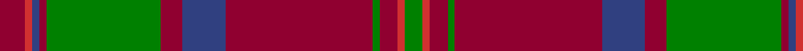

In pattern [GRRGRBRGRBRR](/patterns/grrgrbrgrbrr/).

This was sourced from weddslist.  It is a [12 stripes tartan](/stripes/stripes12/).

Original link http://www.weddslist.com/cgi-bin/tartans/pg.pl?source=sts

## Thread count
DR/14 R4 B4 DR4 G64 DR12 B24 DR82 G4 DR10 R4 G/10

## Palette
Each colour and its ΔE from the base-6 reference it is a variant of.

| Colour | Shade | Base | ΔE (OKLab) |
|---|---|---|---|
| B | <code style="background-color:#304080;">#304080</code> `#304080` | B <code style="background-color:#2A418A;">#2A418A</code> | 0.02 |
| DR | <code style="background-color:#900030;">#900030</code> `#900030` | R <code style="background-color:#CC0000;">#CC0000</code> | 0.14 |
| G | <code style="background-color:#008000;">#008000</code> `#008000` | G <code style="background-color:#006100;">#006100</code> | 0.10 |
| R | <code style="background-color:#D03030;">#D03030</code> `#D03030` | R <code style="background-color:#CC0000;">#CC0000</code> | 0.04 |

## Nearest tartans

The nearest existing variants by ΔTartan distance.

1. [MacLintock Clan Tartan Tartan Number: 881. Earliest known date: 1842 Tartan is in the MacGregor Hastie collection of the STS and also appears in the J. T. Thompson files at the STA. It also appears in Clans Originaux verified by BW in 2004. Mentioned in correspondence by D C Stewart sending this count to Life Member Andrew Pearson in October 1971. See products available Copyright © Blair Urquhart, Comrie, 2015](/setts/s12/g36r3g3r3b9r3ba2r40b3r3b2r6x2~b2c2c80-ba5c8ca8-g006818-rc80000/) — ΔT 0.67
1. [Chisholm, hunting](/setts/s10/r7w2r32b7g3b2g3b2g16r3x2~b304080-g008000-r900030-we0e0e0/) — ΔT 0.72
1. [MacLintock](/setts/s12/g36r3g3r3b9r3ba2r40b3r3b2r6x2~b304080-ba5480b0-g008000-rc00000/) — ΔT 0.80
1. [MacLintock](/setts/s12/g38r3g3r3b9r3ba2r40b3r3b2r6x2~b1c0070-ba5c8ca8-g006818-rc80000/) — ΔT 0.83
1. [MacLintock - 1880 (Clan)](/setts/s12/g36r3g3r3b9r3ba2r40b3r3b2r6x2~b1c0070-ba5c8ca8-g006818-rc80000/) — ΔT 0.85
1. [Drumbeg](/setts/s12/r12b3r3ba4r16ra3r3ra3r3ra16ba52r4~b5c5c5c-ba14283c-rb07430-ra880000/) — ΔT 0.88
1. [Robertson 7](/setts/s13/w1g2r18b2r2b18r2g18r2b2r18g2w1x2~b304080-g008000-rc00000-we0e0e0/) — ΔT 0.92
1. [Crieff District Tartan Tartan Number: 1636. Earliest known date: 1793 Wilson's accounts of 1793 mention the Crieff tartan with no details. A manuscript dated 1800 gives details of colour but it is not until the publication of the Key Pattern Book of 1819 that this sett is revealed in full. Crieff in Perthshire was the most famous of the cattle drovers 'trysts' prior to 1700. It is a very large sett which has been proportionately reduced for this illustration. The full threadcount: Light Red 4, Red 12, Green 8, R 140, G 8, R 4, Purple 42, R 4, G 170, R 4, G 8, R 12, LR 4. See products available Copyright © Blair Urquhart, Comrie, 2015](/setts/s13/r4ra10g7ra70g7ra4b21ra4g85ra4g7ra10r4~b780078-g006818-rd05054-rac80000/) — ΔT 0.93
1. [Stewart of Appin - 1906](/setts/s16/r3b2ba1r2g24r4g2r2b8r2g2r24b2ba1r2g2x2~b2c2c80-ba5c8ca8-g006818-rc80000/) — ΔT 0.93
1. [Harbor Club (Corporate)](/setts/s10/r47g14k5y2k3g7k3y2k5g14x2~g006428-k101010-r800028-ye8c000/) — ΔT 0.95

## Neighbour map

Every grey dot is one of 15726 variants placed by the first two principal components of the ΔTartan feature space (44% of its variance). Red is this tartan; blue dots are its nearest — click one to open its page.

<svg viewBox="0 0 640 380" role="img" style="max-width:100%;height:auto;border:1px solid #e0e0e0;border-radius:4px;display:block" xmlns="http://www.w3.org/2000/svg"><image href="/nn/cloud.v1.png" width="640" height="380"/><a href="/setts/s12/g36r3g3r3b9r3ba2r40b3r3b2r6x2~b2c2c80-ba5c8ca8-g006818-rc80000/"><circle cx="349.9" cy="121.4" r="4" fill="#3465a4"><title>MacLintock Clan Tartan Tartan Number: 881. Earliest known date: 1842 Tartan is in the MacGregor Hastie collection of the STS and also appears in the J. T. Thompson files at the STA. It also appears in Clans Originaux verified by BW in 2004. Mentioned in correspondence by D C Stewart sending this count to Life Member Andrew Pearson in October 1971. See products available Copyright © Blair Urquhart, Comrie, 2015</title></circle></a><a href="/setts/s10/r7w2r32b7g3b2g3b2g16r3x2~b304080-g008000-r900030-we0e0e0/"><circle cx="343.9" cy="150.8" r="4" fill="#3465a4"><title>Chisholm, hunting</title></circle></a><a href="/setts/s12/g36r3g3r3b9r3ba2r40b3r3b2r6x2~b304080-ba5480b0-g008000-rc00000/"><circle cx="348.4" cy="121.6" r="4" fill="#3465a4"><title>MacLintock</title></circle></a><a href="/setts/s12/g38r3g3r3b9r3ba2r40b3r3b2r6x2~b1c0070-ba5c8ca8-g006818-rc80000/"><circle cx="336.9" cy="117.6" r="4" fill="#3465a4"><title>MacLintock</title></circle></a><a href="/setts/s12/g36r3g3r3b9r3ba2r40b3r3b2r6x2~b1c0070-ba5c8ca8-g006818-rc80000/"><circle cx="340.1" cy="118.0" r="4" fill="#3465a4"><title>MacLintock - 1880 (Clan)</title></circle></a><a href="/setts/s12/r12b3r3ba4r16ra3r3ra3r3ra16ba52r4~b5c5c5c-ba14283c-rb07430-ra880000/"><circle cx="307.1" cy="133.8" r="4" fill="#3465a4"><title>Drumbeg</title></circle></a><a href="/setts/s13/w1g2r18b2r2b18r2g18r2b2r18g2w1x2~b304080-g008000-rc00000-we0e0e0/"><circle cx="292.1" cy="132.0" r="4" fill="#3465a4"><title>Robertson 7</title></circle></a><a href="/setts/s13/r4ra10g7ra70g7ra4b21ra4g85ra4g7ra10r4~b780078-g006818-rd05054-rac80000/"><circle cx="335.2" cy="116.5" r="4" fill="#3465a4"><title>Crieff District Tartan Tartan Number: 1636. Earliest known date: 1793 Wilson's accounts of 1793 mention the Crieff tartan with no details. A manuscript dated 1800 gives details of colour but it is not until the publication of the Key Pattern Book of 1819 that this sett is revealed in full. Crieff in Perthshire was the most famous of the cattle drovers 'trysts' prior to 1700. It is a very large sett which has been proportionately reduced for this illustration. The full threadcount: Light Red 4, Red 12, Green 8, R 140, G 8, R 4, Purple 42, R 4, G 170, R 4, G 8, R 12, LR 4. See products available Copyright © Blair Urquhart, Comrie, 2015</title></circle></a><a href="/setts/s16/r3b2ba1r2g24r4g2r2b8r2g2r24b2ba1r2g2x2~b2c2c80-ba5c8ca8-g006818-rc80000/"><circle cx="325.7" cy="100.8" r="4" fill="#3465a4"><title>Stewart of Appin - 1906</title></circle></a><a href="/setts/s10/r47g14k5y2k3g7k3y2k5g14x2~g006428-k101010-r800028-ye8c000/"><circle cx="323.1" cy="136.6" r="4" fill="#3465a4"><title>Harbor Club (Corporate)</title></circle></a><circle cx="350.3" cy="133.2" r="5" fill="#c00000"/></svg>

ID: /setts/s12/r7ra2b2r2g32r6b12r41g2r5ra2g5x2~b304080-g008000-r900030-rad03030/
