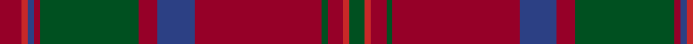

In pattern [GRRGRBRGRBRR](/patterns/grrgrbrgrbrr/).

This was sourced from register-of-tartans.  It is a [12 stripes tartan](/stripes/stripes12/).

Original link https://www.tartanregister.gov.uk/tartanDetails.aspx?ref=2398

## Thread count
DR/14 R4 B4 DR4 G64 DR12 B24 DR82 G4 DR10 R4 G/10

## Palette
Each colour and its ΔE from the base-6 reference it is a variant of.

| Colour | Shade | Base | ΔE (OKLab) |
|---|---|---|---|
| B | <code style="background-color:#2C4084;">#2C4084</code> `#2C4084` | B <code style="background-color:#2A418A;">#2A418A</code> | 0.01 |
| DR | <code style="background-color:#960028;">#960028</code> `#960028` | R <code style="background-color:#CC0000;">#CC0000</code> | 0.12 |
| G | <code style="background-color:#005020;">#005020</code> `#005020` | G <code style="background-color:#006100;">#006100</code> | 0.07 |
| R | <code style="background-color:#C82828;">#C82828</code> `#C82828` | R <code style="background-color:#CC0000;">#CC0000</code> | 0.03 |

## Nearest tartans

The nearest existing variants by ΔTartan distance.

1. [Chisholm Hunting](/setts/s10/r7w2r32b7g3b2g3b2g16r3~b2c4084-g005020-r960028-we0e0e0~x2/) — ΔT 0.95
1. [MacDougall VS](/setts/s11/b4g8ba6b8r6g2r2g2r24g1r3~b6e5058-ba000052-g11450d-raa0000~x2/) — ΔT 0.97
1. [Chisholm D](/setts/s10/r6y1r24b6g2b1g2b1g12r1~b6e5058-g11450d-raa0000-yaaaaaa~x2/) — ΔT 1.00
1. [Beanpole Brown Trial](/setts/s12/r4b31r2ra2r2ra2r2b2ba2b4ba11r4~b441800-ba4c3428-ra07c58-ra880000/) — ΔT 1.04
1. [Livingstone Australia (NSW) (Clan)](/setts/s12/g12r4k1y1r2k1y1r4g16r20g2r8~g005430-k101010-ra00048-ybc8c00~x2/) — ΔT 1.12
1. [Livingstone (Australia) NSW](/setts/s12/g12r4k1y1r2k1y1r4g16r20g2r8~g003820-k101010-r780808-ye1ad29~x2/) — ΔT 1.15
1. [Rice Welsh Name Tartan Tartan Number: 5754. Earliest known date: 2002 The tartan for this Welsh surname and its variations, Brice, Bryce, Price, Pryce, Rice, Rhys, Ryce, is actually woven in Wales at the Cambrian Woollen Mill, weaving on the same site since 1830. This tartan differs from many traditional patterns in that the warp and weft differ, giving the finished worsted wool cloth more of a predominant stripe, noticeable in the finished Kilt, or Cilt in Wales. See products available Copyright © Blair Urquhart, Comrie, 2015](/setts/s10/y4r21y1r21g8b4g5b4g4y4~b202060-g5c6428-r901c38-ybc8c00/) — ΔT 1.19
1. [MacEdward (MacGregor Hastie)](/setts/s10/r6y1r24g6b2k1b2k1b12r1~b202060-g003820-k101010-r880000-yd09800~x2/) — ΔT 1.22
1. [MacDonald of Glenaladale](/setts/s12/r7ra2b2r2g32r6b12r41g2r5ra2g5~b304080-g008000-r900030-rad03030~x2/) — ΔT 1.26
1. [MacDonald of Glencoe](/setts/s13/g3r1ra2g2ra16w1b4ra3g13ra1b1r1ra3~b2c2c80-g285800-re87878-ra880000-w98c8e8~x2/) — ΔT 1.29

## Neighbour map

Every grey dot is one of 15726 variants placed by the first two principal components of the ΔTartan feature space (44% of its variance). Red is this tartan; blue dots are its nearest — click one to open its page.

<svg viewBox="0 0 640 380" role="img" style="max-width:100%;height:auto;border:1px solid #e0e0e0;border-radius:4px;display:block" xmlns="http://www.w3.org/2000/svg"><image href="/nn/cloud.v1.png" width="640" height="380"/><a href="/setts/s10/r7w2r32b7g3b2g3b2g16r3~b2c4084-g005020-r960028-we0e0e0~x2/"><circle cx="367.6" cy="160.3" r="4" fill="#3465a4"><title>Chisholm Hunting</title></circle></a><a href="/setts/s11/b4g8ba6b8r6g2r2g2r24g1r3~b6e5058-ba000052-g11450d-raa0000~x2/"><circle cx="363.1" cy="151.5" r="4" fill="#3465a4"><title>MacDougall VS</title></circle></a><a href="/setts/s10/r6y1r24b6g2b1g2b1g12r1~b6e5058-g11450d-raa0000-yaaaaaa~x2/"><circle cx="419.3" cy="149.1" r="4" fill="#3465a4"><title>Chisholm D</title></circle></a><a href="/setts/s12/r4b31r2ra2r2ra2r2b2ba2b4ba11r4~b441800-ba4c3428-ra07c58-ra880000/"><circle cx="395.3" cy="156.6" r="4" fill="#3465a4"><title>Beanpole Brown Trial</title></circle></a><a href="/setts/s12/g12r4k1y1r2k1y1r4g16r20g2r8~g005430-k101010-ra00048-ybc8c00~x2/"><circle cx="379.7" cy="154.9" r="4" fill="#3465a4"><title>Livingstone Australia (NSW) (Clan)</title></circle></a><a href="/setts/s12/g12r4k1y1r2k1y1r4g16r20g2r8~g003820-k101010-r780808-ye1ad29~x2/"><circle cx="408.6" cy="173.5" r="4" fill="#3465a4"><title>Livingstone (Australia) NSW</title></circle></a><a href="/setts/s10/y4r21y1r21g8b4g5b4g4y4~b202060-g5c6428-r901c38-ybc8c00/"><circle cx="372.5" cy="171.7" r="4" fill="#3465a4"><title>Rice Welsh Name Tartan Tartan Number: 5754. Earliest known date: 2002 The tartan for this Welsh surname and its variations, Brice, Bryce, Price, Pryce, Rice, Rhys, Ryce, is actually woven in Wales at the Cambrian Woollen Mill, weaving on the same site since 1830. This tartan differs from many traditional patterns in that the warp and weft differ, giving the finished worsted wool cloth more of a predominant stripe, noticeable in the finished Kilt, or Cilt in Wales. See products available Copyright © Blair Urquhart, Comrie, 2015</title></circle></a><a href="/setts/s10/r6y1r24g6b2k1b2k1b12r1~b202060-g003820-k101010-r880000-yd09800~x2/"><circle cx="393.9" cy="136.2" r="4" fill="#3465a4"><title>MacEdward (MacGregor Hastie)</title></circle></a><a href="/setts/s12/r7ra2b2r2g32r6b12r41g2r5ra2g5~b304080-g008000-r900030-rad03030~x2/"><circle cx="350.3" cy="133.2" r="4" fill="#3465a4"><title>MacDonald of Glenaladale</title></circle></a><a href="/setts/s13/g3r1ra2g2ra16w1b4ra3g13ra1b1r1ra3~b2c2c80-g285800-re87878-ra880000-w98c8e8~x2/"><circle cx="319.9" cy="133.8" r="4" fill="#3465a4"><title>MacDonald of Glencoe</title></circle></a><circle cx="385.6" cy="147.4" r="5" fill="#c00000"/></svg>

ID: /setts/s12/r7ra2b2r2g32r6b12r41g2r5ra2g5~b2c4084-g005020-r960028-rac82828~x2/
