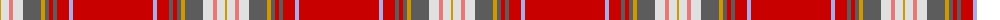

In pattern [RWRBRBYBWRWY](/patterns/rwrbrbybwrwy/).

This was sourced from tartans-authority.  It is a [12 stripes tartan](/stripes/stripes12/).

Original link http://www.tartansauthority.com/tartan-ferret/display/1518/

## Thread count
DY/2 LN8 LR4 LN10 N18 DY4 N4 R4 N4 R12 LP4 R/80

## Palette
Each colour and its ΔE from the base-6 reference it is a variant of.

| Colour | Shade | Base | ΔE (OKLab) |
|---|---|---|---|
| DY | <code style="background-color:#D09800;">#D09800</code> `#D09800` | Y <code style="background-color:#E8C000;">#E8C000</code> | 0.11 |
| LN | <code style="background-color:#E0E0E0;">#E0E0E0</code> `#E0E0E0` | W <code style="background-color:#F4F4F0;">#F4F4F0</code> | 0.06 |
| LP | <code style="background-color:#A8ACE8;">#A8ACE8</code> `#A8ACE8` | W <code style="background-color:#F4F4F0;">#F4F4F0</code> | 0.22 |
| LR | <code style="background-color:#E87878;">#E87878</code> `#E87878` | R <code style="background-color:#C80000;">#C80000</code> | 0.19 |
| N | <code style="background-color:#5C5C5C;">#5C5C5C</code> `#5C5C5C` | B <code style="background-color:#2C4084;">#2C4084</code> | 0.14 |
| R | <code style="background-color:#C80000;">#C80000</code> `#C80000` | R <code style="background-color:#C80000;">#C80000</code> | 0.00 |

ID: /setts/s12/r80w4r12b4r4b4y4b18wa10ra4wa8y2-b5c5c5c-rc80000-rae87878-wa8ace8-wae0e0e0-yd09800/
