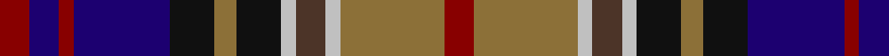

In pattern [RBRBKGKWBWGR](/patterns/rbrbkgkwbwgr/).

This was sourced from register-of-tartans.  It is a [12 stripes tartan](/stripes/stripes12/).

Original link https://www.tartanregister.gov.uk/tartanDetails.aspx?ref=1989

## Attestations

This cloth appears in 2 source records; the oldest owns this page.

- 01/11/1997 — Kinloch Anderson Old Dress (register-of-tartans, [record](https://www.tartanregister.gov.uk/tartanDetails.aspx?ref=1989))
- pre 2002 — Kinloch Anderson Dress (Corporate) (tartans-authority, [record](http://www.tartansauthority.com/tartan-ferret/display/2406/))

## Thread count
DR/8 DB8 DR4 DB26 K12 LT6 K12 N4 T8 N4 LT28 DR/8

## Palette
Each colour and its ΔE from the base-6 reference it is a variant of.

| Colour | Shade | Base | ΔE (OKLab) |
|---|---|---|---|
| DB | <code style="background-color:#1C0070;">#1C0070</code> `#1C0070` | B <code style="background-color:#2A418A;">#2A418A</code> | 0.14 |
| DR | <code style="background-color:#880000;">#880000</code> `#880000` | R <code style="background-color:#CC0000;">#CC0000</code> | 0.15 |
| K | <code style="background-color:#101010;">#101010</code> `#101010` | K <code style="background-color:#000000;">#000000</code> | 0.17 |
| LT | <code style="background-color:#8C7038;">#8C7038</code> `#8C7038` | G <code style="background-color:#006100;">#006100</code> | 0.18 |
| N | <code style="background-color:#C0C0C0;">#C0C0C0</code> `#C0C0C0` | W <code style="background-color:#F7F7F7;">#F7F7F7</code> | 0.17 |
| T | <code style="background-color:#4C3428;">#4C3428</code> `#4C3428` | B <code style="background-color:#2A418A;">#2A418A</code> | 0.17 |

## Nearest tartans

The nearest existing variants by ΔTartan distance.

1. [South Australia #2](/setts/s11/r6b24r3ba12r7ba12k3g8y3g8k3-b2c4084-ba141e46-g005020-k101010-rdc0000-ye8c000/) — ΔT 0.64
1. [Alberta Caledonia (Corporate)](/setts/s13/r12b18k4b4k4b18k20y8ba34r10k4r10w8-b2c2c80-ba5c5c5c-k101010-rc80000-we0e0e0-ye8c000/) — ΔT 0.64
1. [Haughey (Personal)](/setts/s16/b12r4b4r8b28r4g24r4g6w4g6k22ba18g4ba12w4-b2c2c80-ba780078-g006818-k101010-rc80000-wf8f8f8/) — ΔT 0.74
1. [Haughey (Personal)](/setts/s16/b12r4b4r8b28r4g24r4g6w4g6ga22ba18g4ba12w4-b141e46-ba5a008c-g003c14-ga2a2303-rdc0000-we0e0e0/) — ΔT 0.80
1. [Tawain Scottish (Commemorative)](/setts/s14/r26w4r26k6ra26g42b6k36b18k4b4k4b30w4-b2c2c80-g006818-k101010-rc80000-ra880000-we0e0e0/) — ΔT 0.87
1. [Kinloch Anderson Castle Grey](/setts/s12/b8g8b4g28k12ba6k12r4ba8r4ba29y6-b3e3e3e-ba2c2c2c-g696969-k000000-r960028-y999999/) — ΔT 0.97
1. [Kinloch Anderson, dress](/setts/s12/r8ra28w4rb8w4k12ra6k12b28r4b8r8-b000050-k000000-rc00000-ra906030-rb806050-we0e0e0/) — ΔT 0.97
1. [Logan Rogers (Personal)](/setts/s10/b4r4b4w2b16k16g16r4g4y4-b202060-g003820-k101010-rc80000-wfcfcfc-yfccc00/) — ΔT 0.98
1. [Bowie (Dalgety) Family Tartan Tartan Number: 434. Earliest known date: 1970-80 The name Bowie or Buie is associated with Argyllshire and the islands of Jura, Uist and Bute. The design comes from J. Dalgety, a weaving manufacturer who specializes in tartan. The date of the tartan is assumed. See products available Copyright © Blair Urquhart, Comrie, 2015](/setts/s13/b16r4b6r8b26w4ba26w4g26r8g8y4g16-b2c2c80-ba480800-g006818-rc80000-we0e0e0-ye8c000/) — ΔT 0.98
1. [Logan Rogers](/setts/s10/b4r4b4w2b16k16g16r4g4y4-b202060-g003820-k101010-rc80000-wffffff-ye8c000/) — ΔT 0.99

## Neighbour map

Every grey dot is one of 15726 variants placed by the first two principal components of the ΔTartan feature space (44% of its variance). Red is this tartan; blue dots are its nearest — click one to open its page.

<svg viewBox="0 0 640 380" role="img" style="max-width:100%;height:auto;border:1px solid #e0e0e0;border-radius:4px;display:block" xmlns="http://www.w3.org/2000/svg"><image href="/nn/cloud.v1.png" width="640" height="380"/><a href="/setts/s11/r6b24r3ba12r7ba12k3g8y3g8k3-b2c4084-ba141e46-g005020-k101010-rdc0000-ye8c000/"><circle cx="80.8" cy="172.1" r="4" fill="#3465a4"><title>South Australia #2</title></circle></a><a href="/setts/s13/r12b18k4b4k4b18k20y8ba34r10k4r10w8-b2c2c80-ba5c5c5c-k101010-rc80000-we0e0e0-ye8c000/"><circle cx="51.5" cy="150.0" r="4" fill="#3465a4"><title>Alberta Caledonia (Corporate)</title></circle></a><a href="/setts/s16/b12r4b4r8b28r4g24r4g6w4g6k22ba18g4ba12w4-b2c2c80-ba780078-g006818-k101010-rc80000-wf8f8f8/"><circle cx="49.2" cy="146.6" r="4" fill="#3465a4"><title>Haughey (Personal)</title></circle></a><a href="/setts/s16/b12r4b4r8b28r4g24r4g6w4g6ga22ba18g4ba12w4-b141e46-ba5a008c-g003c14-ga2a2303-rdc0000-we0e0e0/"><circle cx="62.8" cy="155.7" r="4" fill="#3465a4"><title>Haughey (Personal)</title></circle></a><a href="/setts/s14/r26w4r26k6ra26g42b6k36b18k4b4k4b30w4-b2c2c80-g006818-k101010-rc80000-ra880000-we0e0e0/"><circle cx="67.5" cy="137.4" r="4" fill="#3465a4"><title>Tawain Scottish (Commemorative)</title></circle></a><a href="/setts/s12/b8g8b4g28k12ba6k12r4ba8r4ba29y6-b3e3e3e-ba2c2c2c-g696969-k000000-r960028-y999999/"><circle cx="105.3" cy="170.6" r="4" fill="#3465a4"><title>Kinloch Anderson Castle Grey</title></circle></a><a href="/setts/s12/r8ra28w4rb8w4k12ra6k12b28r4b8r8-b000050-k000000-rc00000-ra906030-rb806050-we0e0e0/"><circle cx="40.9" cy="153.5" r="4" fill="#3465a4"><title>Kinloch Anderson, dress</title></circle></a><a href="/setts/s10/b4r4b4w2b16k16g16r4g4y4-b202060-g003820-k101010-rc80000-wfcfcfc-yfccc00/"><circle cx="97.0" cy="171.5" r="4" fill="#3465a4"><title>Logan Rogers (Personal)</title></circle></a><a href="/setts/s13/b16r4b6r8b26w4ba26w4g26r8g8y4g16-b2c2c80-ba480800-g006818-rc80000-we0e0e0-ye8c000/"><circle cx="78.5" cy="166.8" r="4" fill="#3465a4"><title>Bowie (Dalgety) Family Tartan Tartan Number: 434. Earliest known date: 1970-80 The name Bowie or Buie is associated with Argyllshire and the islands of Jura, Uist and Bute. The design comes from J. Dalgety, a weaving manufacturer who specializes in tartan. The date of the tartan is assumed. See products available Copyright © Blair Urquhart, Comrie, 2015</title></circle></a><a href="/setts/s10/b4r4b4w2b16k16g16r4g4y4-b202060-g003820-k101010-rc80000-wffffff-ye8c000/"><circle cx="99.6" cy="172.8" r="4" fill="#3465a4"><title>Logan Rogers</title></circle></a><circle cx="59.0" cy="166.2" r="5" fill="#c00000"/></svg>

ID: /setts/s12/r8g28w4b8w4k12g6k12ba26r4ba8r8-b4c3428-ba1c0070-g8c7038-k101010-r880000-wc0c0c0/
