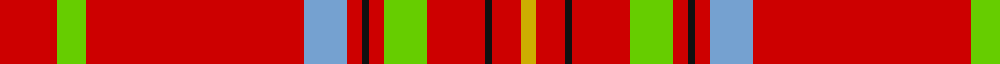

In pattern [RYRYRKRYRKRY](/patterns/ryryrkryrkry/).

This was sourced from register-of-tartans.  It is a [12 stripes tartan](/stripes/stripes12/).

Original link https://www.tartanregister.gov.uk/tartanDetails.aspx?ref=10171

## Register references

External register numbers recorded for this tartan.

- Scottish Register of Tartans: [10171](https://www.tartanregister.gov.uk/tartanDetails.aspx?ref=10171)

## Thread count
R/16 LG8 R60 B12 R4 K2 R4 LG12 R16 K2 R8 Y/4

## Palette
Each colour and its ΔE from the base-6 reference it is a variant of.

| Colour | Shade | Base | ΔE (OKLab) |
|---|---|---|---|
| B | <code style="background-color:#75A1D0;">#75A1D0</code> `#75A1D0` | Y <code style="background-color:#F2BF00;">#F2BF00</code> | 0.28 |
| K | <code style="background-color:#101010;">#101010</code> `#101010` | K <code style="background-color:#000000;">#000000</code> | 0.17 |
| LG | <code style="background-color:#66CD00;">#66CD00</code> `#66CD00` | Y <code style="background-color:#F2BF00;">#F2BF00</code> | 0.18 |
| R | <code style="background-color:#CD0000;">#CD0000</code> `#CD0000` | R <code style="background-color:#CC0000;">#CC0000</code> | 0.00 |
| W | <code style="background-color:#FFFFFF;">#FFFFFF</code> `#FFFFFF` | W <code style="background-color:#F7F7F7;">#F7F7F7</code> | 0.02 |
| Y | <code style="background-color:#CDAD00;">#CDAD00</code> `#CDAD00` | Y <code style="background-color:#F2BF00;">#F2BF00</code> | 0.08 |

## Nearest tartans

The nearest existing variants by ΔTartan distance.

1. [Hackston (Green stripe) or Halkerston](/setts/s14/r11y3r11y3k11ya2r51ya2k11y3r11y3r11g3~g006818-k101010-rc80000-ybc8c00-yab8b8b8~x2/) — ΔT 1.01
1. [Wilding, Michael John (Personal)](/setts/s13/w2k2b2y2k2r7k1r12k2r6w1r23k1~b5c8ca8-k101010-ra00000-wfcfcfc-yfccc00~x2/) — ΔT 1.33
1. [Junor](/setts/s9/r72g6y2g11b2g2b2r9k2~b8080d0-g30a010-k000000-rc00000-yf0c000~x2/) — ΔT 1.36
1. [Earl of Inverness (Royal)](/setts/s8/r100b10w5b14y4ba8y4r24~b1c1c50-ba2c2c80-rc80000-we0e0e0-ye8c000/) — ΔT 1.41
1. [Princess Elizabeth #2](/setts/s8/r60b8w3b10y3ba4y3r19~b2c2c80-ba5c8ca8-rc80000-we0e0e0-ye8c000~x2/) — ΔT 1.44
1. [Hackston (Green stripe) (Portrait)](/setts/s8/r51y2k11ya3r11ya3r11g3~g006818-k101010-rc80000-yb8b8b8-yabc8c00~x2/) — ΔT 1.45
1. [MacAulay (MacGregor)](/setts/s9/r96b1g24b1r10b1g12k1w4~b2c4084-g005020-k101010-rdc0000-we0e0e0~x2/) — ΔT 1.46
1. [Princess Elizabeth](/setts/s8/r60b8w3b10y3ba4y3r19~b304080-ba5480b0-rc00000-we0e0e0-yf0c000~x2/) — ΔT 1.47
1. [Brodie of that Ilk & the Burn Clan Tartan Tartan Number: 1684. Earliest known date: 1856 Peters' book, 'The Baronage of Angus and Mearns' (1856), provides the full title of this tartan which also appears in the manuscript prepared for the Vestiarium Scoticum. Peters did not give any clue to the origin of the tartan. See products available Copyright © Blair Urquhart, Comrie, 2015](/setts/s8/r48w4b4k4r12b4r1y4~b2c2c80-k101010-rc80000-we0e0e0-ye8c000~x2/) — ΔT 1.49
1. [Highland Queen (Corporate)](/setts/s12/r8g4r30b6r2k1r2g6r8k1r4y2~b2c2c80-g5c9478-k101010-rc44438-ye8c000~x2/) — ΔT 1.50

## Neighbour map

Every grey dot is one of 15726 variants placed by the first two principal components of the ΔTartan feature space (44% of its variance). Red is this tartan; blue dots are its nearest — click one to open its page.

<svg viewBox="0 0 640 380" role="img" style="max-width:100%;height:auto;border:1px solid #e0e0e0;border-radius:4px;display:block" xmlns="http://www.w3.org/2000/svg"><image href="/nn/cloud.v1.png" width="640" height="380"/><a href="/setts/s14/r11y3r11y3k11ya2r51ya2k11y3r11y3r11g3~g006818-k101010-rc80000-ybc8c00-yab8b8b8~x2/"><circle cx="441.3" cy="91.6" r="4" fill="#3465a4"><title>Hackston (Green stripe) or Halkerston</title></circle></a><a href="/setts/s13/w2k2b2y2k2r7k1r12k2r6w1r23k1~b5c8ca8-k101010-ra00000-wfcfcfc-yfccc00~x2/"><circle cx="478.8" cy="101.5" r="4" fill="#3465a4"><title>Wilding, Michael John (Personal)</title></circle></a><a href="/setts/s9/r72g6y2g11b2g2b2r9k2~b8080d0-g30a010-k000000-rc00000-yf0c000~x2/"><circle cx="533.9" cy="79.5" r="4" fill="#3465a4"><title>Junor</title></circle></a><a href="/setts/s8/r100b10w5b14y4ba8y4r24~b1c1c50-ba2c2c80-rc80000-we0e0e0-ye8c000/"><circle cx="486.1" cy="105.9" r="4" fill="#3465a4"><title>Earl of Inverness (Royal)</title></circle></a><a href="/setts/s8/r60b8w3b10y3ba4y3r19~b2c2c80-ba5c8ca8-rc80000-we0e0e0-ye8c000~x2/"><circle cx="465.0" cy="120.2" r="4" fill="#3465a4"><title>Princess Elizabeth #2</title></circle></a><a href="/setts/s8/r51y2k11ya3r11ya3r11g3~g006818-k101010-rc80000-yb8b8b8-yabc8c00~x2/"><circle cx="524.9" cy="120.9" r="4" fill="#3465a4"><title>Hackston (Green stripe) (Portrait)</title></circle></a><a href="/setts/s9/r96b1g24b1r10b1g12k1w4~b2c4084-g005020-k101010-rdc0000-we0e0e0~x2/"><circle cx="515.1" cy="66.7" r="4" fill="#3465a4"><title>MacAulay (MacGregor)</title></circle></a><a href="/setts/s8/r60b8w3b10y3ba4y3r19~b304080-ba5480b0-rc00000-we0e0e0-yf0c000~x2/"><circle cx="472.8" cy="124.4" r="4" fill="#3465a4"><title>Princess Elizabeth</title></circle></a><a href="/setts/s8/r48w4b4k4r12b4r1y4~b2c2c80-k101010-rc80000-we0e0e0-ye8c000~x2/"><circle cx="523.2" cy="82.0" r="4" fill="#3465a4"><title>Brodie of that Ilk &amp; the Burn Clan Tartan Tartan Number: 1684. Earliest known date: 1856 Peters' book, 'The Baronage of Angus and Mearns' (1856), provides the full title of this tartan which also appears in the manuscript prepared for the Vestiarium Scoticum. Peters did not give any clue to the origin of the tartan. See products available Copyright © Blair Urquhart, Comrie, 2015</title></circle></a><a href="/setts/s12/r8g4r30b6r2k1r2g6r8k1r4y2~b2c2c80-g5c9478-k101010-rc44438-ye8c000~x2/"><circle cx="495.7" cy="107.9" r="4" fill="#3465a4"><title>Highland Queen (Corporate)</title></circle></a><circle cx="465.7" cy="90.6" r="5" fill="#c00000"/></svg>

ID: /setts/s12/r8y4r30ya6r2k1r2y6r8k1r4yb2~k101010-rcd0000-y66cd00-ya75a1d0-ybcdad00~x2/
