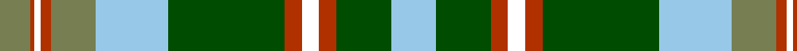

In pattern [GRWRGWGRWRGW](/patterns/grwrgwgrwrgw/).

This was sourced from register-of-tartans.  It is a [12 stripes tartan](/stripes/stripes12/).

Original link https://www.tartanregister.gov.uk/tartanDetails.aspx?ref=11596

## Register references

External register numbers recorded for this tartan.

- Scottish Register of Tartans: [11596](https://www.tartanregister.gov.uk/tartanDetails.aspx?ref=11596)

## Thread count
Ga/18 R2 W4 R6 Ga26 LB42 G68 R10 W10 R10 G32 LB/26

## Palette
Each colour and its ΔE from the base-6 reference it is a variant of.

| Colour | Shade | Base | ΔE (OKLab) |
|---|---|---|---|
| G | <code style="background-color:#004C00;">#004C00</code> `#004C00` | G <code style="background-color:#006100;">#006100</code> | 0.07 |
| Ga | <code style="background-color:#767E52;">#767E52</code> `#767E52` | G <code style="background-color:#006100;">#006100</code> | 0.17 |
| LB | <code style="background-color:#98C8E8;">#98C8E8</code> `#98C8E8` | W <code style="background-color:#F7F7F7;">#F7F7F7</code> | 0.18 |
| R | <code style="background-color:#B03000;">#B03000</code> `#B03000` | R <code style="background-color:#CC0000;">#CC0000</code> | 0.06 |
| W | <code style="background-color:#FFFFFF;">#FFFFFF</code> `#FFFFFF` | W <code style="background-color:#F7F7F7;">#F7F7F7</code> | 0.02 |

## Nearest tartans

The nearest existing variants by ΔTartan distance.

1. [Glynn of Glynstewart (Personal)](/setts/s14/b20k2g3k2b20r3k20r2k20r3g30y3g1y2~b33a1c9-g3d8b37-k101010-rff0000-yffe600~x2/) — ΔT 1.24
1. [Southwell (Personal)](/setts/s14/g10ga2w14b14r2w1r2ga39r2w1r2b14w14ga2~b202060-g289c18-ga006818-rc80000-wfcfcfc~x2/) — ΔT 1.25
1. [California State](/setts/s13/w4k1b28k16g10r2g10r4g10r2g10k1y4~b5c8ca8-g006818-k101010-rc8002c-wa8ace8-ye8c000~x2/) — ΔT 1.28
1. [Bannockbane Green](/setts/s8/b3y2b30y1w18ya30yb2ya3~b1c1c1c-wececd8-ybc8c00-ya809850-ybd87c00~x2/) — ΔT 1.38
1. [Fermanagh County Crest (Fashion)](/setts/s10/r4w6k10b5k3y16k3g33k1w4~b2c2c80-g006818-k101010-r880000-we0e0e0-ybc8c00~x2/) — ΔT 1.41
1. [California State American District Tartan Tartan Number: 2454. Earliest known date: 1998 Designed by J.Howard Standing of Tarzana, California and Thomas Ferguson of Sydney, British Columbia. Adopted as the 'official' California State tartan by the State Legislature. For general use by all those living in the State. Based on Muir, after the famous botanist and environmentalist John Muir who lived in California. Assembly Bill 2362, february 20th 1998. See products available Copyright © Blair Urquhart, Comrie, 2015](/setts/s13/w4k1b28k16g10r2g10r4g10r2g10k1y4~b5c8ca8-g006818-k101010-ra00000-wa8ace8-yd09800~x2/) — ΔT 1.42
1. [MacGillivray Dress, Janice (Personal](/setts/s13/w4b1ba1w22b2w2ba12r2g16r4b1r4ba2~b5c8ca8-ba003c64-g285800-rc80000-we8ccb8~x2/) — ΔT 1.46
1. [Gigha, Green (Dance)](/setts/s8/b4w2b1w18g18ga18y3ga4~b2c2c80-g003820-ga38885c-wf0e0c8-ye8d468~x2/) — ΔT 1.46
1. [Big Sur MacLaren (Personal)](/setts/s7/y31k18g13r3g13k1ya3~g005030-k101010-rc80000-y88acb8-yae8c000~x2/) — ΔT 1.47
1. [MacManus](/setts/s9/w3y2g8y2k3y2b15k1y2~b3c5c6c-g006818-k101010-wf8f8f8-yc4bc68~x4/) — ΔT 1.48

## Neighbour map

Every grey dot is one of 15726 variants placed by the first two principal components of the ΔTartan feature space (44% of its variance). Red is this tartan; blue dots are its nearest — click one to open its page.

<svg viewBox="0 0 640 380" role="img" style="max-width:100%;height:auto;border:1px solid #e0e0e0;border-radius:4px;display:block" xmlns="http://www.w3.org/2000/svg"><image href="/nn/cloud.v1.png" width="640" height="380"/><a href="/setts/s14/b20k2g3k2b20r3k20r2k20r3g30y3g1y2~b33a1c9-g3d8b37-k101010-rff0000-yffe600~x2/"><circle cx="164.8" cy="92.5" r="4" fill="#3465a4"><title>Glynn of Glynstewart (Personal)</title></circle></a><a href="/setts/s14/g10ga2w14b14r2w1r2ga39r2w1r2b14w14ga2~b202060-g289c18-ga006818-rc80000-wfcfcfc~x2/"><circle cx="173.3" cy="64.7" r="4" fill="#3465a4"><title>Southwell (Personal)</title></circle></a><a href="/setts/s13/w4k1b28k16g10r2g10r4g10r2g10k1y4~b5c8ca8-g006818-k101010-rc8002c-wa8ace8-ye8c000~x2/"><circle cx="178.3" cy="99.0" r="4" fill="#3465a4"><title>California State</title></circle></a><a href="/setts/s8/b3y2b30y1w18ya30yb2ya3~b1c1c1c-wececd8-ybc8c00-ya809850-ybd87c00~x2/"><circle cx="200.3" cy="106.5" r="4" fill="#3465a4"><title>Bannockbane Green</title></circle></a><a href="/setts/s10/r4w6k10b5k3y16k3g33k1w4~b2c2c80-g006818-k101010-r880000-we0e0e0-ybc8c00~x2/"><circle cx="173.1" cy="85.1" r="4" fill="#3465a4"><title>Fermanagh County Crest (Fashion)</title></circle></a><a href="/setts/s13/w4k1b28k16g10r2g10r4g10r2g10k1y4~b5c8ca8-g006818-k101010-ra00000-wa8ace8-yd09800~x2/"><circle cx="184.6" cy="102.3" r="4" fill="#3465a4"><title>California State American District Tartan Tartan Number: 2454. Earliest known date: 1998 Designed by J.Howard Standing of Tarzana, California and Thomas Ferguson of Sydney, British Columbia. Adopted as the 'official' California State tartan by the State Legislature. For general use by all those living in the State. Based on Muir, after the famous botanist and environmentalist John Muir who lived in California. Assembly Bill 2362, february 20th 1998. See products available Copyright © Blair Urquhart, Comrie, 2015</title></circle></a><a href="/setts/s13/w4b1ba1w22b2w2ba12r2g16r4b1r4ba2~b5c8ca8-ba003c64-g285800-rc80000-we8ccb8~x2/"><circle cx="176.2" cy="88.5" r="4" fill="#3465a4"><title>MacGillivray Dress, Janice (Personal</title></circle></a><a href="/setts/s8/b4w2b1w18g18ga18y3ga4~b2c2c80-g003820-ga38885c-wf0e0c8-ye8d468~x2/"><circle cx="133.4" cy="140.1" r="4" fill="#3465a4"><title>Gigha, Green (Dance)</title></circle></a><a href="/setts/s7/y31k18g13r3g13k1ya3~g005030-k101010-rc80000-y88acb8-yae8c000~x2/"><circle cx="195.2" cy="139.0" r="4" fill="#3465a4"><title>Big Sur MacLaren (Personal)</title></circle></a><a href="/setts/s9/w3y2g8y2k3y2b15k1y2~b3c5c6c-g006818-k101010-wf8f8f8-yc4bc68~x4/"><circle cx="169.9" cy="139.3" r="4" fill="#3465a4"><title>MacManus</title></circle></a><circle cx="185.6" cy="106.0" r="5" fill="#c00000"/></svg>

ID: /setts/s12/w13g16r5wa5r5g34w21ga13r3wa2r1ga9~g004c00-ga767e52-rb03000-w98c8e8-waffffff~x2/
