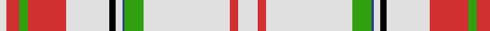

In pattern [WRGRWKWBGWRW](/patterns/wrgrwkwbgwrw/).

This was sourced from weddslist.  It is a [12 stripes tartan](/stripes/stripes12/).

Original link http://www.weddslist.com/cgi-bin/tartans/pg.pl?source=sts

## Thread count
LN/6 R12 G8 R36 LN40 K6 LN6 B2 G18 LN80 R8 LN/18

## Palette
Each colour and its ΔE from the base-6 reference it is a variant of.

| Colour | Shade | Base | ΔE (OKLab) |
|---|---|---|---|
| B | <code style="background-color:#304080;">#304080</code> `#304080` | B <code style="background-color:#2A418A;">#2A418A</code> | 0.02 |
| G | <code style="background-color:#30A010;">#30A010</code> `#30A010` | G <code style="background-color:#006100;">#006100</code> | 0.20 |
| K | <code style="background-color:#000000;">#000000</code> `#000000` | K <code style="background-color:#000000;">#000000</code> | 0.00 |
| LN | <code style="background-color:#E0E0E0;">#E0E0E0</code> `#E0E0E0` | W <code style="background-color:#F7F7F7;">#F7F7F7</code> | 0.07 |
| R | <code style="background-color:#D03030;">#D03030</code> `#D03030` | R <code style="background-color:#CC0000;">#CC0000</code> | 0.04 |

## Nearest tartans

The nearest existing variants by ΔTartan distance.

1. [Border Sett](/setts/s13/w180r38w40g40w40k4r44k4w40g40w40r38w80-g008000-k000000-rc00000-we0e0e0/) — ΔT 1.20
1. [Ivanka Trump (Personal)](/setts/s15/r24w4k8w8k2w48r4w4r4w4b2w2ra6k4w24-b2888c4-k101010-re87878-ra9c68a4-wf8f8f8/) — ΔT 1.26
1. [Confederate Memorial Dress](/setts/s14/b36w8r12w8y8w72g8w8g8w72r24w2ba8w6-b2888c4-ba00008c-g7c7c7c-rc82800-wfcfcfc-yc88c00/) — ΔT 1.33
1. [Boucherville Formal District Tartan Tartan Number: 2118. Earliest known date: 1990 Three designers from La Navette d'Art ENR, Jeanette Blanchette, Pauline Bastien and Jacqueline Provost, based their design on symbolic colours. Le bleu azur represente la loyaute, le gris argent la serenite, le jaune (l'or) la generosite, le vert represente l'esperance, et le blanc symbole de purete et d'innocence "nous rappelle notre appartenance au Quebec." "Les tisserands, c'est nous tous...!" See products available Copyright © Blair Urquhart, Comrie, 2015](/setts/s9/w40y4r10w8b4r4b4r4g1-b2c2c80-g006818-r888888-we0e0e0-ye8c000/) — ΔT 1.37
1. [Border Sett](/setts/s10/w150g2r40w32r40w40ga18w32ga2r76-g604000-ga006818-rc80000-wfcfcfc/) — ΔT 1.45
1. [Confederate Memorial Dress (Military](/setts/s14/b36w8r12w8y8w72ba8w8ba8w72r24w2bb8w6-b2888c4-ba5c5c5c-bb00008c-ra00048-wfcfcfc-yc88c00/) — ΔT 1.46
1. [Shaw of Tordarroch, Mrs (Personal)](/setts/s11/r16w92b8w8b8w10g14w14g14w8b4-b202060-g5c6428-re86000-we8ccb8/) — ΔT 1.47
1. [Snowy Owl (Fashion)](/setts/s14/w80r2w12r6y2r14y6b2y16b6k2b18k4w16-b5c5c5c-k101010-r888888-we0e0e0-ya08858/) — ΔT 1.51
1. [Loch Skene (Fashion)](/setts/s10/w96g30y4g6w4g6ya24w16g4w12-g604000-we8ccb8-yfcb464-yaa08858/) — ΔT 1.54
1. [Snowy Owl](/setts/s14/w80r2w12r6b2r14b6ba2b16ba6k2ba18k4w16-b544b4e-ba3c3233-k101010-r91827b-wffffff/) — ΔT 1.54

## Neighbour map

Every grey dot is one of 15726 variants placed by the first two principal components of the ΔTartan feature space (44% of its variance). Red is this tartan; blue dots are its nearest — click one to open its page.

<svg viewBox="0 0 640 380" role="img" style="max-width:100%;height:auto;border:1px solid #e0e0e0;border-radius:4px;display:block" xmlns="http://www.w3.org/2000/svg"><image href="/nn/cloud.v1.png" width="640" height="380"/><a href="/setts/s13/w180r38w40g40w40k4r44k4w40g40w40r38w80-g008000-k000000-rc00000-we0e0e0/"><circle cx="381.1" cy="97.4" r="4" fill="#3465a4"><title>Border Sett</title></circle></a><a href="/setts/s15/r24w4k8w8k2w48r4w4r4w4b2w2ra6k4w24-b2888c4-k101010-re87878-ra9c68a4-wf8f8f8/"><circle cx="327.1" cy="64.3" r="4" fill="#3465a4"><title>Ivanka Trump (Personal)</title></circle></a><a href="/setts/s14/b36w8r12w8y8w72g8w8g8w72r24w2ba8w6-b2888c4-ba00008c-g7c7c7c-rc82800-wfcfcfc-yc88c00/"><circle cx="310.6" cy="46.8" r="4" fill="#3465a4"><title>Confederate Memorial Dress</title></circle></a><a href="/setts/s9/w40y4r10w8b4r4b4r4g1-b2c2c80-g006818-r888888-we0e0e0-ye8c000/"><circle cx="361.8" cy="81.6" r="4" fill="#3465a4"><title>Boucherville Formal District Tartan Tartan Number: 2118. Earliest known date: 1990 Three designers from La Navette d'Art ENR, Jeanette Blanchette, Pauline Bastien and Jacqueline Provost, based their design on symbolic colours. Le bleu azur represente la loyaute, le gris argent la serenite, le jaune (l'or) la generosite, le vert represente l'esperance, et le blanc symbole de purete et d'innocence &quot;nous rappelle notre appartenance au Quebec.&quot; &quot;Les tisserands, c'est nous tous...!&quot; See products available Copyright © Blair Urquhart, Comrie, 2015</title></circle></a><a href="/setts/s10/w150g2r40w32r40w40ga18w32ga2r76-g604000-ga006818-rc80000-wfcfcfc/"><circle cx="357.9" cy="87.0" r="4" fill="#3465a4"><title>Border Sett</title></circle></a><a href="/setts/s14/b36w8r12w8y8w72ba8w8ba8w72r24w2bb8w6-b2888c4-ba5c5c5c-bb00008c-ra00048-wfcfcfc-yc88c00/"><circle cx="304.2" cy="45.1" r="4" fill="#3465a4"><title>Confederate Memorial Dress (Military</title></circle></a><a href="/setts/s11/r16w92b8w8b8w10g14w14g14w8b4-b202060-g5c6428-re86000-we8ccb8/"><circle cx="395.8" cy="102.1" r="4" fill="#3465a4"><title>Shaw of Tordarroch, Mrs (Personal)</title></circle></a><a href="/setts/s14/w80r2w12r6y2r14y6b2y16b6k2b18k4w16-b5c5c5c-k101010-r888888-we0e0e0-ya08858/"><circle cx="336.3" cy="54.0" r="4" fill="#3465a4"><title>Snowy Owl (Fashion)</title></circle></a><a href="/setts/s10/w96g30y4g6w4g6ya24w16g4w12-g604000-we8ccb8-yfcb464-yaa08858/"><circle cx="388.6" cy="108.9" r="4" fill="#3465a4"><title>Loch Skene (Fashion)</title></circle></a><a href="/setts/s14/w80r2w12r6b2r14b6ba2b16ba6k2ba18k4w16-b544b4e-ba3c3233-k101010-r91827b-wffffff/"><circle cx="300.4" cy="37.7" r="4" fill="#3465a4"><title>Snowy Owl</title></circle></a><circle cx="347.5" cy="72.9" r="5" fill="#c00000"/></svg>

ID: /setts/s12/w18r8w80g18b2w6k6w40r36g8r12w6-b304080-g30a010-k000000-rd03030-we0e0e0/
