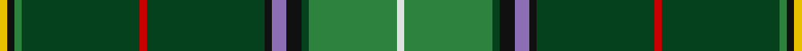

In pattern [WGGKBKGRGGKY](/stripes/wggkbkgrggky/).

This was sourced from register-of-tartans.  It is a [12 stripe tartan](/stripes/stripes12/).

Original link https://www.tartanregister.gov.uk/tartanDetails.aspx?ref=4487

## Register references

External register numbers recorded for this tartan.

- Scottish Register of Tartans: [4487](https://www.tartanregister.gov.uk/tartanDetails.aspx?ref=4487)
- Scottish Tartans Authority (ITI): 7484
- Scottish Tartans World Register: 2783

## Thread count
Y/2 K2 G2 DG32 R2 DG32 K2 LP4 K4 DG2 G24 LN/2

## Palette
Each colour and the base-6 reference it is a variant of.

| Colour | Shade | Base |
|---|---|---|
| DG | <code style="background-color:#04411C;">#04411C</code> `oklch(32.9% 0.086 150.6)` <small>#04411C</small> | G <code style="background-color:#006100;">#006100</code> |
| G | <code style="background-color:#2D833D;">#2D833D</code> `oklch(54.1% 0.133 146.9)` <small>#2D833D</small> | G <code style="background-color:#006100;">#006100</code> |
| K | <code style="background-color:#101010;">#101010</code> `oklch(17.3% 0.000 89.9)` <small>#101010</small> | K <code style="background-color:#000000;">#000000</code> |
| LN | <code style="background-color:#E0E0E0;">#E0E0E0</code> `oklch(90.7% 0.000 89.9)` <small>#E0E0E0</small> | W <code style="background-color:#F7F7F7;">#F7F7F7</code> |
| LP | <code style="background-color:#8C6EB5;">#8C6EB5</code> `oklch(59.6% 0.110 302.7)` <small>#8C6EB5</small> | B <code style="background-color:#2A418A;">#2A418A</code> |
| R | <code style="background-color:#C80000;">#C80000</code> `oklch(52.3% 0.215 29.2)` <small>#C80000</small> | R <code style="background-color:#CC0000;">#CC0000</code> |
| Y | <code style="background-color:#E8C000;">#E8C000</code> `oklch(81.9% 0.168 93.7)` <small>#E8C000</small> | Y <code style="background-color:#F2BF00;">#F2BF00</code> |

## Nearest tartans

The nearest existing variants by ΔTartan distance, with this tartan at the top so the swatches line up against it.

ΔTartan

Tartan

Sett

—

<a href="/ttd/edit/#slug=w1g12dg1k2b2k1dg16r1dg16g1k1ly1~x2">Walsh</a> <a class="nn-out" href="/setts/s12/w1g12dg1k2b2k1dg16r1dg16g1k1ly1~x2/" title="open its dictionary page">↗</a>

1.19

<a href="/ttd/edit/#slug=k17y4g51ly3g4ly3g51y4k17db6~x2">U.S. Army</a> <a class="nn-out" href="/setts/s10/k17y4g51ly3g4ly3g51y4k17db6~x2/" title="open its dictionary page">↗</a>

1.23

<a href="/ttd/edit/#slug=g30lo4k6lo2k2g4k2db5y4k2y3g2~x2">Bottle Green (Fashion)</a> <a class="nn-out" href="/setts/s12/g30lo4k6lo2k2g4k2db5y4k2y3g2~x2/" title="open its dictionary page">↗</a>

1.24

<a href="/ttd/edit/#slug=k2w1g2dy6g2dt4g2k2g15r2g2k1~x4">MacClure Htg (Name)</a> <a class="nn-out" href="/setts/s12/k2w1g2dy6g2dt4g2k2g15r2g2k1~x4/" title="open its dictionary page">↗</a>

1.27

<a href="/ttd/edit/#slug=w1g12g1k2m2k1g16r1g16g1k1ly1~x2">Walsh (Name)</a> <a class="nn-out" href="/setts/s12/w1g12g1k2m2k1g16r1g16g1k1ly1~x2/" title="open its dictionary page">↗</a>

1.32

<a href="/ttd/edit/#slug=k2lr1g2dy6g2dt4g2k2g15r2g2k1~x4">MacClure Hunting Clan/Family Tartan Tartan Number: 3331. Earliest known date: pre 2002 Designed by Phil Smith for all MacClures. (note by Phil Smith Sept 2004) and originally woven by D C Dalgliesh. MacClures and MacLures are a sept of MacLeod. See products available Copyright © Blair Urquhart, Comrie, 2015</a> <a class="nn-out" href="/setts/s12/k2lr1g2dy6g2dt4g2k2g15r2g2k1~x4/" title="open its dictionary page">↗</a>

1.32

<a href="/ttd/edit/#slug=g9lo1g2r3g28k16t1g8t1db8r1~x2">New York Caledonian Club Day</a> <a class="nn-out" href="/setts/s11/g9lo1g2r3g28k16t1g8t1db8r1~x2/" title="open its dictionary page">↗</a>

1.38

<a href="/ttd/edit/#slug=k2g2ly1g3m1g2m1g12db4k3db3k3db3k3db4g24r2~x2">Kennedy Clan Tartan Tartan Number: 1123. Earliest known date: 1847 The Earls of Cassilis built Culzean Castle on the site of an ancient Kennedy stronghold. Dunure Castle near Culzean on the Ayrshire coast, was also owned by the Kennedys. The tartan was first recorded by MacIan in his book 'The Clans of the Scottish Highlands' (1847) which he co-authored with James Logan. See products available Copyright © Blair Urquhart, Comrie, 2015</a> <a class="nn-out" href="/setts/s17/k2g2ly1g3m1g2m1g12db4k3db3k3db3k3db4g24r2~x2/" title="open its dictionary page">↗</a>

1.41

<a href="/ttd/edit/#slug=g49b6k12lo4r6g29lo4dy16g7lo4~x2">State Seal of New Hampshire (Fash.)</a> <a class="nn-out" href="/setts/s10/g49b6k12lo4r6g29lo4dy16g7lo4~x2/" title="open its dictionary page">↗</a>

1.41

<a href="/ttd/edit/#slug=g50dg3k3dg9db7dg2w4dg2r5dg2g8dg5ly4~x2">Irish American</a> <a class="nn-out" href="/setts/s13/g50dg3k3dg9db7dg2w4dg2r5dg2g8dg5ly4~x2/" title="open its dictionary page">↗</a>

1.42

<a href="/ttd/edit/#slug=r3g24dt4k3dt3k3dt3k3dt4g12dp2g2dp2g3lo2g2k2~x2">Kennedy (Clan)</a> <a class="nn-out" href="/setts/s17/r3g24dt4k3dt3k3dt3k3dt4g12dp2g2dp2g3lo2g2k2~x2/" title="open its dictionary page">↗</a>

## Neighbour map

Every grey dot is one of 14299 variants placed by the first two principal components of the ΔTartan feature space (44% of its variance). Red is this tartan; blue dots are its nearest — click one to open its page.

<svg viewBox="0 0 640 380" role="img" style="max-width:100%;height:auto;border:1px solid #e0e0e0;border-radius:4px;display:block" xmlns="http://www.w3.org/2000/svg"><image href="/nn/cloud.v1.png" width="640" height="380"/><a href="/setts/s10/k17y4g51ly3g4ly3g51y4k17db6~x2/"><circle cx="354.3" cy="143.7" r="4" fill="#3465a4"><title>U.S. Army</title></circle></a><a href="/setts/s12/g30lo4k6lo2k2g4k2db5y4k2y3g2~x2/"><circle cx="288.7" cy="121.8" r="4" fill="#3465a4"><title>Bottle Green (Fashion)</title></circle></a><a href="/setts/s12/k2w1g2dy6g2dt4g2k2g15r2g2k1~x4/"><circle cx="297.9" cy="145.7" r="4" fill="#3465a4"><title>MacClure Htg (Name)</title></circle></a><a href="/setts/s12/w1g12g1k2m2k1g16r1g16g1k1ly1~x2/"><circle cx="326.8" cy="119.6" r="4" fill="#3465a4"><title>Walsh (Name)</title></circle></a><a href="/setts/s12/k2lr1g2dy6g2dt4g2k2g15r2g2k1~x4/"><circle cx="307.2" cy="150.3" r="4" fill="#3465a4"><title>MacClure Hunting Clan/Family Tartan Tartan Number: 3331. Earliest known date: pre 2002 Designed by Phil Smith for all MacClures. (note by Phil Smith Sept 2004) and originally woven by D C Dalgliesh. MacClures and MacLures are a sept of MacLeod. See products available Copyright © Blair Urquhart, Comrie, 2015</title></circle></a><a href="/setts/s11/g9lo1g2r3g28k16t1g8t1db8r1~x2/"><circle cx="347.9" cy="121.1" r="4" fill="#3465a4"><title>New York Caledonian Club Day</title></circle></a><a href="/setts/s17/k2g2ly1g3m1g2m1g12db4k3db3k3db3k3db4g24r2~x2/"><circle cx="333.1" cy="99.6" r="4" fill="#3465a4"><title>Kennedy Clan Tartan Tartan Number: 1123. Earliest known date: 1847 The Earls of Cassilis built Culzean Castle on the site of an ancient Kennedy stronghold. Dunure Castle near Culzean on the Ayrshire coast, was also owned by the Kennedys. The tartan was first recorded by MacIan in his book 'The Clans of the Scottish Highlands' (1847) which he co-authored with James Logan. See products available Copyright © Blair Urquhart, Comrie, 2015</title></circle></a><a href="/setts/s10/g49b6k12lo4r6g29lo4dy16g7lo4~x2/"><circle cx="329.9" cy="161.7" r="4" fill="#3465a4"><title>State Seal of New Hampshire (Fash.)</title></circle></a><a href="/setts/s13/g50dg3k3dg9db7dg2w4dg2r5dg2g8dg5ly4~x2/"><circle cx="315.4" cy="84.0" r="4" fill="#3465a4"><title>Irish American</title></circle></a><a href="/setts/s17/r3g24dt4k3dt3k3dt3k3dt4g12dp2g2dp2g3lo2g2k2~x2/"><circle cx="289.3" cy="131.1" r="4" fill="#3465a4"><title>Kennedy (Clan)</title></circle></a><circle cx="324.3" cy="117.9" r="5" fill="#c00000"/></svg>

ID: /setts/s12/w1g12dg1k2b2k1dg16r1dg16g1k1ly1~x2/
