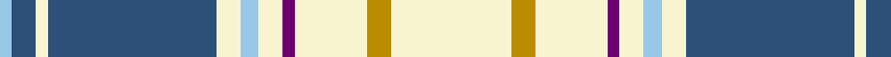

**Bands:** [WBWBBWWWBWYW](/stripes/wbwbbwwwbwyw/) · **Stripes:** [LB N W N N W LB W DP W LO W](/stripes/stripes12/) LB N W N N W LB W DP W LO W

This was sourced from register-of-tartans.  It is a [12 band tartan](/bands/bands12/).

Original link https://www.tartanregister.gov.uk/tartanDetails.aspx?ref=3362

## Register references

External register numbers recorded for this tartan.

- Scottish Register of Tartans: [3362](https://www.tartanregister.gov.uk/tartanDetails.aspx?ref=3362)
- Scottish Tartans Authority (ITI): 5488

## Thread count
LB/4 B8 LY4 B20 B36 LY8 LB6 LY8 P4 LY24 DY8 LY/40

## Palette
Each colour and its ΔE from the base-6 reference it is a variant of.

| Colour | Shade | Base | ΔE (OKLab) |
|---|---|---|---|
| B | <code style="background-color:#2C5078;">#2C5078</code> `#2C5078` | B <code style="background-color:#2A418A;">#2A418A</code> | 0.06 |
| DY | <code style="background-color:#BC8C00;">#BC8C00</code> `#BC8C00` | Y <code style="background-color:#F2BF00;">#F2BF00</code> | 0.16 |
| LB | <code style="background-color:#98C8E8;">#98C8E8</code> `#98C8E8` | W <code style="background-color:#F7F7F7;">#F7F7F7</code> | 0.18 |
| LY | <code style="background-color:#F8F4D0;">#F8F4D0</code> `#F8F4D0` | W <code style="background-color:#F7F7F7;">#F7F7F7</code> | 0.05 |
| P | <code style="background-color:#6C0070;">#6C0070</code> `#6C0070` | B <code style="background-color:#2A418A;">#2A418A</code> | 0.16 |

## Nearest tartans

The nearest existing variants by ΔTartan distance.

1. [Aelfleda Arisaid (Personal)](/setts/s13/ly4db5ly4db5w8g2w24r2w8db5ly4db5ly4~x2/) — ΔT 0.85
1. [Aelfleda Arisaid (Personal)](/setts/s13/ly4db5ly4db5lb8dg2lb24r2lb8db5ly4db5ly4~x2/) — ΔT 1.06
1. [Portree, Blue (Dance)](/setts/s12/w20lo4w12dp2w4lb3w4n18db10w2db4lb2~x2/) — ΔT 1.11
1. [Henderson Dress #1](/setts/s16/k6g4k1w16t1w4t6w1t6w4t1w16k1g4k6ly1~x2/) — ΔT 1.17
1. [Henderson Dress (Clan?)](/setts/s9/ly1k6g4k1w16t1w4t6w1~x2/) — ΔT 1.23
1. [Balmoral (Ghillies white variation)](/setts/s13/w2r1w8o2k2w1o1w1o4w2k1w1r1~x4/) — ΔT 1.24
1. [MacRae Grey (Fashion)](/setts/s11/r2o9lb4w2n22w2lb4w22n2w8r2~x2/) — ΔT 1.27
1. [Beckett Beaumont](/setts/s16/w54dt7w19k5w8y8w8y16k8dy8w21r11y7dt11y8w7~x2/) — ΔT 1.31
1. [Henderson Dress](/setts/s9/ly1k6g4k1w16b1w4b6w1~x2/) — ΔT 1.35
1. [Elsa Dance](/setts/s10/w8g6w44db10g6k3g4k3g34w4/) — ΔT 1.35

## Neighbour map

Every grey dot is one of 14313 variants placed by the first two principal components of the ΔTartan feature space (44% of its variance). Red is this tartan; blue dots are its nearest — click one to open its page.

<svg viewBox="0 0 640 380" role="img" style="max-width:100%;height:auto;border:1px solid #e0e0e0;border-radius:4px;display:block" xmlns="http://www.w3.org/2000/svg"><image href="/nn/cloud.v1.png" width="640" height="380"/><a href="/setts/s13/ly4db5ly4db5w8g2w24r2w8db5ly4db5ly4~x2/"><circle cx="189.9" cy="114.0" r="4" fill="#3465a4"><title>Aelfleda Arisaid (Personal)</title></circle></a><a href="/setts/s13/ly4db5ly4db5lb8dg2lb24r2lb8db5ly4db5ly4~x2/"><circle cx="201.4" cy="120.7" r="4" fill="#3465a4"><title>Aelfleda Arisaid (Personal)</title></circle></a><a href="/setts/s12/w20lo4w12dp2w4lb3w4n18db10w2db4lb2~x2/"><circle cx="155.1" cy="116.0" r="4" fill="#3465a4"><title>Portree, Blue (Dance)</title></circle></a><a href="/setts/s16/k6g4k1w16t1w4t6w1t6w4t1w16k1g4k6ly1~x2/"><circle cx="200.1" cy="94.4" r="4" fill="#3465a4"><title>Henderson Dress #1</title></circle></a><a href="/setts/s9/ly1k6g4k1w16t1w4t6w1~x2/"><circle cx="215.1" cy="112.9" r="4" fill="#3465a4"><title>Henderson Dress (Clan?)</title></circle></a><a href="/setts/s13/w2r1w8o2k2w1o1w1o4w2k1w1r1~x4/"><circle cx="242.2" cy="150.5" r="4" fill="#3465a4"><title>Balmoral (Ghillies white variation)</title></circle></a><a href="/setts/s11/r2o9lb4w2n22w2lb4w22n2w8r2~x2/"><circle cx="176.0" cy="121.4" r="4" fill="#3465a4"><title>MacRae Grey (Fashion)</title></circle></a><a href="/setts/s16/w54dt7w19k5w8y8w8y16k8dy8w21r11y7dt11y8w7~x2/"><circle cx="200.5" cy="101.3" r="4" fill="#3465a4"><title>Beckett Beaumont</title></circle></a><a href="/setts/s9/ly1k6g4k1w16b1w4b6w1~x2/"><circle cx="217.5" cy="114.4" r="4" fill="#3465a4"><title>Henderson Dress</title></circle></a><a href="/setts/s10/w8g6w44db10g6k3g4k3g34w4/"><circle cx="205.6" cy="113.9" r="4" fill="#3465a4"><title>Elsa Dance</title></circle></a><circle cx="201.1" cy="135.1" r="5" fill="#c00000"/></svg>

ID: /setts/s12/w20lo4w12dp2w4lb3w4n18n10w2n4lb2~x2/
