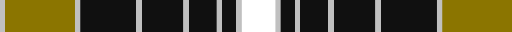

In pattern [WGWKWKWKWKWW](/patterns/wgwkwkwkwkww/).

This was sourced from register-of-tartans.  It is a [12 stripes tartan](/stripes/stripes12/).

Original link https://www.tartanregister.gov.uk/tartanDetails.aspx?ref=10621

## Thread count
N/4 LG50 N4 K40 N4 K30 N4 K20 N4 K10 N4 W/24

## Palette
Each colour and its ΔE from the base-6 reference it is a variant of.

| Colour | Shade | Base | ΔE (OKLab) |
|---|---|---|---|
| K | <code style="background-color:#101010;">#101010</code> `#101010` | K <code style="background-color:#000000;">#000000</code> | 0.17 |
| LG | <code style="background-color:#8B7500;">#8B7500</code> `#8B7500` | G <code style="background-color:#006100;">#006100</code> | 0.18 |
| N | <code style="background-color:#C0C0C0;">#C0C0C0</code> `#C0C0C0` | W <code style="background-color:#F7F7F7;">#F7F7F7</code> | 0.17 |
| W | <code style="background-color:#FFFFFF;">#FFFFFF</code> `#FFFFFF` | W <code style="background-color:#F7F7F7;">#F7F7F7</code> | 0.02 |

## Nearest tartans

The nearest existing variants by ΔTartan distance.

1. [Abergavenny](/setts/s17/w36k41w4wa6k8r24w12wa4r4k6wa4w4k48r4w8k22w18-k101010-ra07c58-we8ccb8-wac0c0c0/) — ΔT 0.88
1. [Braemar, Camel](/setts/s10/r4w8k20r12k4ra16k4ra40k4ra4-k000000-r7c4420-raa0783c-wffffff/) — ΔT 0.92
1. [Braemar, Camel (Fashion)](/setts/s10/r4w8k20r12k4ra16k4ra40k4ra4-k000000-r7c4420-raa0783c-wf4f4d0/) — ΔT 0.95
1. [Tyrone County Crest (Fashion)](/setts/s12/r8k4y26ya6k44r4k4w26k14r6k14w8-k101010-r880000-we0e0e0-y909c3c-yabc8c00/) — ΔT 0.97
1. [Auld Lang Syne, Grey Weavers Tartan Tartan Number: 8081. Earliest known date: pre 2007 From a woven sample from the weavers, Marton Mills. See products available Copyright © Blair Urquhart, Comrie, 2015](/setts/s12/w8k4r18r6ra6k6ra6k46r20k4r12k4-k101010-r888888-ra880000-we0e0e0/) — ΔT 0.97
1. [Auld Lang Syne, Grey (Fashion)](/setts/s12/k8w4k18k6r6w6r6w46k20w4k12w4-k101010-r880000-we0e0e0/) — ΔT 1.03
1. [Bro-Leon](/setts/s9/b8k44y4k4g14y4k4y34k8-b2c2c80-g408060-k101010-ybc8c00/) — ΔT 1.05
1. [Unidentified #49](/setts/s10/w64k16r4k8w4k24g24k4g24w4-g003014-k000000-rb43c00-wc8c8c8/) — ΔT 1.08
1. [Braemar, or Blair Atholl](/setts/s10/r4w8k20r12k4ra20k4ra44k4ra4-k000000-r806050-ra906030-we0e0e0/) — ΔT 1.10
1. [Gordon Dress (Variation) Trade Tartan Tartan Number: 1831. Earliest known date: pre 2003 This sample comes from the MacGregor-Hastie collection which forms the basis of the cloth archive of the Scottish Tartans Society. Some of the samples, including this one, were unmarked. One can assume that the sample dates between 1930 and 1950. See products available Copyright © Blair Urquhart, Comrie, 2015](/setts/s9/w8k4w32k8w8k74g24k8y8-g006818-k101010-we0e0e0-ye8c000/) — ΔT 1.11

## Neighbour map

Every grey dot is one of 15726 variants placed by the first two principal components of the ΔTartan feature space (44% of its variance). Red is this tartan; blue dots are its nearest — click one to open its page.

<svg viewBox="0 0 640 380" role="img" style="max-width:100%;height:auto;border:1px solid #e0e0e0;border-radius:4px;display:block" xmlns="http://www.w3.org/2000/svg"><image href="/nn/cloud.v1.png" width="640" height="380"/><a href="/setts/s17/w36k41w4wa6k8r24w12wa4r4k6wa4w4k48r4w8k22w18-k101010-ra07c58-we8ccb8-wac0c0c0/"><circle cx="213.5" cy="130.2" r="4" fill="#3465a4"><title>Abergavenny</title></circle></a><a href="/setts/s10/r4w8k20r12k4ra16k4ra40k4ra4-k000000-r7c4420-raa0783c-wffffff/"><circle cx="234.0" cy="161.2" r="4" fill="#3465a4"><title>Braemar, Camel</title></circle></a><a href="/setts/s10/r4w8k20r12k4ra16k4ra40k4ra4-k000000-r7c4420-raa0783c-wf4f4d0/"><circle cx="235.2" cy="161.8" r="4" fill="#3465a4"><title>Braemar, Camel (Fashion)</title></circle></a><a href="/setts/s12/r8k4y26ya6k44r4k4w26k14r6k14w8-k101010-r880000-we0e0e0-y909c3c-yabc8c00/"><circle cx="178.2" cy="139.9" r="4" fill="#3465a4"><title>Tyrone County Crest (Fashion)</title></circle></a><a href="/setts/s12/w8k4r18r6ra6k6ra6k46r20k4r12k4-k101010-r888888-ra880000-we0e0e0/"><circle cx="235.3" cy="154.7" r="4" fill="#3465a4"><title>Auld Lang Syne, Grey Weavers Tartan Tartan Number: 8081. Earliest known date: pre 2007 From a woven sample from the weavers, Marton Mills. See products available Copyright © Blair Urquhart, Comrie, 2015</title></circle></a><a href="/setts/s12/k8w4k18k6r6w6r6w46k20w4k12w4-k101010-r880000-we0e0e0/"><circle cx="209.2" cy="139.3" r="4" fill="#3465a4"><title>Auld Lang Syne, Grey (Fashion)</title></circle></a><a href="/setts/s9/b8k44y4k4g14y4k4y34k8-b2c2c80-g408060-k101010-ybc8c00/"><circle cx="246.3" cy="168.5" r="4" fill="#3465a4"><title>Bro-Leon</title></circle></a><a href="/setts/s10/w64k16r4k8w4k24g24k4g24w4-g003014-k000000-rb43c00-wc8c8c8/"><circle cx="190.8" cy="140.9" r="4" fill="#3465a4"><title>Unidentified #49</title></circle></a><a href="/setts/s10/r4w8k20r12k4ra20k4ra44k4ra4-k000000-r806050-ra906030-we0e0e0/"><circle cx="268.6" cy="160.6" r="4" fill="#3465a4"><title>Braemar, or Blair Atholl</title></circle></a><a href="/setts/s9/w8k4w32k8w8k74g24k8y8-g006818-k101010-we0e0e0-ye8c000/"><circle cx="272.1" cy="136.6" r="4" fill="#3465a4"><title>Gordon Dress (Variation) Trade Tartan Tartan Number: 1831. Earliest known date: pre 2003 This sample comes from the MacGregor-Hastie collection which forms the basis of the cloth archive of the Scottish Tartans Society. Some of the samples, including this one, were unmarked. One can assume that the sample dates between 1930 and 1950. See products available Copyright © Blair Urquhart, Comrie, 2015</title></circle></a><circle cx="219.8" cy="146.6" r="5" fill="#c00000"/></svg>

ID: /setts/s12/w24wa4k10wa4k20wa4k30wa4k40wa4g50wa4-g8b7500-k101010-wffffff-wac0c0c0/
