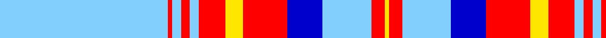

In pattern [WRWRWRYRBWRY](/patterns/wrwrwryrbwry/).

This was sourced from register-of-tartans.  It is a [12 stripes tartan](/stripes/stripes12/).

Original link https://www.tartanregister.gov.uk/tartanDetails.aspx?ref=10564

## Thread count
LB/76 R2 LB4 R4 LB4 R12 Y8 R20 B16 LB22 R6 Y/2

## Palette
Each colour and its ΔE from the base-6 reference it is a variant of.

| Colour | Shade | Base | ΔE (OKLab) |
|---|---|---|---|
| B | <code style="background-color:#0000CD;">#0000CD</code> `#0000CD` | B <code style="background-color:#2A418A;">#2A418A</code> | 0.14 |
| LB | <code style="background-color:#82CFFD;">#82CFFD</code> `#82CFFD` | W <code style="background-color:#F7F7F7;">#F7F7F7</code> | 0.18 |
| R | <code style="background-color:#FF0000;">#FF0000</code> `#FF0000` | R <code style="background-color:#CC0000;">#CC0000</code> | 0.11 |
| Y | <code style="background-color:#FFE600;">#FFE600</code> `#FFE600` | Y <code style="background-color:#F2BF00;">#F2BF00</code> | 0.10 |

## Nearest tartans

The nearest existing variants by ΔTartan distance.

1. [Grotto Dove (Dance)](/setts/s11/w102b20w4b4w4b4g20r18b3r10w4~b180060-g1c3c00-rfc1060-we0e0e0/) — ΔT 1.13
1. [Boucherville (Tartan de..), dress](/setts/s9/w40y4g10w8b4g4b4g4ga1~b4000ff-g808080-ga008000-we0e0e0-yf0c000/) — ΔT 1.31
1. [Rothesay, Dress (VS)](/setts/s10/r2w28b4w2k6w2r4k1r2w1~b2c2c80-k101010-rc80000-we0e0e0~x2/) — ΔT 1.32
1. [McGillivray, Pauline (Personal)](/setts/s13/w6b1ba1w57b2w2ba23w4g30w6b1w6ba2~b5c8ca8-ba2c2c80-g006818-wf8f8f8~x2/) — ΔT 1.35
1. [Boucherville Formal District Tartan Tartan Number: 2118. Earliest known date: 1990 Three designers from La Navette d'Art ENR, Jeanette Blanchette, Pauline Bastien and Jacqueline Provost, based their design on symbolic colours. Le bleu azur represente la loyaute, le gris argent la serenite, le jaune (l'or) la generosite, le vert represente l'esperance, et le blanc symbole de purete et d'innocence "nous rappelle notre appartenance au Quebec." "Les tisserands, c'est nous tous...!" See products available Copyright © Blair Urquhart, Comrie, 2015](/setts/s9/w40y4r10w8b4r4b4r4g1~b2c2c80-g006818-r888888-we0e0e0-ye8c000/) — ΔT 1.40
1. [Glen Moy Tartan Tartan Number: 1293. Earliest known date: pre 1986 A colour variation of the Royal Stewart woven by Edgars, Pitlochry around 1986, named after the place in Angus described as follows: Its mainly Sheep farming in Glen Moy. Off the beaten track, its a very quiet area of the Angus glens close to Cortachy castle and great for walking if you like it to yourself! See products available Copyright © Blair Urquhart, Comrie, 2015](/setts/s12/w98b12k16wa5k5wa5k5b28w16k5w16wa6~b5c5c5c-k101010-wc0c0c0-wae0e0e0/) — ΔT 1.43
1. [Stewart dress, Blue](/setts/s11/w72b20y2b3w2b3g16r6b2r5w2~b000050-g808080-r806050-we0e0e0-yf0c000~x2/) — ΔT 1.46
1. [Snowy Owl](/setts/s14/w40r1w6r3b1r7b3ba1b8ba3k1ba9k2w8~b544b4e-ba3c3233-k101010-r91827b-wffffff~x2/) — ΔT 1.48
1. [Allandale Blue Dress Tartan Tartan Number: 8453. Earliest known date: Threadcount and colours aren't 100% original. Generated manually. See products available Copyright © Blair Urquhart, Comrie, 2015](/setts/s12/b3r2b1r9w2y3r5b17w40k1w2k3~b2888c4-k101010-rb80478-we0e0e0-ye8c000~x2/) — ΔT 1.50
1. [Stuart/Stewart variant #2](/setts/s11/w46g5w1k3w1k5g4r6g2r4w2~g005020-k101010-rdc0000-we0e0e0~x2/) — ΔT 1.52

## Neighbour map

Every grey dot is one of 15726 variants placed by the first two principal components of the ΔTartan feature space (44% of its variance). Red is this tartan; blue dots are its nearest — click one to open its page.

<svg viewBox="0 0 640 380" role="img" style="max-width:100%;height:auto;border:1px solid #e0e0e0;border-radius:4px;display:block" xmlns="http://www.w3.org/2000/svg"><image href="/nn/cloud.v1.png" width="640" height="380"/><a href="/setts/s11/w102b20w4b4w4b4g20r18b3r10w4~b180060-g1c3c00-rfc1060-we0e0e0/"><circle cx="338.8" cy="69.0" r="4" fill="#3465a4"><title>Grotto Dove (Dance)</title></circle></a><a href="/setts/s9/w40y4g10w8b4g4b4g4ga1~b4000ff-g808080-ga008000-we0e0e0-yf0c000/"><circle cx="362.9" cy="83.4" r="4" fill="#3465a4"><title>Boucherville (Tartan de..), dress</title></circle></a><a href="/setts/s10/r2w28b4w2k6w2r4k1r2w1~b2c2c80-k101010-rc80000-we0e0e0~x2/"><circle cx="361.2" cy="85.1" r="4" fill="#3465a4"><title>Rothesay, Dress (VS)</title></circle></a><a href="/setts/s13/w6b1ba1w57b2w2ba23w4g30w6b1w6ba2~b5c8ca8-ba2c2c80-g006818-wf8f8f8~x2/"><circle cx="331.8" cy="56.1" r="4" fill="#3465a4"><title>McGillivray, Pauline (Personal)</title></circle></a><a href="/setts/s9/w40y4r10w8b4r4b4r4g1~b2c2c80-g006818-r888888-we0e0e0-ye8c000/"><circle cx="363.4" cy="83.5" r="4" fill="#3465a4"><title>Boucherville Formal District Tartan Tartan Number: 2118. Earliest known date: 1990 Three designers from La Navette d'Art ENR, Jeanette Blanchette, Pauline Bastien and Jacqueline Provost, based their design on symbolic colours. Le bleu azur represente la loyaute, le gris argent la serenite, le jaune (l'or) la generosite, le vert represente l'esperance, et le blanc symbole de purete et d'innocence &quot;nous rappelle notre appartenance au Quebec.&quot; &quot;Les tisserands, c'est nous tous...!&quot; See products available Copyright © Blair Urquhart, Comrie, 2015</title></circle></a><a href="/setts/s12/w98b12k16wa5k5wa5k5b28w16k5w16wa6~b5c5c5c-k101010-wc0c0c0-wae0e0e0/"><circle cx="329.1" cy="105.0" r="4" fill="#3465a4"><title>Glen Moy Tartan Tartan Number: 1293. Earliest known date: pre 1986 A colour variation of the Royal Stewart woven by Edgars, Pitlochry around 1986, named after the place in Angus described as follows: Its mainly Sheep farming in Glen Moy. Off the beaten track, its a very quiet area of the Angus glens close to Cortachy castle and great for walking if you like it to yourself! See products available Copyright © Blair Urquhart, Comrie, 2015</title></circle></a><a href="/setts/s11/w72b20y2b3w2b3g16r6b2r5w2~b000050-g808080-r806050-we0e0e0-yf0c000~x2/"><circle cx="311.5" cy="52.2" r="4" fill="#3465a4"><title>Stewart dress, Blue</title></circle></a><a href="/setts/s14/w40r1w6r3b1r7b3ba1b8ba3k1ba9k2w8~b544b4e-ba3c3233-k101010-r91827b-wffffff~x2/"><circle cx="302.3" cy="40.1" r="4" fill="#3465a4"><title>Snowy Owl</title></circle></a><a href="/setts/s12/b3r2b1r9w2y3r5b17w40k1w2k3~b2888c4-k101010-rb80478-we0e0e0-ye8c000~x2/"><circle cx="285.1" cy="51.9" r="4" fill="#3465a4"><title>Allandale Blue Dress Tartan Tartan Number: 8453. Earliest known date: Threadcount and colours aren't 100% original. Generated manually. See products available Copyright © Blair Urquhart, Comrie, 2015</title></circle></a><a href="/setts/s11/w46g5w1k3w1k5g4r6g2r4w2~g005020-k101010-rdc0000-we0e0e0~x2/"><circle cx="385.0" cy="55.4" r="4" fill="#3465a4"><title>Stuart/Stewart variant #2</title></circle></a><circle cx="362.2" cy="80.9" r="5" fill="#c00000"/></svg>

ID: /setts/s12/w38r1w2r2w2r6y4r10b8w11r3y1~b0000cd-rff0000-w82cffd-yffe600~x2/
