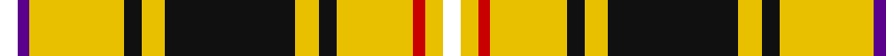

**Bands:** [WBYKYKYKYRYW](/stripes/wbykykykyryw/) · **Stripes:** [W DP LY K LY K LY K LY R LY W](/stripes/stripes12/) W DP LY K LY K LY K LY R LY W

This was sourced from register-of-tartans.  It is a [12 band tartan](/bands/bands12/).

Original link https://www.tartanregister.gov.uk/tartanDetails.aspx?ref=11081

## Register references

External register numbers recorded for this tartan.

- Scottish Register of Tartans: [11081](https://www.tartanregister.gov.uk/tartanDetails.aspx?ref=11081)

## Thread count
W/6 P4 Y32 K6 Y8 K44 Y8 K6 Y26 R4 Y6 W/6

## Palette
Each colour and its ΔE from the base-6 reference it is a variant of.

| Colour | Shade | Base | ΔE (OKLab) |
|---|---|---|---|
| K | <code style="background-color:#101010;">#101010</code> `#101010` | K <code style="background-color:#000000;">#000000</code> | 0.17 |
| P | <code style="background-color:#5A008C;">#5A008C</code> `#5A008C` | B <code style="background-color:#2A418A;">#2A418A</code> | 0.13 |
| R | <code style="background-color:#C80000;">#C80000</code> `#C80000` | R <code style="background-color:#CC0000;">#CC0000</code> | 0.01 |
| W | <code style="background-color:#FFFFFF;">#FFFFFF</code> `#FFFFFF` | W <code style="background-color:#F7F7F7;">#F7F7F7</code> | 0.02 |
| Y | <code style="background-color:#E8C000;">#E8C000</code> `#E8C000` | Y <code style="background-color:#F2BF00;">#F2BF00</code> | 0.02 |

## Nearest tartans

The nearest existing variants by ΔTartan distance.

1. [Loch Sween](/setts/s12/w3ly3r2ly13k3ly4k22ly4k3ly16p2w3~x2/) — ΔT 0.26
1. [Bracken](/setts/s9/ly20db27r6db15ly8db11ly78db10r12/) — ΔT 1.27
1. [Bracken](/setts/s9/ly5db9r3db5ly2db4ly26t3r4~x2/) — ΔT 1.30
1. [Burns Battalion (Fashion)](/setts/s10/dy22b2dy3ly4dy3b2dy12b4w19dy3~x2/) — ΔT 1.36
1. [Hay, or Stewart](/setts/s13/w9r5w29k10ly2k3w3k3g12r6k3r3w2~x2/) — ΔT 1.43
1. [Rosemount Course, Blairgowrie Golf Club](/setts/s11/w3lo30dg3db3r3lo3db8g3lo3db3w3~x2/) — ΔT 1.45
1. [Hay or Stewart](/setts/s13/w9r5w29k10ly2k3w3k3dg12r6k3r3w2~x2/) — ΔT 1.54
1. [Courtet-Meyer (Personal)](/setts/s14/k15w1k1w1k1w1k1g15r1g15lo2r5lo2w3~x2/) — ΔT 1.55
1. [Fraser Yellow](/setts/s7/ly2db14ly2dg14ly27w2r2~x2/) — ΔT 1.56
1. [MacKellar Dress, Maroon (Dance)](/setts/s11/dy27w2dy3lo4dy3w2dy5k13n2w26n3~x2/) — ΔT 1.57

## Neighbour map

Every grey dot is one of 14313 variants placed by the first two principal components of the ΔTartan feature space (44% of its variance). Red is this tartan; blue dots are its nearest — click one to open its page.

<svg viewBox="0 0 640 380" role="img" style="max-width:100%;height:auto;border:1px solid #e0e0e0;border-radius:4px;display:block" xmlns="http://www.w3.org/2000/svg"><image href="/nn/cloud.v1.png" width="640" height="380"/><a href="/setts/s12/w3ly3r2ly13k3ly4k22ly4k3ly16p2w3~x2/"><circle cx="216.2" cy="117.9" r="4" fill="#3465a4"><title>Loch Sween</title></circle></a><a href="/setts/s9/ly20db27r6db15ly8db11ly78db10r12/"><circle cx="275.4" cy="140.1" r="4" fill="#3465a4"><title>Bracken</title></circle></a><a href="/setts/s9/ly5db9r3db5ly2db4ly26t3r4~x2/"><circle cx="270.5" cy="139.6" r="4" fill="#3465a4"><title>Bracken</title></circle></a><a href="/setts/s10/dy22b2dy3ly4dy3b2dy12b4w19dy3~x2/"><circle cx="282.5" cy="154.5" r="4" fill="#3465a4"><title>Burns Battalion (Fashion)</title></circle></a><a href="/setts/s13/w9r5w29k10ly2k3w3k3g12r6k3r3w2~x2/"><circle cx="182.8" cy="99.7" r="4" fill="#3465a4"><title>Hay, or Stewart</title></circle></a><a href="/setts/s11/w3lo30dg3db3r3lo3db8g3lo3db3w3~x2/"><circle cx="230.6" cy="95.5" r="4" fill="#3465a4"><title>Rosemount Course, Blairgowrie Golf Club</title></circle></a><a href="/setts/s13/w9r5w29k10ly2k3w3k3dg12r6k3r3w2~x2/"><circle cx="189.6" cy="100.5" r="4" fill="#3465a4"><title>Hay or Stewart</title></circle></a><a href="/setts/s14/k15w1k1w1k1w1k1g15r1g15lo2r5lo2w3~x2/"><circle cx="214.7" cy="101.5" r="4" fill="#3465a4"><title>Courtet-Meyer (Personal)</title></circle></a><a href="/setts/s7/ly2db14ly2dg14ly27w2r2~x2/"><circle cx="224.4" cy="142.2" r="4" fill="#3465a4"><title>Fraser Yellow</title></circle></a><a href="/setts/s11/dy27w2dy3lo4dy3w2dy5k13n2w26n3~x2/"><circle cx="189.2" cy="113.8" r="4" fill="#3465a4"><title>MacKellar Dress, Maroon (Dance)</title></circle></a><circle cx="218.5" cy="120.9" r="5" fill="#c00000"/></svg>

ID: /setts/s12/w3ly3r2ly13k3ly4k22ly4k3ly16dp2w3~x2/
