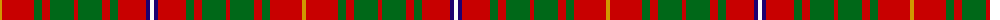

In pattern [WBRGRGRGRGRY](/patterns/wbrgrgrgrgry/).

This was sourced from register-of-tartans.  It is a [12 stripes tartan](/stripes/stripes12/).

Original link https://www.tartanregister.gov.uk/tartanDetails.aspx?ref=401

## Attestations

This cloth appears in 2 source records; the oldest owns this page.

- 01/01/1964 — Bruce County (register-of-tartans, [record](https://www.tartanregister.gov.uk/tartanDetails.aspx?ref=401))
- 1964 — Bruce County (District) (tartans-authority, [record](http://www.tartansauthority.com/tartan-ferret/display/1778/))

## Thread count
DY/4 R32 G8 R8 G24 R4 G24 R8 G8 R28 DB4 W/4

## Palette
Each colour and its ΔE from the base-6 reference it is a variant of.

| Colour | Shade | Base | ΔE (OKLab) |
|---|---|---|---|
| DB | <code style="background-color:#1C0070;">#1C0070</code> `#1C0070` | B <code style="background-color:#2A418A;">#2A418A</code> | 0.14 |
| DY | <code style="background-color:#D09800;">#D09800</code> `#D09800` | Y <code style="background-color:#F2BF00;">#F2BF00</code> | 0.12 |
| G | <code style="background-color:#006818;">#006818</code> `#006818` | G <code style="background-color:#006100;">#006100</code> | 0.02 |
| R | <code style="background-color:#C80000;">#C80000</code> `#C80000` | R <code style="background-color:#CC0000;">#CC0000</code> | 0.01 |
| W | <code style="background-color:#FCFCFC;">#FCFCFC</code> `#FCFCFC` | W <code style="background-color:#F7F7F7;">#F7F7F7</code> | 0.01 |

## Nearest tartans

The nearest existing variants by ΔTartan distance.

1. [Bruce County District Tartan Tartan Number: 1778. Earliest known date: 1964 Bruce County is an administrative district of the Province of Ontario. The design is attributed to Lord Bruce, the son of the Earl of Elgin, and chief of the Clan Bruce, for his role in adapting the Bruce clan tartan. Two blue stripes have been added to represent the coastline of Lake Huron and Georgian Bay. See products available Copyright © Blair Urquhart, Comrie, 2015](/setts/s12/w2b2r14g4r4g12r2g12r4g4r16y2-b2c2c80-g006818-rc80000-we0e0e0-ye8c000/) — ΔT 0.10
1. [Bruce County](/setts/s12/w2b2r14g4r4g12r2g12r4g4r16y2-b304080-g008000-rc00000-we0e0e0-yf0c000/) — ΔT 0.44
1. [Bruce (Vestiarium)](/setts/s11/w4r32g8r8g24r4g24r8g8r32y4-g006818-rc80000-we0e0e0-ye8c000/) — ΔT 0.95
1. [Seton (Clan)](/setts/s10/g24w8g48r16b16r8k16r80g8r16-b780078-g006818-k101010-rc80000-wfcfcfc/) — ΔT 1.03
1. [Bruce](/setts/s11/w4r32g8r8g24r4g24r8g8r32y4-g008000-rc00000-we0e0e0-yf0c000/) — ΔT 1.04
1. [Burns](/setts/s12/r6g6r6g28r6g6r6b10r36y4r16y4-b304080-g008000-rc00000-yf0c000/) — ΔT 1.08
1. [MacKinnon 10](/setts/s14/b6r8g6ba6r14g34r6ba10g8r42g14b6r12w6-b800080-ba304080-g008000-rc00000-we0e0e0/) — ΔT 1.09
1. [Fulton Family Tartan Tartan Number: 2205. Earliest known date: 1982 For anyone of the name Fulton. See products available Copyright © Blair Urquhart, Comrie, 2015](/setts/s9/r8k4g34ra12g12ra12g30ra40y6-g006818-k101010-r880000-rac80000-yd09800/) — ΔT 1.09
1. [MacKinnon 7](/setts/s11/w4r8g16r32b4r6g32r8b4r8w4-b5480b0-g008000-rc00000-we0e0e0/) — ΔT 1.12
1. [Burns Family Tartan Tartan Number: 1539. Earliest known date: pre 2003 Modern family sett discovered by MacKinlay at Messrs Forsyth. Probably dates between 1930-50. There is also a Robert Burns check. (see under R...) See products available Copyright © Blair Urquhart, Comrie, 2015](/setts/s12/r6g6r6g28r6g6r6b10r36y4r16y4-b2c2c80-g006818-rc80000-ye8c000/) — ΔT 1.14

## Neighbour map

Every grey dot is one of 15726 variants placed by the first two principal components of the ΔTartan feature space (44% of its variance). Red is this tartan; blue dots are its nearest — click one to open its page.

<svg viewBox="0 0 640 380" role="img" style="max-width:100%;height:auto;border:1px solid #e0e0e0;border-radius:4px;display:block" xmlns="http://www.w3.org/2000/svg"><image href="/nn/cloud.v1.png" width="640" height="380"/><a href="/setts/s12/w2b2r14g4r4g12r2g12r4g4r16y2-b2c2c80-g006818-rc80000-we0e0e0-ye8c000/"><circle cx="266.5" cy="173.6" r="4" fill="#3465a4"><title>Bruce County District Tartan Tartan Number: 1778. Earliest known date: 1964 Bruce County is an administrative district of the Province of Ontario. The design is attributed to Lord Bruce, the son of the Earl of Elgin, and chief of the Clan Bruce, for his role in adapting the Bruce clan tartan. Two blue stripes have been added to represent the coastline of Lake Huron and Georgian Bay. See products available Copyright © Blair Urquhart, Comrie, 2015</title></circle></a><a href="/setts/s12/w2b2r14g4r4g12r2g12r4g4r16y2-b304080-g008000-rc00000-we0e0e0-yf0c000/"><circle cx="263.3" cy="173.1" r="4" fill="#3465a4"><title>Bruce County</title></circle></a><a href="/setts/s11/w4r32g8r8g24r4g24r8g8r32y4-g006818-rc80000-we0e0e0-ye8c000/"><circle cx="305.4" cy="195.7" r="4" fill="#3465a4"><title>Bruce (Vestiarium)</title></circle></a><a href="/setts/s10/g24w8g48r16b16r8k16r80g8r16-b780078-g006818-k101010-rc80000-wfcfcfc/"><circle cx="251.9" cy="156.4" r="4" fill="#3465a4"><title>Seton (Clan)</title></circle></a><a href="/setts/s11/w4r32g8r8g24r4g24r8g8r32y4-g008000-rc00000-we0e0e0-yf0c000/"><circle cx="301.4" cy="194.9" r="4" fill="#3465a4"><title>Bruce</title></circle></a><a href="/setts/s12/r6g6r6g28r6g6r6b10r36y4r16y4-b304080-g008000-rc00000-yf0c000/"><circle cx="311.1" cy="173.5" r="4" fill="#3465a4"><title>Burns</title></circle></a><a href="/setts/s14/b6r8g6ba6r14g34r6ba10g8r42g14b6r12w6-b800080-ba304080-g008000-rc00000-we0e0e0/"><circle cx="208.7" cy="162.2" r="4" fill="#3465a4"><title>MacKinnon 10</title></circle></a><a href="/setts/s9/r8k4g34ra12g12ra12g30ra40y6-g006818-k101010-r880000-rac80000-yd09800/"><circle cx="261.1" cy="191.7" r="4" fill="#3465a4"><title>Fulton Family Tartan Tartan Number: 2205. Earliest known date: 1982 For anyone of the name Fulton. See products available Copyright © Blair Urquhart, Comrie, 2015</title></circle></a><a href="/setts/s11/w4r8g16r32b4r6g32r8b4r8w4-b5480b0-g008000-rc00000-we0e0e0/"><circle cx="264.6" cy="179.6" r="4" fill="#3465a4"><title>MacKinnon 7</title></circle></a><a href="/setts/s12/r6g6r6g28r6g6r6b10r36y4r16y4-b2c2c80-g006818-rc80000-ye8c000/"><circle cx="312.0" cy="173.1" r="4" fill="#3465a4"><title>Burns Family Tartan Tartan Number: 1539. Earliest known date: pre 2003 Modern family sett discovered by MacKinlay at Messrs Forsyth. Probably dates between 1930-50. There is also a Robert Burns check. (see under R...) See products available Copyright © Blair Urquhart, Comrie, 2015</title></circle></a><circle cx="264.0" cy="172.6" r="5" fill="#c00000"/></svg>

ID: /setts/s12/w4b4r28g8r8g24r4g24r8g8r32y4-b1c0070-g006818-rc80000-wfcfcfc-yd09800/
