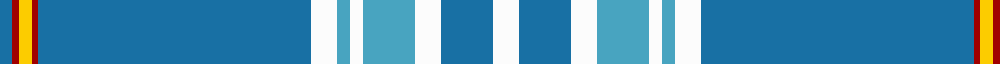

**Bands:** [BRYRBWYWYWBW](/stripes/bryrbwywywbw/) · **Stripes:** [B R LY R B W LG W LG W B W](/stripes/stripes12/) B R LY R B W LG W LG W B W

This was sourced from tartans-authority.  It is a [12 band tartan](/bands/bands12/).

Original link http://www.tartansauthority.com/tartan-ferret/display/11040/

## Thread count
B/4 DR2 Y4 DR2 B84 W8 Ba4 W4 Ba16 W8 B16 W/8

## Palette
Each colour and its ΔE from the base-6 reference it is a variant of.

| Colour | Shade | Base | ΔE (OKLab) |
|---|---|---|---|
| B | <code style="background-color:#1870A4;">#1870A4</code> `#1870A4` | B <code style="background-color:#2A418A;">#2A418A</code> | 0.13 |
| Ba | <code style="background-color:#48A4C0;">#48A4C0</code> `#48A4C0` | Y <code style="background-color:#F2BF00;">#F2BF00</code> | 0.29 |
| DR | <code style="background-color:#A00000;">#A00000</code> `#A00000` | R <code style="background-color:#CC0000;">#CC0000</code> | 0.09 |
| W | <code style="background-color:#FCFCFC;">#FCFCFC</code> `#FCFCFC` | W <code style="background-color:#F7F7F7;">#F7F7F7</code> | 0.01 |
| Y | <code style="background-color:#FCCC00;">#FCCC00</code> `#FCCC00` | Y <code style="background-color:#F2BF00;">#F2BF00</code> | 0.04 |

## Nearest tartans

The nearest existing variants by ΔTartan distance.

1. [Stratford, (Oregon) City of (Dist.)](/setts/s10/b42w5b1w1lo9b1g2w1b1r1~x4/) — ΔT 1.25
1. [London Fog Blue (Fashion)](/setts/s12/t144k9t13lb9t4k9t4lr13lb9t4lb13k4/) — ΔT 1.38
1. [Laing (Clan)](/setts/s15/b1k3b1k4b1w1b26r1b1ly4b1ly3b1ly1r1~x4/) — ΔT 1.40
1. [Parr](/setts/s10/b106r3b4r6b8k28g8lb4g12k8/) — ΔT 1.44
1. [StammBar](/setts/s12/w4dt8w4lt8w2lt2w4dt42r1ly2r1dt2~x2/) — ΔT 1.45
1. [Spirit of India](/setts/s13/b32w2db1w2b4db1g8w8r8db1b16db1w4~x2/) — ΔT 1.49
1. [Glen Innes (Australia)](/setts/s8/t142db12db24w7db5w5db5r10/) — ΔT 1.54
1. [Goil Dress](/setts/s11/t42db10lo2db2lb2db2t10lb6db2lb3t2~x2/) — ΔT 1.59
1. [Summerwood](/setts/s12/b76w3r4w3dg4w3dg8b20lt20b3lt8w10/) — ΔT 1.62
1. [De Clercq, Christian (Belgium)](/setts/s13/lb3db1lb1r1lb1db10r1lb9b35lo2b2lo1lb2~x2/) — ΔT 1.63

## Neighbour map

Every grey dot is one of 14313 variants placed by the first two principal components of the ΔTartan feature space (44% of its variance). Red is this tartan; blue dots are its nearest — click one to open its page.

<svg viewBox="0 0 640 380" role="img" style="max-width:100%;height:auto;border:1px solid #e0e0e0;border-radius:4px;display:block" xmlns="http://www.w3.org/2000/svg"><image href="/nn/cloud.v1.png" width="640" height="380"/><a href="/setts/s10/b42w5b1w1lo9b1g2w1b1r1~x4/"><circle cx="482.2" cy="83.4" r="4" fill="#3465a4"><title>Stratford, (Oregon) City of (Dist.)</title></circle></a><a href="/setts/s12/t144k9t13lb9t4k9t4lr13lb9t4lb13k4/"><circle cx="482.9" cy="87.7" r="4" fill="#3465a4"><title>London Fog Blue (Fashion)</title></circle></a><a href="/setts/s15/b1k3b1k4b1w1b26r1b1ly4b1ly3b1ly1r1~x4/"><circle cx="371.9" cy="64.5" r="4" fill="#3465a4"><title>Laing (Clan)</title></circle></a><a href="/setts/s10/b106r3b4r6b8k28g8lb4g12k8/"><circle cx="403.3" cy="98.5" r="4" fill="#3465a4"><title>Parr</title></circle></a><a href="/setts/s12/w4dt8w4lt8w2lt2w4dt42r1ly2r1dt2~x2/"><circle cx="376.3" cy="57.3" r="4" fill="#3465a4"><title>StammBar</title></circle></a><a href="/setts/s13/b32w2db1w2b4db1g8w8r8db1b16db1w4~x2/"><circle cx="313.7" cy="79.6" r="4" fill="#3465a4"><title>Spirit of India</title></circle></a><a href="/setts/s8/t142db12db24w7db5w5db5r10/"><circle cx="418.0" cy="106.3" r="4" fill="#3465a4"><title>Glen Innes (Australia)</title></circle></a><a href="/setts/s11/t42db10lo2db2lb2db2t10lb6db2lb3t2~x2/"><circle cx="410.9" cy="124.1" r="4" fill="#3465a4"><title>Goil Dress</title></circle></a><a href="/setts/s12/b76w3r4w3dg4w3dg8b20lt20b3lt8w10/"><circle cx="312.2" cy="69.6" r="4" fill="#3465a4"><title>Summerwood</title></circle></a><a href="/setts/s13/lb3db1lb1r1lb1db10r1lb9b35lo2b2lo1lb2~x2/"><circle cx="346.4" cy="77.4" r="4" fill="#3465a4"><title>De Clercq, Christian (Belgium)</title></circle></a><circle cx="403.8" cy="70.1" r="5" fill="#c00000"/></svg>

ID: /setts/s12/w4b8w4lg8w2lg2w4b42r1ly2r1b2~x2/
