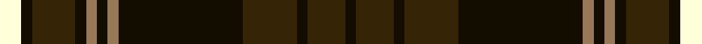

In pattern [KGKGKRKRKGKW](/stripes/kgkgkrkrkgkw/).

This was sourced from house-of-tartan.  It is a [12 stripe tartan](/stripes/stripes12/).

Original link http://www.house-of-tartan.scotland.net/house/TartanViewjs.asp?colr=Def&tnam=2401

## Thread count
LY/8 Ka4 K16 Ka4 LT4 Ka4 LT4 Ka46 K20 Ka4 K14 Ka/4

## Palette
Each colour and the base-6 reference it is a variant of.

| Colour | Shade | Base |
|---|---|---|
| K | <code style="background-color:#352406;">#352406</code> `oklch(27.5% 0.050 77.9)` <small>#352406</small> | G <code style="background-color:#006100;">#006100</code> |
| Ka | <code style="background-color:#130D00;">#130D00</code> `oklch(16.2% 0.033 91.4)` <small>#130D00</small> | K <code style="background-color:#000000;">#000000</code> |
| LT | <code style="background-color:#977957;">#977957</code> `oklch(59.6% 0.061 69.7)` <small>#977957</small> | R <code style="background-color:#CC0000;">#CC0000</code> |
| LY | <code style="background-color:#FFFFDA;">#FFFFDA</code> `oklch(99.1% 0.048 107.2)` <small>#FFFFDA</small> | W <code style="background-color:#F7F7F7;">#F7F7F7</code> |

## Nearest tartans

The nearest existing variants by ΔTartan distance.

1. [Daks (Chino Check) (Fashion)](/setts/s12/k22k3lo7k2lo2k2lo2k10db6lo2db3k2~x2/) — ΔT 1.24
1. [Brunton (Personal)](/setts/s8/k7r3k27dg27ly3dg3ly3dg3~x2/) — ΔT 1.36
1. [Clan Iain Mhor (Name)](/setts/s13/dg22w2dg2dr3dt2w2dt19w2dt2dr3dt2w2dt19~x2/) — ΔT 1.37
1. [MacKillen](/setts/s9/k4lo15dg5k3dg7k3dg30r20dg3~x2/) — ΔT 1.42
1. [Glen Tilt #1](/setts/s10/lb1dr1g1dr11db6dr1g14dr1g1lb1~x4/) — ΔT 1.43
1. [Buchan (d)](/setts/s13/k2db2r2k24r2dg6r6db2k6r2dg27r2k2~x2/) — ΔT 1.43
1. [Buchan](/setts/s13/k2db2r2k24r2dg6r6db2k6r2dg27r2k2/) — ΔT 1.43
1. [Childers](/setts/s10/k4g13k4g8k44g8k4g13k4w3~x2/) — ΔT 1.45
1. [Glendronach Distillery](/setts/s10/dg22o2lb1lo3o1dg6o22lo3o1dg10~x4/) — ΔT 1.47
1. [Fort William](/setts/s11/y17t2ly2t2k21t2k3y30k2t2k4~x2/) — ΔT 1.49

## Neighbour map

Every grey dot is one of 14299 variants placed by the first two principal components of the ΔTartan feature space (44% of its variance). Red is this tartan; blue dots are its nearest — click one to open its page.

<svg viewBox="0 0 640 380" role="img" style="max-width:100%;height:auto;border:1px solid #e0e0e0;border-radius:4px;display:block" xmlns="http://www.w3.org/2000/svg"><image href="/nn/cloud.v1.png" width="640" height="380"/><a href="/setts/s12/k22k3lo7k2lo2k2lo2k10db6lo2db3k2~x2/"><circle cx="270.3" cy="177.1" r="4" fill="#3465a4"><title>Daks (Chino Check) (Fashion)</title></circle></a><a href="/setts/s8/k7r3k27dg27ly3dg3ly3dg3~x2/"><circle cx="290.8" cy="211.0" r="4" fill="#3465a4"><title>Brunton (Personal)</title></circle></a><a href="/setts/s13/dg22w2dg2dr3dt2w2dt19w2dt2dr3dt2w2dt19~x2/"><circle cx="283.0" cy="151.6" r="4" fill="#3465a4"><title>Clan Iain Mhor (Name)</title></circle></a><a href="/setts/s9/k4lo15dg5k3dg7k3dg30r20dg3~x2/"><circle cx="269.2" cy="196.4" r="4" fill="#3465a4"><title>MacKillen</title></circle></a><a href="/setts/s10/lb1dr1g1dr11db6dr1g14dr1g1lb1~x4/"><circle cx="267.7" cy="160.3" r="4" fill="#3465a4"><title>Glen Tilt #1</title></circle></a><a href="/setts/s13/k2db2r2k24r2dg6r6db2k6r2dg27r2k2~x2/"><circle cx="248.4" cy="148.7" r="4" fill="#3465a4"><title>Buchan (d)</title></circle></a><a href="/setts/s13/k2db2r2k24r2dg6r6db2k6r2dg27r2k2/"><circle cx="248.4" cy="148.7" r="4" fill="#3465a4"><title>Buchan</title></circle></a><a href="/setts/s10/k4g13k4g8k44g8k4g13k4w3~x2/"><circle cx="329.5" cy="171.1" r="4" fill="#3465a4"><title>Childers</title></circle></a><a href="/setts/s10/dg22o2lb1lo3o1dg6o22lo3o1dg10~x4/"><circle cx="360.7" cy="154.7" r="4" fill="#3465a4"><title>Glendronach Distillery</title></circle></a><a href="/setts/s11/y17t2ly2t2k21t2k3y30k2t2k4~x2/"><circle cx="340.0" cy="161.4" r="4" fill="#3465a4"><title>Fort William</title></circle></a><circle cx="297.0" cy="173.2" r="5" fill="#c00000"/></svg>

ID: /setts/s12/w4k2dy8k2o2k2o2k23dy10k2dy7k2~x2/
