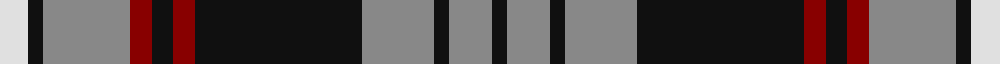

This page is one **sett** — a single exact thread-count. It belongs to the [tartan](/tartans/w4k2o9o3r3k3r3k23o10k2o6k2/)
(the same proportion at any scale), whose colour order is pattern [KRKRKRKRRRKW](/stripes/krkrkrkrrrkw/).

Sourced from house-of-tartan.  It is a [12 stripe tartan](/stripes/stripes12/).

Original link http://www.house-of-tartan.scotland.net/house/TartanViewjs.asp?colr=Def&tnam=8081

## Thread count
LN/8 K4 N18 N6 DR6 K6 DR6 K46 N20 K4 N12 K/4

## Palette

Palette: <strong>Tartan Register</strong> <small style="color:#888">(6 of 8 colours)</small>
<table><thead><tr><th>Colour</th><th>Threads</th><th>Shade</th><th>Base</th><th>OKLCh</th></tr></thead><tbody><tr><td>LN/</td><td style="text-align:right;font-variant-numeric:tabular-nums">8</td><td><code style="background-color:#E0E0E0;">#E0E0E0</code> <small style="color:#888">#E0E0E0</small></td><td>W <code style="background-color:#F7F7F7;">#F7F7F7</code></td><td><small style="color:#888">oklch(90.7% 0.000 89.9)</small></td></tr><tr><td>K</td><td style="text-align:right;font-variant-numeric:tabular-nums">4</td><td><code style="background-color:#101010;">#101010</code> <small style="color:#888">#101010</small></td><td>K <code style="background-color:#000000;">#000000</code></td><td><small style="color:#888">oklch(17.3% 0.000 89.9)</small></td></tr><tr><td>N</td><td style="text-align:right;font-variant-numeric:tabular-nums">18</td><td><code style="background-color:#888888;">#888888</code> <small style="color:#888">#888888</small></td><td>R <code style="background-color:#CC0000;">#CC0000</code></td><td><small style="color:#888">oklch(62.7% 0.000 89.9)</small></td></tr><tr><td>N</td><td style="text-align:right;font-variant-numeric:tabular-nums">6</td><td><code style="background-color:#888888;">#888888</code> <small style="color:#888">#888888</small></td><td>R <code style="background-color:#CC0000;">#CC0000</code></td><td><small style="color:#888">oklch(62.7% 0.000 89.9)</small></td></tr><tr><td>DR</td><td style="text-align:right;font-variant-numeric:tabular-nums">6</td><td><code style="background-color:#880000;">#880000</code> <small style="color:#888">#880000</small></td><td>R <code style="background-color:#CC0000;">#CC0000</code></td><td><small style="color:#888">oklch(39.4% 0.162 29.2)</small></td></tr><tr><td>K</td><td style="text-align:right;font-variant-numeric:tabular-nums">6</td><td><code style="background-color:#101010;">#101010</code> <small style="color:#888">#101010</small></td><td>K <code style="background-color:#000000;">#000000</code></td><td><small style="color:#888">oklch(17.3% 0.000 89.9)</small></td></tr><tr><td>DR</td><td style="text-align:right;font-variant-numeric:tabular-nums">6</td><td><code style="background-color:#880000;">#880000</code> <small style="color:#888">#880000</small></td><td>R <code style="background-color:#CC0000;">#CC0000</code></td><td><small style="color:#888">oklch(39.4% 0.162 29.2)</small></td></tr><tr><td>K</td><td style="text-align:right;font-variant-numeric:tabular-nums">46</td><td><code style="background-color:#101010;">#101010</code> <small style="color:#888">#101010</small></td><td>K <code style="background-color:#000000;">#000000</code></td><td><small style="color:#888">oklch(17.3% 0.000 89.9)</small></td></tr><tr><td>N</td><td style="text-align:right;font-variant-numeric:tabular-nums">20</td><td><code style="background-color:#888888;">#888888</code> <small style="color:#888">#888888</small></td><td>R <code style="background-color:#CC0000;">#CC0000</code></td><td><small style="color:#888">oklch(62.7% 0.000 89.9)</small></td></tr><tr><td>K</td><td style="text-align:right;font-variant-numeric:tabular-nums">4</td><td><code style="background-color:#101010;">#101010</code> <small style="color:#888">#101010</small></td><td>K <code style="background-color:#000000;">#000000</code></td><td><small style="color:#888">oklch(17.3% 0.000 89.9)</small></td></tr><tr><td>N</td><td style="text-align:right;font-variant-numeric:tabular-nums">12</td><td><code style="background-color:#888888;">#888888</code> <small style="color:#888">#888888</small></td><td>R <code style="background-color:#CC0000;">#CC0000</code></td><td><small style="color:#888">oklch(62.7% 0.000 89.9)</small></td></tr><tr><td>K/</td><td style="text-align:right;font-variant-numeric:tabular-nums">4</td><td><code style="background-color:#101010;">#101010</code> <small style="color:#888">#101010</small></td><td>K <code style="background-color:#000000;">#000000</code></td><td><small style="color:#888">oklch(17.3% 0.000 89.9)</small></td></tr></tbody></table>

## Nearest tartans

The nearest existing variants by ΔTartan distance, with this tartan at the top so the swatches line up against it.

ΔTartan

Tartan

Sett

—

<a href="/ttd/edit/#slug=w4k2o9o3r3k3r3k23o10k2o6k2~x2">Auld Lang Syne, Grey Weavers Tartan Tartan Number: 8081. Earliest known date: pre 2007 From a woven sample from the weavers, Marton Mills. See products available Copyright © Blair Urquhart, Comrie, 2015</a> <a class="nn-out" href="/setts/s12/w4k2o9o3r3k3r3k23o10k2o6k2~x2/" title="open its dictionary page">↗</a>

0.98

<a href="/ttd/edit/#slug=w12lb2k5lb2k10lb2k15lb2k20lb2y25lb2~x2">Liberty Square</a> <a class="nn-out" href="/setts/s12/w12lb2k5lb2k10lb2k15lb2k20lb2y25lb2~x2/" title="open its dictionary page">↗</a>

0.99

<a href="/ttd/edit/#slug=r3k15r2k2r6o16k3o2k3o9w2~x2">Lunch with an Old Bag Charity, The</a> <a class="nn-out" href="/setts/s11/r3k15r2k2r6o16k3o2k3o9w2~x2/" title="open its dictionary page">↗</a>

0.99

<a href="/ttd/edit/#slug=k6t2n2t3n2t2n30k20w6k4~x2">Nunavut (District)</a> <a class="nn-out" href="/setts/s10/k6t2n2t3n2t2n30k20w6k4~x2/" title="open its dictionary page">↗</a>

1.02

<a href="/ttd/edit/#slug=k4lo17k2lo2g7k2lo2k22db4~x2">Bro-Leon</a> <a class="nn-out" href="/setts/s9/k4lo17k2lo2g7k2lo2k22db4~x2/" title="open its dictionary page">↗</a>

1.05

<a href="/setts/s12/k36w3k10w3g28r6k18~x2/">Wild Highlanders</a>

1.08

<a href="/ttd/edit/#slug=k3db2ly3k2ly5db18g3k3g2db3~x2">St Andrews University Corporate Tartan Tartan Number: 2398. Earliest known date: pre 1998 Originally named St. Andrews International. Apparently a Gordon Paton MD, bought the company from North East Fife Enterprise Trust in 1997, the aim being to brand quality Scottish products for export worldwide. The company intended to set up a membership scheme but the company went into liquidation. The intended venue belonged to St Andrews University and it appears that the ownership of the tartan has fallen to the University and its name has been changed from 'International' to 'University' (Deirdre Kinloch Anderson, Aug 2004).No thread count given so this entry is based on an estimate from a small computer graphic. Has since been corrected to conform to the SRT (Scottish Register of Tartans) See products available Copyright © Blair Urquhart, Comrie, 2015</a> <a class="nn-out" href="/setts/s10/k3db2ly3k2ly5db18g3k3g2db3~x2/" title="open its dictionary page">↗</a>

1.14

<a href="/ttd/edit/#slug=lo32db10k52db10w5k24db16w10k11lo15">Cavan County Crest (Fashion)</a> <a class="nn-out" href="/setts/s10/lo32db10k52db10w5k24db16w10k11lo15/" title="open its dictionary page">↗</a>

1.15

<a href="/ttd/edit/#slug=g24k3g2k3g4k4m20k3m6~x2">Alma College</a> <a class="nn-out" href="/setts/s9/g24k3g2k3g4k4m20k3m6~x2/" title="open its dictionary page">↗</a>

1.19

<a href="/ttd/edit/#slug=lbi36k41lbi4lb6k8o24lbi12lb4o4k6lb4lbi4k48o4lbi8k22lbi18">Abergavenny</a> <a class="nn-out" href="/setts/s17/lbi36k41lbi4lb6k8o24lbi12lb4o4k6lb4lbi4k48o4lbi8k22lbi18/" title="open its dictionary page">↗</a>

1.19

<a href="/ttd/edit/#slug=g9r6g40dp6g6dp6k6dp36ly4dp8ly4">Boyle Family, Susan (Personal)</a> <a class="nn-out" href="/setts/s11/g9r6g40dp6g6dp6k6dp36ly4dp8ly4/" title="open its dictionary page">↗</a>

## Neighbour map

Every grey dot is one of 14359 variants placed by the first two principal components of the ΔTartan feature space (44% of its variance). Red is this tartan; blue dots are its nearest — click one to open its page.

<svg viewBox="0 0 640 380" role="img" style="max-width:100%;height:auto;border:1px solid #e0e0e0;border-radius:4px;display:block" xmlns="http://www.w3.org/2000/svg"><image href="/nn/cloud.v1.png" width="640" height="380"/><a href="/setts/s12/w12lb2k5lb2k10lb2k15lb2k20lb2y25lb2~x2/"><circle cx="221.9" cy="146.2" r="4" fill="#3465a4"><title>Liberty Square</title></circle></a><a href="/setts/s11/r3k15r2k2r6o16k3o2k3o9w2~x2/"><circle cx="194.8" cy="173.1" r="4" fill="#3465a4"><title>Lunch with an Old Bag Charity, The</title></circle></a><a href="/setts/s10/k6t2n2t3n2t2n30k20w6k4~x2/"><circle cx="262.7" cy="151.3" r="4" fill="#3465a4"><title>Nunavut (District)</title></circle></a><a href="/setts/s9/k4lo17k2lo2g7k2lo2k22db4~x2/"><circle cx="248.4" cy="169.5" r="4" fill="#3465a4"><title>Bro-Leon</title></circle></a><a href="/setts/s12/k36w3k10w3g28r6k18~x2/"><circle cx="240.3" cy="173.6" r="4" fill="#3465a4"><title>Wild Highlanders</title></circle></a><a href="/setts/s10/k3db2ly3k2ly5db18g3k3g2db3~x2/"><circle cx="246.3" cy="173.5" r="4" fill="#3465a4"><title>St Andrews University Corporate Tartan Tartan Number: 2398. Earliest known date: pre 1998 Originally named St. Andrews International. Apparently a Gordon Paton MD, bought the company from North East Fife Enterprise Trust in 1997, the aim being to brand quality Scottish products for export worldwide. The company intended to set up a membership scheme but the company went into liquidation. The intended venue belonged to St Andrews University and it appears that the ownership of the tartan has fallen to the University and its name has been changed from 'International' to 'University' (Deirdre Kinloch Anderson, Aug 2004).No thread count given so this entry is based on an estimate from a small computer graphic. Has since been corrected to conform to the SRT (Scottish Register of Tartans) See products available Copyright © Blair Urquhart, Comrie, 2015</title></circle></a><a href="/setts/s10/lo32db10k52db10w5k24db16w10k11lo15/"><circle cx="197.3" cy="183.6" r="4" fill="#3465a4"><title>Cavan County Crest (Fashion)</title></circle></a><a href="/setts/s9/g24k3g2k3g4k4m20k3m6~x2/"><circle cx="248.5" cy="175.6" r="4" fill="#3465a4"><title>Alma College</title></circle></a><a href="/setts/s17/lbi36k41lbi4lb6k8o24lbi12lb4o4k6lb4lbi4k48o4lbi8k22lbi18/"><circle cx="215.7" cy="129.4" r="4" fill="#3465a4"><title>Abergavenny</title></circle></a><a href="/setts/s11/g9r6g40dp6g6dp6k6dp36ly4dp8ly4/"><circle cx="225.4" cy="156.1" r="4" fill="#3465a4"><title>Boyle Family, Susan (Personal)</title></circle></a><circle cx="237.8" cy="155.6" r="5" fill="#c00000"/></svg>

ID: /setts/s12/w4k2o9o3r3k3r3k23o10k2o6k2~x2/
