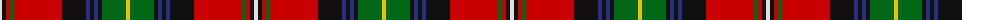

In pattern [WKRGRKBKBKGY](/patterns/wkrgrkbkbkgy/).

This was sourced from house-of-tartan.  It is a [12 stripes tartan](/stripes/stripes12/).

Original link http://www.house-of-tartan.scotland.net/house/TartanViewjs.asp?colr=Def&tnam=1819

## Thread count
LN/4 K4 R4 G4 R48 K24 DB4 K4 DB4 K4 G24 Y/4

## Palette
Each colour and its ΔE from the base-6 reference it is a variant of.

| Colour | Shade | Base | ΔE (OKLab) |
|---|---|---|---|
| DB | <code style="background-color:#2C2C80;">#2C2C80</code> `#2C2C80` | B <code style="background-color:#2A418A;">#2A418A</code> | 0.06 |
| G | <code style="background-color:#006818;">#006818</code> `#006818` | G <code style="background-color:#006100;">#006100</code> | 0.02 |
| K | <code style="background-color:#101010;">#101010</code> `#101010` | K <code style="background-color:#000000;">#000000</code> | 0.17 |
| LN | <code style="background-color:#E0E0E0;">#E0E0E0</code> `#E0E0E0` | W <code style="background-color:#F7F7F7;">#F7F7F7</code> | 0.07 |
| R | <code style="background-color:#C80000;">#C80000</code> `#C80000` | R <code style="background-color:#CC0000;">#CC0000</code> | 0.01 |
| Y | <code style="background-color:#E8C000;">#E8C000</code> `#E8C000` | Y <code style="background-color:#F2BF00;">#F2BF00</code> | 0.02 |

## Nearest tartans

The nearest existing variants by ΔTartan distance.

1. [MacLean](/setts/s12/b8w2k6y2g2w2k2g16r24w2r4k2-b000064-g004c00-k000000-rc80000-wd0d0d0-yffc800/) — ΔT 0.66
1. [Cats (Fashion)](/setts/s12/b16g4k4y4k4ya4k4g36r4g4r58k6-b2c2c80-g006818-k101010-rc80000-ybc8c00-yae8c000/) — ΔT 0.71
1. [Kilmorie](/setts/s11/k6r60g20k6y4k6w4k12r4b24w4-b2c2c80-g006818-k101010-rc80000-we0e0e0-ye8c000/) — ΔT 0.72
1. [Boyd](/setts/s12/w4k4r4g4r48k24b4k4b4k4g24y4-b304080-g008000-k000000-rc00000-we0e0e0-yf0c000/) — ΔT 0.76
1. [MacLean of Duart #4](/setts/s11/b26k12y4k6w8k6g44r62b6r8k4-b3c82af-g005020-k101010-rdc0000-we0e0e0-ye8c000/) — ΔT 0.83
1. [Maclean of Duart (Wilsons) (Clan)](/setts/s11/b16k12y4k4w6k4g32r50b6r8k3-b5c8ca8-g285800-k101010-rc80000-we0e0e0-ye8c000/) — ΔT 0.85
1. [MacLean of Duart #3](/setts/s11/b16k12y4k4w6k4g32r50b6r8k3-b3c82af-g005020-k101010-rdc0000-we0e0e0-ye8c000/) — ΔT 0.85
1. [Norwell](/setts/s11/r8k8r64g8w6g8k26g6b36r4y6-b2c2c80-g006818-k101010-rc80000-we0e0e0-ye8c000/) — ΔT 0.87
1. [Boyd](/setts/s12/y10g44k4b4k4b4k20r76g10r8k8ya10-b000052-g11450d-k000000-raa0000-yaaaa00-yaaaaaaa/) — ΔT 0.88
1. [Boyd](/setts/s12/y5g22k2b2k2b2k10r38g5r4k4ya5-b000052-g11450d-k000000-raa0000-yaaaa00-yaaaaaaa/) — ΔT 0.88

## Neighbour map

Every grey dot is one of 15726 variants placed by the first two principal components of the ΔTartan feature space (44% of its variance). Red is this tartan; blue dots are its nearest — click one to open its page.

<svg viewBox="0 0 640 380" role="img" style="max-width:100%;height:auto;border:1px solid #e0e0e0;border-radius:4px;display:block" xmlns="http://www.w3.org/2000/svg"><image href="/nn/cloud.v1.png" width="640" height="380"/><a href="/setts/s12/b8w2k6y2g2w2k2g16r24w2r4k2-b000064-g004c00-k000000-rc80000-wd0d0d0-yffc800/"><circle cx="139.1" cy="101.0" r="4" fill="#3465a4"><title>MacLean</title></circle></a><a href="/setts/s12/b16g4k4y4k4ya4k4g36r4g4r58k6-b2c2c80-g006818-k101010-rc80000-ybc8c00-yae8c000/"><circle cx="210.5" cy="93.9" r="4" fill="#3465a4"><title>Cats (Fashion)</title></circle></a><a href="/setts/s11/k6r60g20k6y4k6w4k12r4b24w4-b2c2c80-g006818-k101010-rc80000-we0e0e0-ye8c000/"><circle cx="186.2" cy="96.4" r="4" fill="#3465a4"><title>Kilmorie</title></circle></a><a href="/setts/s12/w4k4r4g4r48k24b4k4b4k4g24y4-b304080-g008000-k000000-rc00000-we0e0e0-yf0c000/"><circle cx="153.6" cy="96.5" r="4" fill="#3465a4"><title>Boyd</title></circle></a><a href="/setts/s11/b26k12y4k6w8k6g44r62b6r8k4-b3c82af-g005020-k101010-rdc0000-we0e0e0-ye8c000/"><circle cx="156.9" cy="101.0" r="4" fill="#3465a4"><title>MacLean of Duart #4</title></circle></a><a href="/setts/s11/b16k12y4k4w6k4g32r50b6r8k3-b5c8ca8-g285800-k101010-rc80000-we0e0e0-ye8c000/"><circle cx="174.9" cy="101.0" r="4" fill="#3465a4"><title>Maclean of Duart (Wilsons) (Clan)</title></circle></a><a href="/setts/s11/b16k12y4k4w6k4g32r50b6r8k3-b3c82af-g005020-k101010-rdc0000-we0e0e0-ye8c000/"><circle cx="169.3" cy="98.3" r="4" fill="#3465a4"><title>MacLean of Duart #3</title></circle></a><a href="/setts/s11/r8k8r64g8w6g8k26g6b36r4y6-b2c2c80-g006818-k101010-rc80000-we0e0e0-ye8c000/"><circle cx="185.9" cy="101.5" r="4" fill="#3465a4"><title>Norwell</title></circle></a><a href="/setts/s12/y10g44k4b4k4b4k20r76g10r8k8ya10-b000052-g11450d-k000000-raa0000-yaaaa00-yaaaaaaa/"><circle cx="196.5" cy="87.2" r="4" fill="#3465a4"><title>Boyd</title></circle></a><a href="/setts/s12/y5g22k2b2k2b2k10r38g5r4k4ya5-b000052-g11450d-k000000-raa0000-yaaaa00-yaaaaaaa/"><circle cx="196.5" cy="87.2" r="4" fill="#3465a4"><title>Boyd</title></circle></a><circle cx="172.7" cy="102.1" r="5" fill="#c00000"/></svg>

ID: /setts/s12/w4k4r4g4r48k24b4k4b4k4g24y4-b2c2c80-g006818-k101010-rc80000-we0e0e0-ye8c000/
