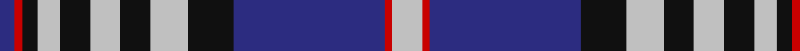

In pattern [BRKWKWKWKBRW](/patterns/brkwkwkwkbrw/).

This was sourced from tartans-authority.  It is a [12 stripes tartan](/stripes/stripes12/).

Original link http://www.tartansauthority.com/tartan-ferret/display/559/

## Thread count
DB/4 R2 K4 N6 K8 N8 K8 N10 K12 DB40 R2 N/8

## Palette
Each colour and its ΔE from the base-6 reference it is a variant of.

| Colour | Shade | Base | ΔE (OKLab) |
|---|---|---|---|
| DB | <code style="background-color:#2C2C80;">#2C2C80</code> `#2C2C80` | B <code style="background-color:#2C4084;">#2C4084</code> | 0.05 |
| K | <code style="background-color:#101010;">#101010</code> `#101010` | K <code style="background-color:#000000;">#000000</code> | 0.17 |
| N | <code style="background-color:#C0C0C0;">#C0C0C0</code> `#C0C0C0` | W <code style="background-color:#F4F4F0;">#F4F4F0</code> | 0.16 |
| R | <code style="background-color:#C80000;">#C80000</code> `#C80000` | R <code style="background-color:#C80000;">#C80000</code> | 0.00 |

## Nearest tartans

The nearest existing variants by ΔTartan distance.

1. [Knights Templar St Andrews Corporate Tartan Tartan Number: 559. Earliest known date: 1989 An Order of Chivalry serving God and Scotland.' Correct name is 'Scottish Knights Templar of Militi Scotia, St Andrews.' One of three similar designs which were designed by Capt T.S. Davidson* in 1978. All were ratified and approved by the Grand Conclave of the Militi Scotia S.M.O.T.J* in Perth - 28 Mar 1998. Stuart Davidson started the Scottish Tartan Society in 1966. There are slight differences between each one which dictates which 'branch' of the order is entitled to wear it. * Supreme Military Order of the Temple of Jeruslalem See products available Copyright © Blair Urquhart, Comrie, 2015](/setts/s12/w8r2b36k12w10k8w8k8w6k4r2b4-b2c2c80-k101010-rc80000-we0e0e0/) — ΔT 0.56
1. [Hogmany Plaid](/setts/s13/r4w13k6w6k6w6k5w1k24b28r2b2r4-b102040-k000030-rc00000-we0e0e0/) — ΔT 0.83
1. [Scottish Knights Templar, of M.T.S. St Andrew](/setts/s10/w8r2b40k12w10k8w6k4r2b4-b304080-k000000-rc00000-we0e0e0/) — ΔT 0.85
1. [Icelandic](/setts/s13/r16w8b48ba4b8ba4b2ba4b8ba4b2ba40w12-b2c4084-ba080848-rdc0000-we0e0e0/) — ΔT 0.86
1. [Hogmany Plaid (Fashion)](/setts/s13/r4w14b6w6b6w6b6w2b24ba28r2ba2r4-b003c64-ba2c2c80-rc80000-we0e0e0/) — ΔT 0.92
1. [Knights Templar International Corporate Tartan Tartan Number: 560. Earliest known date: 1989 Alternative sett (International Branch). Stuart Davidson was a founder member of the Scottish Tartans Society. See products available Copyright © Blair Urquhart, Comrie, 2015](/setts/s9/r6b40k12w10k8w6k4r2b4-b2c2c80-k101010-rc80000-we0e0e0/) — ΔT 0.96
1. [Tiger of Sweden](/setts/s14/b6g2k2b4w32b4k8g2k2b32w4b4k2g6-b202060-g006818-k101010-wc0c0c0/) — ΔT 1.00
1. [Carsaig](/setts/s12/y12r3y3b4y16ra3y3ra3y3ra16b52y4-b000048-r880000-rab07430-yacacac/) — ΔT 1.03
1. [Scottish Knights Templar Int. (Corp)](/setts/s9/r6b40k12w10k8w6k4r2b4-b2c2c80-k101010-rc80000-wc0c0c0/) — ΔT 1.06
1. [Scottish Knights Templar, of M.T.S. International](/setts/s9/r6b40k12w10k8w6k4r2b4-b304080-k000000-rc00000-we0e0e0/) — ΔT 1.06

## Neighbour map

Every grey dot is one of 15726 variants placed by the first two principal components of the ΔTartan feature space (44% of its variance). Red is this tartan; blue dots are its nearest — click one to open its page.

<svg viewBox="0 0 640 380" role="img" style="max-width:100%;height:auto;border:1px solid #e0e0e0;border-radius:4px;display:block" xmlns="http://www.w3.org/2000/svg"><image href="/nn/cloud.v1.png" width="640" height="380"/><a href="/setts/s12/w8r2b36k12w10k8w8k8w6k4r2b4-b2c2c80-k101010-rc80000-we0e0e0/"><circle cx="177.7" cy="130.6" r="4" fill="#3465a4"><title>Knights Templar St Andrews Corporate Tartan Tartan Number: 559. Earliest known date: 1989 An Order of Chivalry serving God and Scotland.' Correct name is 'Scottish Knights Templar of Militi Scotia, St Andrews.' One of three similar designs which were designed by Capt T.S. Davidson* in 1978. All were ratified and approved by the Grand Conclave of the Militi Scotia S.M.O.T.J* in Perth - 28 Mar 1998. Stuart Davidson started the Scottish Tartan Society in 1966. There are slight differences between each one which dictates which 'branch' of the order is entitled to wear it. * Supreme Military Order of the Temple of Jeruslalem See products available Copyright © Blair Urquhart, Comrie, 2015</title></circle></a><a href="/setts/s13/r4w13k6w6k6w6k5w1k24b28r2b2r4-b102040-k000030-rc00000-we0e0e0/"><circle cx="191.1" cy="113.3" r="4" fill="#3465a4"><title>Hogmany Plaid</title></circle></a><a href="/setts/s10/w8r2b40k12w10k8w6k4r2b4-b304080-k000000-rc00000-we0e0e0/"><circle cx="228.5" cy="126.8" r="4" fill="#3465a4"><title>Scottish Knights Templar, of M.T.S. St Andrew</title></circle></a><a href="/setts/s13/r16w8b48ba4b8ba4b2ba4b8ba4b2ba40w12-b2c4084-ba080848-rdc0000-we0e0e0/"><circle cx="242.8" cy="117.3" r="4" fill="#3465a4"><title>Icelandic</title></circle></a><a href="/setts/s13/r4w14b6w6b6w6b6w2b24ba28r2ba2r4-b003c64-ba2c2c80-rc80000-we0e0e0/"><circle cx="173.2" cy="140.8" r="4" fill="#3465a4"><title>Hogmany Plaid (Fashion)</title></circle></a><a href="/setts/s9/r6b40k12w10k8w6k4r2b4-b2c2c80-k101010-rc80000-we0e0e0/"><circle cx="250.8" cy="138.9" r="4" fill="#3465a4"><title>Knights Templar International Corporate Tartan Tartan Number: 560. Earliest known date: 1989 Alternative sett (International Branch). Stuart Davidson was a founder member of the Scottish Tartans Society. See products available Copyright © Blair Urquhart, Comrie, 2015</title></circle></a><a href="/setts/s14/b6g2k2b4w32b4k8g2k2b32w4b4k2g6-b202060-g006818-k101010-wc0c0c0/"><circle cx="233.3" cy="115.9" r="4" fill="#3465a4"><title>Tiger of Sweden</title></circle></a><a href="/setts/s12/y12r3y3b4y16ra3y3ra3y3ra16b52y4-b000048-r880000-rab07430-yacacac/"><circle cx="249.2" cy="114.6" r="4" fill="#3465a4"><title>Carsaig</title></circle></a><a href="/setts/s9/r6b40k12w10k8w6k4r2b4-b2c2c80-k101010-rc80000-wc0c0c0/"><circle cx="262.2" cy="144.4" r="4" fill="#3465a4"><title>Scottish Knights Templar Int. (Corp)</title></circle></a><a href="/setts/s9/r6b40k12w10k8w6k4r2b4-b304080-k000000-rc00000-we0e0e0/"><circle cx="240.5" cy="136.2" r="4" fill="#3465a4"><title>Scottish Knights Templar, of M.T.S. International</title></circle></a><circle cx="207.4" cy="127.9" r="5" fill="#c00000"/></svg>

ID: /setts/s12/w8r2b40k12w10k8w8k8w6k4r2b4-b2c2c80-k101010-rc80000-wc0c0c0/
