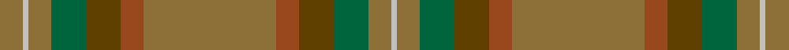

In pattern [GWGGGRGRGGGW](/stripes/gwgggrgrgggw/).

This was sourced from register-of-tartans.  It is a [12 stripe tartan](/stripes/stripes12/).

Original link https://www.tartanregister.gov.uk/tartanDetails.aspx?ref=4151

## Register references

External register numbers recorded for this tartan.

- Scottish Register of Tartans: [4151](https://www.tartanregister.gov.uk/tartanDetails.aspx?ref=4151)
- Scottish Tartans Authority (ITI): 5823

## Thread count
LT/16 N4 LT16 G24 T24 Ta16 LT92 Ta16 T24 G24 LT16 N/4

## Palette
Each colour and its ΔE from the base-6 reference it is a variant of.

| Colour | Shade | Base | ΔE (OKLab) |
|---|---|---|---|
| G | <code style="background-color:#00643C;">#00643C</code> `#00643C` | G <code style="background-color:#006100;">#006100</code> | 0.05 |
| LT | <code style="background-color:#8C7038;">#8C7038</code> `#8C7038` | G <code style="background-color:#006100;">#006100</code> | 0.18 |
| N | <code style="background-color:#C0C0C0;">#C0C0C0</code> `#C0C0C0` | W <code style="background-color:#F7F7F7;">#F7F7F7</code> | 0.17 |
| T | <code style="background-color:#604000;">#604000</code> `#604000` | G <code style="background-color:#006100;">#006100</code> | 0.14 |
| Ta | <code style="background-color:#98481C;">#98481C</code> `#98481C` | R <code style="background-color:#CC0000;">#CC0000</code> | 0.11 |

## Nearest tartans

The nearest existing variants by ΔTartan distance.

1. [Ensign of Ontario (Fashion)](/setts/s15/dg21k1r4k1dy21dg3dy3dg3dy21dg3lo4dg21dy3dg3dy3~x2/) — ΔT 1.47
1. [Historic Scotland Corporate Tartan Tartan Number: 2122. Earliest known date: 1988 Custodians at Historic Scotland properties throughout Scotland, including Edinburgh Castle, wear this distinctive tartan. See products available Copyright © Blair Urquhart, Comrie, 2015](/setts/s9/k2y7k1y9dy21o2dy1o1dy2~x2/) — ΔT 1.59
1. [Johansson (Personal)](/setts/s13/r8y1r1y1r1y25n1y1n1y1n25o7lo6~x2/) — ΔT 1.72
1. [MacNaughton Htg](/setts/s9/dg1r1dg22dy21dg12r11dg22r1dg1~x2/) — ΔT 1.72
1. [The Broons (Corporate)](/setts/s9/r3k1y8lo1dy7lo1y19dy25k1~x2/) — ΔT 1.75
1. [Johansson (Aneby, Sweden), Christian (Personal)](/setts/s13/o8y1o1y1o1y25dt1y1dt1y1dt25y7lo6~x2/) — ΔT 1.82
1. [Prince David](/setts/s15/g3y1lo2g3y1lo2dy21g18dy2g3dy2g18dy21y1lo2~x2/) — ΔT 1.85
1. [Broons, The (DC Thomson)](/setts/s9/r3k1y8ly1dy7ly1y19y25k1~x2/) — ΔT 1.88
1. [Willsher Wedding (Personal)](/setts/s9/n8o4lb2o4n1o12g9n24r4~x2/) — ΔT 1.88
1. [Annan (Fashion)](/setts/s10/y16o2y2o2y2o2y2do6n10y3~x2/) — ΔT 1.88

## Neighbour map

Every grey dot is one of 14299 variants placed by the first two principal components of the ΔTartan feature space (44% of its variance). Red is this tartan; blue dots are its nearest — click one to open its page.

<svg viewBox="0 0 640 380" role="img" style="max-width:100%;height:auto;border:1px solid #e0e0e0;border-radius:4px;display:block" xmlns="http://www.w3.org/2000/svg"><image href="/nn/cloud.v1.png" width="640" height="380"/><a href="/setts/s15/dg21k1r4k1dy21dg3dy3dg3dy21dg3lo4dg21dy3dg3dy3~x2/"><circle cx="406.3" cy="190.1" r="4" fill="#3465a4"><title>Ensign of Ontario (Fashion)</title></circle></a><a href="/setts/s9/k2y7k1y9dy21o2dy1o1dy2~x2/"><circle cx="457.3" cy="212.9" r="4" fill="#3465a4"><title>Historic Scotland Corporate Tartan Tartan Number: 2122. Earliest known date: 1988 Custodians at Historic Scotland properties throughout Scotland, including Edinburgh Castle, wear this distinctive tartan. See products available Copyright © Blair Urquhart, Comrie, 2015</title></circle></a><a href="/setts/s13/r8y1r1y1r1y25n1y1n1y1n25o7lo6~x2/"><circle cx="348.6" cy="157.8" r="4" fill="#3465a4"><title>Johansson (Personal)</title></circle></a><a href="/setts/s9/dg1r1dg22dy21dg12r11dg22r1dg1~x2/"><circle cx="401.8" cy="242.5" r="4" fill="#3465a4"><title>MacNaughton Htg</title></circle></a><a href="/setts/s9/r3k1y8lo1dy7lo1y19dy25k1~x2/"><circle cx="375.5" cy="185.5" r="4" fill="#3465a4"><title>The Broons (Corporate)</title></circle></a><a href="/setts/s13/o8y1o1y1o1y25dt1y1dt1y1dt25y7lo6~x2/"><circle cx="340.4" cy="152.9" r="4" fill="#3465a4"><title>Johansson (Aneby, Sweden), Christian (Personal)</title></circle></a><a href="/setts/s15/g3y1lo2g3y1lo2dy21g18dy2g3dy2g18dy21y1lo2~x2/"><circle cx="423.6" cy="196.1" r="4" fill="#3465a4"><title>Prince David</title></circle></a><a href="/setts/s9/r3k1y8ly1dy7ly1y19y25k1~x2/"><circle cx="321.4" cy="153.7" r="4" fill="#3465a4"><title>Broons, The (DC Thomson)</title></circle></a><a href="/setts/s9/n8o4lb2o4n1o12g9n24r4~x2/"><circle cx="349.4" cy="189.7" r="4" fill="#3465a4"><title>Willsher Wedding (Personal)</title></circle></a><a href="/setts/s10/y16o2y2o2y2o2y2do6n10y3~x2/"><circle cx="348.2" cy="222.5" r="4" fill="#3465a4"><title>Annan (Fashion)</title></circle></a><circle cx="385.0" cy="190.5" r="5" fill="#c00000"/></svg>

ID: /setts/s12/y23o4dy6g6y4lb1y4~x4/
