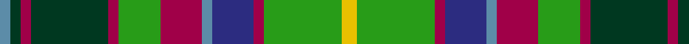

In pattern [BGRGRGRBBRGY](/patterns/bgrgrgrbbrgy/).

This was sourced from house-of-tartan.  It is a [12 stripes tartan](/stripes/stripes12/).

Original link http://www.house-of-tartan.scotland.net/house/TartanViewjs.asp?colr=Def&tnam=190

## Thread count
B/4 DG4 R4 DG30 R4 G16 R16 B4 DB16 R4 G30 Y/6

## Palette
Each colour and its ΔE from the base-6 reference it is a variant of.

| Colour | Shade | Base | ΔE (OKLab) |
|---|---|---|---|
| B | <code style="background-color:#5C8CA8;">#5C8CA8</code> `#5C8CA8` | B <code style="background-color:#2A418A;">#2A418A</code> | 0.23 |
| DB | <code style="background-color:#2C2C80;">#2C2C80</code> `#2C2C80` | B <code style="background-color:#2A418A;">#2A418A</code> | 0.06 |
| DG | <code style="background-color:#003820;">#003820</code> `#003820` | G <code style="background-color:#006100;">#006100</code> | 0.15 |
| G | <code style="background-color:#289C18;">#289C18</code> `#289C18` | G <code style="background-color:#006100;">#006100</code> | 0.19 |
| R | <code style="background-color:#A00048;">#A00048</code> `#A00048` | R <code style="background-color:#CC0000;">#CC0000</code> | 0.12 |
| Y | <code style="background-color:#E8C000;">#E8C000</code> `#E8C000` | Y <code style="background-color:#F2BF00;">#F2BF00</code> | 0.02 |

## Nearest tartans

The nearest existing variants by ΔTartan distance.

1. [Kinloch Anderson Heather (Corporate)](/setts/s12/b4ba4b2ba14g6ga3g6gb2ga4gb2ga15r3~b780078-ba440044-g003820-ga289c18-gb006818-r888888~x2/) — ΔT 0.57
1. [Gordonstoun](/setts/s12/y3g15r2b8ba2r8g8r2ga15r2ga2ba2~b304080-ba5480b0-g008000-ga003000-r900030-yf0c000~x2/) — ΔT 0.61
1. [Bowie](/setts/s13/b8r2b3r4b13w2ra13w2g13r4g4y2g8~b304080-g008000-rc00000-ra703000-we0e0e0-yf0c000~x2/) — ΔT 0.78
1. [Stirling and Bannockburn](/setts/s10/r3g18r4w3r4k13r3y18g2ya3~g006818-k101010-rc80000-w98c8e8-y48a4c0-yae8c000~x2/) — ΔT 0.84
1. [Royal Pharmaceutical Society Commemorative Tartan Tartan Number: 2091. Earliest known date: 1991 Created by Kinloch Anderson of Edinburgh for the 150th Anniversary of the Royal Pharmaceutical Society of Great Britain which was held at Scone Palace, Perthshire in 1991. See products available Copyright © Blair Urquhart, Comrie, 2015](/setts/s10/b3ba2g19ba6g2ba6y14w2bb4w2~b441800-ba2c2c80-bb780078-g006818-we0e0e0-ya08858~x2/) — ΔT 0.90
1. [Gordonstoun (Corporate)](/setts/s12/y5g19r2b11w2r11g11r2k20r2k2w2~b5c8ca8-g408060-k101010-r800028-wa8ace8-ye8c000~x2/) — ΔT 0.90
1. [Donegal County Crest (Fashion)](/setts/s13/k4g10y4g10k4ga20g5k2y6k2r10k2w4~g003820-ga006818-k101010-rc80000-we0e0e0-ybc8c00~x2/) — ΔT 0.95
1. [Wojtek Memorial Trust](/setts/s11/w3g28ga3g3ga11b4r3b3r6b15wa3~b2c2c80-g006818-ga003820-rc80000-we8ccb8-wafcfcfc~x2/) — ΔT 1.03
1. [Lee Cox (Personal)](/setts/s17/b3w2r2ba6g10b3k3b3k3b3g14b3k3b3k7g2r3~b5c8ca8-ba780078-g006818-k101010-rc8002c-we0e0e0~x2/) — ΔT 1.03
1. [Paisley District Tartan Tartan Number: 640. Earliest known date: 1952 This design won a first prize at Kelso Highland Show for designer, Allan Drennan, in 1952. He regarded it as having 'a motif of the Clan Donald'. It is also worn by members of the Paisley & Allied Families Society and the '100 Pipers' pipe band (in ancient colours). See products available Copyright © Blair Urquhart, Comrie, 2015](/setts/s12/b7w2g3b18y2k15y2g17r5g3r2g7~b2c2c80-g006818-k101010-rc80000-we0e0e0-ye8c000~x2/) — ΔT 1.05

## Neighbour map

Every grey dot is one of 15726 variants placed by the first two principal components of the ΔTartan feature space (44% of its variance). Red is this tartan; blue dots are its nearest — click one to open its page.

<svg viewBox="0 0 640 380" role="img" style="max-width:100%;height:auto;border:1px solid #e0e0e0;border-radius:4px;display:block" xmlns="http://www.w3.org/2000/svg"><image href="/nn/cloud.v1.png" width="640" height="380"/><a href="/setts/s12/b4ba4b2ba14g6ga3g6gb2ga4gb2ga15r3~b780078-ba440044-g003820-ga289c18-gb006818-r888888~x2/"><circle cx="94.4" cy="160.0" r="4" fill="#3465a4"><title>Kinloch Anderson Heather (Corporate)</title></circle></a><a href="/setts/s12/y3g15r2b8ba2r8g8r2ga15r2ga2ba2~b304080-ba5480b0-g008000-ga003000-r900030-yf0c000~x2/"><circle cx="105.1" cy="159.7" r="4" fill="#3465a4"><title>Gordonstoun</title></circle></a><a href="/setts/s13/b8r2b3r4b13w2ra13w2g13r4g4y2g8~b304080-g008000-rc00000-ra703000-we0e0e0-yf0c000~x2/"><circle cx="86.4" cy="166.8" r="4" fill="#3465a4"><title>Bowie</title></circle></a><a href="/setts/s10/r3g18r4w3r4k13r3y18g2ya3~g006818-k101010-rc80000-w98c8e8-y48a4c0-yae8c000~x2/"><circle cx="72.2" cy="142.3" r="4" fill="#3465a4"><title>Stirling and Bannockburn</title></circle></a><a href="/setts/s10/b3ba2g19ba6g2ba6y14w2bb4w2~b441800-ba2c2c80-bb780078-g006818-we0e0e0-ya08858~x2/"><circle cx="126.1" cy="147.1" r="4" fill="#3465a4"><title>Royal Pharmaceutical Society Commemorative Tartan Tartan Number: 2091. Earliest known date: 1991 Created by Kinloch Anderson of Edinburgh for the 150th Anniversary of the Royal Pharmaceutical Society of Great Britain which was held at Scone Palace, Perthshire in 1991. See products available Copyright © Blair Urquhart, Comrie, 2015</title></circle></a><a href="/setts/s12/y5g19r2b11w2r11g11r2k20r2k2w2~b5c8ca8-g408060-k101010-r800028-wa8ace8-ye8c000~x2/"><circle cx="105.8" cy="135.9" r="4" fill="#3465a4"><title>Gordonstoun (Corporate)</title></circle></a><a href="/setts/s13/k4g10y4g10k4ga20g5k2y6k2r10k2w4~g003820-ga006818-k101010-rc80000-we0e0e0-ybc8c00~x2/"><circle cx="78.4" cy="146.9" r="4" fill="#3465a4"><title>Donegal County Crest (Fashion)</title></circle></a><a href="/setts/s11/w3g28ga3g3ga11b4r3b3r6b15wa3~b2c2c80-g006818-ga003820-rc80000-we8ccb8-wafcfcfc~x2/"><circle cx="142.7" cy="141.1" r="4" fill="#3465a4"><title>Wojtek Memorial Trust</title></circle></a><a href="/setts/s17/b3w2r2ba6g10b3k3b3k3b3g14b3k3b3k7g2r3~b5c8ca8-ba780078-g006818-k101010-rc8002c-we0e0e0~x2/"><circle cx="86.9" cy="151.4" r="4" fill="#3465a4"><title>Lee Cox (Personal)</title></circle></a><a href="/setts/s12/b7w2g3b18y2k15y2g17r5g3r2g7~b2c2c80-g006818-k101010-rc80000-we0e0e0-ye8c000~x2/"><circle cx="121.5" cy="149.4" r="4" fill="#3465a4"><title>Paisley District Tartan Tartan Number: 640. Earliest known date: 1952 This design won a first prize at Kelso Highland Show for designer, Allan Drennan, in 1952. He regarded it as having 'a motif of the Clan Donald'. It is also worn by members of the Paisley &amp; Allied Families Society and the '100 Pipers' pipe band (in ancient colours). See products available Copyright © Blair Urquhart, Comrie, 2015</title></circle></a><circle cx="90.9" cy="152.0" r="5" fill="#c00000"/></svg>

ID: /setts/s12/y3g15r2b8ba2r8g8r2ga15r2ga2ba2~b2c2c80-ba5c8ca8-g289c18-ga003820-ra00048-ye8c000~x2/
