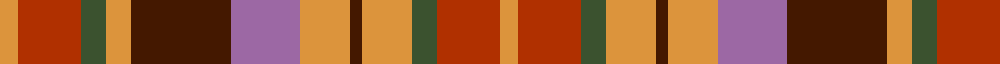

In pattern [YRGYBRYBYGRY](/patterns/yrgybrybygry/).

This was sourced from register-of-tartans.  It is a [12 stripes tartan](/stripes/stripes12/).

Original link https://www.tartanregister.gov.uk/tartanDetails.aspx?ref=11413

## Register references

External register numbers recorded for this tartan.

- Scottish Register of Tartans: [11413](https://www.tartanregister.gov.uk/tartanDetails.aspx?ref=11413)

## Thread count
O/6 R20 G8 O8 DR32 LP22 O16 DR4 O16 G8 R20 O/6

## Palette
Each colour and its ΔE from the base-6 reference it is a variant of.

| Colour | Shade | Base | ΔE (OKLab) |
|---|---|---|---|
| DR | <code style="background-color:#441800;">#441800</code> `#441800` | B <code style="background-color:#2A418A;">#2A418A</code> | 0.23 |
| G | <code style="background-color:#3B522F;">#3B522F</code> `#3B522F` | G <code style="background-color:#006100;">#006100</code> | 0.09 |
| LP | <code style="background-color:#9C68A4;">#9C68A4</code> `#9C68A4` | R <code style="background-color:#CC0000;">#CC0000</code> | 0.21 |
| O | <code style="background-color:#DC943C;">#DC943C</code> `#DC943C` | Y <code style="background-color:#F2BF00;">#F2BF00</code> | 0.12 |
| R | <code style="background-color:#B03000;">#B03000</code> `#B03000` | R <code style="background-color:#CC0000;">#CC0000</code> | 0.06 |

## Nearest tartans

The nearest existing variants by ΔTartan distance.

1. [Bridge of Weir Leather Co. (Corp)](/setts/s12/r3y14g3y3g3y4g11b11ra11r11y1b1~b1c1c1c-g845800-rbc301c-raa00000-yb8a47c~x2/) — ΔT 1.09
1. [Glenmorangie (Corporate)](/setts/s11/g6r2g2r4g13k12y13r4y2r2y6~g805400-k101010-ra8608c-yc09458~x2/) — ΔT 1.36
1. [Roscommon, County](/setts/s10/r5y3r19b6y5b6g12ba5g12ba3~b441800-ba303070-g003820-rb03000-yd8b000~x2/) — ΔT 1.37
1. [MacDougall 6](/setts/s15/g18r6ra4rb6g20rb6ra4rb6ra4r6b22rb8r6ra4rb5~b304080-g008000-r800000-ra802040-rbc00000/) — ΔT 1.42
1. [Watret (Artefact)](/setts/s11/b21ba21y21r2ra21ya21y21b2ra2ba2r21~b2c2c80-ba780078-ra07c58-rac80000-ye8c000-yad87c00~x2/) — ΔT 1.49
1. [Tinkler (Corporate)](/setts/s9/g2y9b6r3b2r3b2r10w2~b441800-g006818-r880000-we0e0e0-yac986c~x4/) — ΔT 1.53
1. [Unidentified Plaid 16](/setts/s13/y18r18g30r12b55r42g6r18g6r42ga44r12g12~b304080-g003000-ga008000-rc00000-yf0c000/) — ΔT 1.55
1. [Fitzsimmons Red (Name)](/setts/s10/g3y2k4ga6k4r15k4y18g2ga3~g5c6428-ga604000-k101010-r880000-ya08858~x2/) — ΔT 1.56
1. [Satchidananda (Personal)](/setts/s9/g18y4b10w2r20y5r2w2g6~b2888c4-g604000-rfc5000-we0e0e0-ye8c000~x2/) — ΔT 1.59
1. [Tinkler, Andrew (Stobart Group)](/setts/s9/g2y9ga6r3ga2r3ga2r10w2~g1b6453-ga5c4033-r8b4513-wfffff0-ycdb38b~x4/) — ΔT 1.60

## Neighbour map

Every grey dot is one of 15726 variants placed by the first two principal components of the ΔTartan feature space (44% of its variance). Red is this tartan; blue dots are its nearest — click one to open its page.

<svg viewBox="0 0 640 380" role="img" style="max-width:100%;height:auto;border:1px solid #e0e0e0;border-radius:4px;display:block" xmlns="http://www.w3.org/2000/svg"><image href="/nn/cloud.v1.png" width="640" height="380"/><a href="/setts/s12/r3y14g3y3g3y4g11b11ra11r11y1b1~b1c1c1c-g845800-rbc301c-raa00000-yb8a47c~x2/"><circle cx="135.1" cy="152.5" r="4" fill="#3465a4"><title>Bridge of Weir Leather Co. (Corp)</title></circle></a><a href="/setts/s11/g6r2g2r4g13k12y13r4y2r2y6~g805400-k101010-ra8608c-yc09458~x2/"><circle cx="141.4" cy="200.5" r="4" fill="#3465a4"><title>Glenmorangie (Corporate)</title></circle></a><a href="/setts/s10/r5y3r19b6y5b6g12ba5g12ba3~b441800-ba303070-g003820-rb03000-yd8b000~x2/"><circle cx="115.1" cy="204.3" r="4" fill="#3465a4"><title>Roscommon, County</title></circle></a><a href="/setts/s15/g18r6ra4rb6g20rb6ra4rb6ra4r6b22rb8r6ra4rb5~b304080-g008000-r800000-ra802040-rbc00000/"><circle cx="112.4" cy="186.8" r="4" fill="#3465a4"><title>MacDougall 6</title></circle></a><a href="/setts/s11/b21ba21y21r2ra21ya21y21b2ra2ba2r21~b2c2c80-ba780078-ra07c58-rac80000-ye8c000-yad87c00~x2/"><circle cx="54.2" cy="140.8" r="4" fill="#3465a4"><title>Watret (Artefact)</title></circle></a><a href="/setts/s9/g2y9b6r3b2r3b2r10w2~b441800-g006818-r880000-we0e0e0-yac986c~x4/"><circle cx="158.7" cy="204.7" r="4" fill="#3465a4"><title>Tinkler (Corporate)</title></circle></a><a href="/setts/s13/y18r18g30r12b55r42g6r18g6r42ga44r12g12~b304080-g003000-ga008000-rc00000-yf0c000/"><circle cx="176.7" cy="171.6" r="4" fill="#3465a4"><title>Unidentified Plaid 16</title></circle></a><a href="/setts/s10/g3y2k4ga6k4r15k4y18g2ga3~g5c6428-ga604000-k101010-r880000-ya08858~x2/"><circle cx="154.9" cy="170.3" r="4" fill="#3465a4"><title>Fitzsimmons Red (Name)</title></circle></a><a href="/setts/s9/g18y4b10w2r20y5r2w2g6~b2888c4-g604000-rfc5000-we0e0e0-ye8c000~x2/"><circle cx="151.4" cy="154.2" r="4" fill="#3465a4"><title>Satchidananda (Personal)</title></circle></a><a href="/setts/s9/g2y9ga6r3ga2r3ga2r10w2~g1b6453-ga5c4033-r8b4513-wfffff0-ycdb38b~x4/"><circle cx="162.5" cy="208.0" r="4" fill="#3465a4"><title>Tinkler, Andrew (Stobart Group)</title></circle></a><circle cx="110.0" cy="182.4" r="5" fill="#c00000"/></svg>

ID: /setts/s12/y3r10g4y8b2y8ra11b16y4g4r10y3~b441800-g3b522f-rb03000-ra9c68a4-ydc943c~x2/
