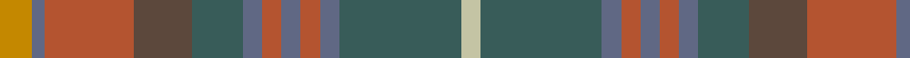

In pattern [YBRGGBRBRBGY](/patterns/ybrggbrbrbgy/).

This was sourced from house-of-tartan.  It is a [12 stripes tartan](/stripes/stripes12/).

Original link http://www.house-of-tartan.scotland.net/house/TartanViewjs.asp?colr=Def&tnam=2269

## Thread count
DY/10 B4 LT28 Na18 N16 B6 LT6 B6 LT6 B6 N38 Nb/6

## Palette
Each colour and its ΔE from the base-6 reference it is a variant of.

| Colour | Shade | Base | ΔE (OKLab) |
|---|---|---|---|
| B | <code style="background-color:#606884;">#606884</code> `#606884` | B <code style="background-color:#2A418A;">#2A418A</code> | 0.15 |
| DY | <code style="background-color:#C48800;">#C48800</code> `#C48800` | Y <code style="background-color:#F2BF00;">#F2BF00</code> | 0.16 |
| LT | <code style="background-color:#B45430;">#B45430</code> `#B45430` | R <code style="background-color:#CC0000;">#CC0000</code> | 0.09 |
| N | <code style="background-color:#385C59;">#385C59</code> `#385C59` | G <code style="background-color:#006100;">#006100</code> | 0.12 |
| Na | <code style="background-color:#5C483C;">#5C483C</code> `#5C483C` | G <code style="background-color:#006100;">#006100</code> | 0.15 |
| Nb | <code style="background-color:#C4C4A4;">#C4C4A4</code> `#C4C4A4` | Y <code style="background-color:#F2BF00;">#F2BF00</code> | 0.13 |

## Nearest tartans

The nearest existing variants by ΔTartan distance.

1. [Allen - 2012 (Personal)](/setts/s14/b16r2b3r4b2ba12g18w2g18ba12b12y2r2y2x2~b441800-ba5c5c5c-g604000-r880000-w98c8e8-ybc8c00/) — ΔT 1.27
1. [Hash House Harriers Hunting (Corp)](/setts/s13/g7ga1w1ga1y1ga7b7ga1b7ga7g7ga1r1x4~b48587c-g006818-ga604000-rc80000-wd4d0b4-ybc8c00/) — ΔT 1.31
1. [Ben Murad (Personal)](/setts/s18/g18r3g3r15ga13r14g3r3g18ga5g2ra5g3r2g3b5g2ba5x2~b205074-ba447888-g244830-ga645028-rac2444-ra947024/) — ΔT 1.39
1. [Limerick, County](/setts/s11/b6y4b3ba2b5ba2b3ba2g14r3ba2x2~b4c3428-ba003c64-g5c6428-r880000-ybc8c00/) — ΔT 1.40
1. [MacVicar, McVicar, McVicker](/setts/s13/b12g2y2g2b2g10ga12g3ga12g10b11r2y2x2~b574b6f-g594312-ga667123-rd45647-yfcc254/) — ΔT 1.42
1. [Clarks No.1](/setts/s10/b5ba2b11g2b2g6r17ra9b1r1x2~b32485c-ba6d8399-g5e633e-ra73e1d-rab07d0f/) — ΔT 1.46
1. [Stewart Camel (Lochcarron)](/setts/s14/g3ga3gb2ga6gc7gb2g3gb2y3gb5g3b3g20ga2x2~b3850c8-g8c7038-ga603800-gb003820-gc5c6428-ybc8c00/) — ΔT 1.52
1. [Greyfriars](/setts/s11/b30r6g16ba8ga10ba14ga24y4g10ba3g28~b214ea9-ba513871-g4b3b19-ga304824-r7e1907-yda9135/) — ΔT 1.58
1. [Auld Scotland](/setts/s10/b2y12b3y3b12g12ba12ga12g1ya2x2~b60082c-ba5c5c5c-g5c6428-ga747c60-ya08858-yad8c888/) — ΔT 1.61
1. [Gordonstoun #2](/setts/s22/g2r2g20r2ga11r11w2b11r2ga19y5ga19r2b11w2r11ga11r2g20r2g2w2x2~b5c8ca8-g408060-ga5c6428-r880000-wa8ace8-ye8c000/) — ΔT 1.69

## Neighbour map

Every grey dot is one of 15726 variants placed by the first two principal components of the ΔTartan feature space (44% of its variance). Red is this tartan; blue dots are its nearest — click one to open its page.

<svg viewBox="0 0 640 380" role="img" style="max-width:100%;height:auto;border:1px solid #e0e0e0;border-radius:4px;display:block" xmlns="http://www.w3.org/2000/svg"><image href="/nn/cloud.v1.png" width="640" height="380"/><a href="/setts/s14/b16r2b3r4b2ba12g18w2g18ba12b12y2r2y2x2~b441800-ba5c5c5c-g604000-r880000-w98c8e8-ybc8c00/"><circle cx="215.7" cy="179.9" r="4" fill="#3465a4"><title>Allen - 2012 (Personal)</title></circle></a><a href="/setts/s13/g7ga1w1ga1y1ga7b7ga1b7ga7g7ga1r1x4~b48587c-g006818-ga604000-rc80000-wd4d0b4-ybc8c00/"><circle cx="216.2" cy="199.1" r="4" fill="#3465a4"><title>Hash House Harriers Hunting (Corp)</title></circle></a><a href="/setts/s18/g18r3g3r15ga13r14g3r3g18ga5g2ra5g3r2g3b5g2ba5x2~b205074-ba447888-g244830-ga645028-rac2444-ra947024/"><circle cx="245.4" cy="167.2" r="4" fill="#3465a4"><title>Ben Murad (Personal)</title></circle></a><a href="/setts/s11/b6y4b3ba2b5ba2b3ba2g14r3ba2x2~b4c3428-ba003c64-g5c6428-r880000-ybc8c00/"><circle cx="223.2" cy="215.4" r="4" fill="#3465a4"><title>Limerick, County</title></circle></a><a href="/setts/s13/b12g2y2g2b2g10ga12g3ga12g10b11r2y2x2~b574b6f-g594312-ga667123-rd45647-yfcc254/"><circle cx="199.5" cy="218.9" r="4" fill="#3465a4"><title>MacVicar, McVicar, McVicker</title></circle></a><a href="/setts/s10/b5ba2b11g2b2g6r17ra9b1r1x2~b32485c-ba6d8399-g5e633e-ra73e1d-rab07d0f/"><circle cx="259.0" cy="174.5" r="4" fill="#3465a4"><title>Clarks No.1</title></circle></a><a href="/setts/s14/g3ga3gb2ga6gc7gb2g3gb2y3gb5g3b3g20ga2x2~b3850c8-g8c7038-ga603800-gb003820-gc5c6428-ybc8c00/"><circle cx="249.6" cy="156.3" r="4" fill="#3465a4"><title>Stewart Camel (Lochcarron)</title></circle></a><a href="/setts/s11/b30r6g16ba8ga10ba14ga24y4g10ba3g28~b214ea9-ba513871-g4b3b19-ga304824-r7e1907-yda9135/"><circle cx="211.3" cy="213.2" r="4" fill="#3465a4"><title>Greyfriars</title></circle></a><a href="/setts/s10/b2y12b3y3b12g12ba12ga12g1ya2x2~b60082c-ba5c5c5c-g5c6428-ga747c60-ya08858-yad8c888/"><circle cx="128.1" cy="176.9" r="4" fill="#3465a4"><title>Auld Scotland</title></circle></a><a href="/setts/s22/g2r2g20r2ga11r11w2b11r2ga19y5ga19r2b11w2r11ga11r2g20r2g2w2x2~b5c8ca8-g408060-ga5c6428-r880000-wa8ace8-ye8c000/"><circle cx="174.1" cy="140.1" r="4" fill="#3465a4"><title>Gordonstoun #2</title></circle></a><circle cx="210.2" cy="179.6" r="5" fill="#c00000"/></svg>

ID: /setts/s12/y5b2r14g9ga8b3r3b3r3b3ga19ya3x2~b606884-g5c483c-ga385c59-rb45430-yc48800-yac4c4a4/
