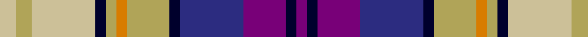

In pattern [BKBBKYYYKYYY](/patterns/bkbbkyyykyyy/).

This was sourced from register-of-tartans.  It is a [12 stripes tartan](/stripes/stripes12/).

Original link https://www.tartanregister.gov.uk/tartanDetails.aspx?ref=5724

## Thread count
N/6 LT6 N24 DB4 LT4 O4 LT16 DB4 DBa24 P16 DB4 P/4

## Palette
Each colour and its ΔE from the base-6 reference it is a variant of.

| Colour | Shade | Base | ΔE (OKLab) |
|---|---|---|---|
| DB | <code style="background-color:#00002C;">#00002C</code> `#00002C` | K <code style="background-color:#000000;">#000000</code> | 0.16 |
| DBa | <code style="background-color:#2C2C80;">#2C2C80</code> `#2C2C80` | B <code style="background-color:#2C4084;">#2C4084</code> | 0.05 |
| LT | <code style="background-color:#B0A458;">#B0A458</code> `#B0A458` | Y <code style="background-color:#E8C000;">#E8C000</code> | 0.13 |
| N | <code style="background-color:#CCC098;">#CCC098</code> `#CCC098` | Y <code style="background-color:#E8C000;">#E8C000</code> | 0.11 |
| O | <code style="background-color:#D87C00;">#D87C00</code> `#D87C00` | Y <code style="background-color:#E8C000;">#E8C000</code> | 0.17 |
| P | <code style="background-color:#780078;">#780078</code> `#780078` | B <code style="background-color:#2C4084;">#2C4084</code> | 0.16 |

ID: /setts/s12/y6ya6y24k4ya4yb4ya16k4b24ba16k4ba4-b2c2c80-ba780078-k00002c-yccc098-yab0a458-ybd87c00/
