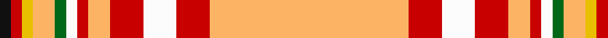

In pattern [KRYYGWRYRWRY](/patterns/kryygwryrwry/).

This was sourced from tartans-authority.  It is a [12 stripes tartan](/stripes/stripes12/).

Original link http://www.tartansauthority.com/tartan-ferret/display/10944/

## Thread count
K/4 R4 Y4 LG8 G4 W4 R4 LG8 R12 W12 R12 LG/72

## Palette
Each colour and its ΔE from the base-6 reference it is a variant of.

| Colour | Shade | Base | ΔE (OKLab) |
|---|---|---|---|
| G | <code style="background-color:#006818;">#006818</code> `#006818` | G <code style="background-color:#006400;">#006400</code> | 0.02 |
| K | <code style="background-color:#101010;">#101010</code> `#101010` | K <code style="background-color:#000000;">#000000</code> | 0.17 |
| LG | <code style="background-color:#FCB464;">#FCB464</code> `#FCB464` | Y <code style="background-color:#E8C000;">#E8C000</code> | 0.08 |
| R | <code style="background-color:#C80000;">#C80000</code> `#C80000` | R <code style="background-color:#C80000;">#C80000</code> | 0.00 |
| W | <code style="background-color:#FCFCFC;">#FCFCFC</code> `#FCFCFC` | W <code style="background-color:#F4F4F0;">#F4F4F0</code> | 0.03 |
| Y | <code style="background-color:#E8C000;">#E8C000</code> `#E8C000` | Y <code style="background-color:#E8C000;">#E8C000</code> | 0.00 |

ID: /setts/s12/y72r12w12r12y8r4w4g4y8ya4r4k4-g006818-k101010-rc80000-wfcfcfc-yfcb464-yae8c000/
