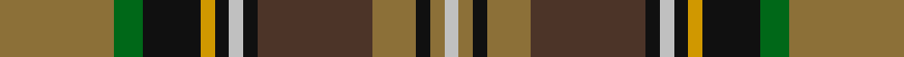

**Bands:** [GGKYKWKBGKGW](/stripes/ggkykwkbgkgw/) · **Stripes:** [Y G K LO K LB K DO Y K Y LB](/stripes/stripes12/) Y G K LO K LB K DO Y K Y LB

This was sourced from register-of-tartans.  It is a [12 band tartan](/bands/bands12/).

Original link https://www.tartanregister.gov.uk/tartanDetails.aspx?ref=4557

## Register references

External register numbers recorded for this tartan.

- Scottish Register of Tartans: [4557](https://www.tartanregister.gov.uk/tartanDetails.aspx?ref=4557)
- Scottish Tartans Authority (ITI): 4522

## Thread count
LT/32 G8 K16 DY4 K4 N4 K4 T32 LT12 K4 LT4 N/4

## Palette
Each colour and its ΔE from the base-6 reference it is a variant of.

| Colour | Shade | Base | ΔE (OKLab) |
|---|---|---|---|
| DY | <code style="background-color:#D09800;">#D09800</code> `#D09800` | Y <code style="background-color:#F2BF00;">#F2BF00</code> | 0.12 |
| G | <code style="background-color:#006818;">#006818</code> `#006818` | G <code style="background-color:#006100;">#006100</code> | 0.02 |
| K | <code style="background-color:#101010;">#101010</code> `#101010` | K <code style="background-color:#000000;">#000000</code> | 0.17 |
| LT | <code style="background-color:#8C7038;">#8C7038</code> `#8C7038` | G <code style="background-color:#006100;">#006100</code> | 0.18 |
| N | <code style="background-color:#C0C0C0;">#C0C0C0</code> `#C0C0C0` | W <code style="background-color:#F7F7F7;">#F7F7F7</code> | 0.17 |
| T | <code style="background-color:#4C3428;">#4C3428</code> `#4C3428` | B <code style="background-color:#2A418A;">#2A418A</code> | 0.17 |

## Nearest tartans

The nearest existing variants by ΔTartan distance.

1. [State Seal of Florida (Fashion)](/setts/s10/r3lo21r14lb3db11g36do3db3do4lo3~x2/) — ΔT 0.96
1. [Royal Pharmaceutical Society (Corp)](/setts/s9/dy2o2dg19o6dg2o6lo14r4w2~x2/) — ΔT 0.98
1. [Royal Pharmaceutical Society](/setts/s9/dy3o2dg19o6dg2o6lo14r4w2~x2/) — ΔT 0.99
1. [Gordonstoun](/setts/s12/ly3g15r2db8t2r8g8r2dg15r2dg2t2~x2/) — ΔT 1.00
1. [Cuthill (Personal)](/setts/s13/db3g4r2g3r3g16dt16r16db3r3db2r4ly3~x2/) — ΔT 1.02
1. [Kelsey, William (Personal)](/setts/s12/g12r2g2r5g16db3o2k2o3db6k20ly3~x2/) — ΔT 1.04
1. [Murphy (District)](/setts/s12/k4r1k3ly1k1w1k1y8g12r1g2k1~x4/) — ΔT 1.05
1. [Allen - 2001 (Personal)](/setts/s14/dt16r2dt3r4dt2dy12g18w2g18dy12dt12ly2r2ly2~x2/) — ΔT 1.06
1. [Wojtek Memorial Trust](/setts/s11/w3db15r6db3r3db4dg11dg3dg3dg28lo3~x2/) — ΔT 1.07
1. [Gordonstoun (Corporate)](/setts/s12/ly5g19r2t11lb2r11g11r2k20r2k2lb2~x2/) — ΔT 1.08

## Neighbour map

Every grey dot is one of 14299 variants placed by the first two principal components of the ΔTartan feature space (44% of its variance). Red is this tartan; blue dots are its nearest — click one to open its page.

<svg viewBox="0 0 640 380" role="img" style="max-width:100%;height:auto;border:1px solid #e0e0e0;border-radius:4px;display:block" xmlns="http://www.w3.org/2000/svg"><image href="/nn/cloud.v1.png" width="640" height="380"/><a href="/setts/s10/r3lo21r14lb3db11g36do3db3do4lo3~x2/"><circle cx="164.8" cy="142.4" r="4" fill="#3465a4"><title>State Seal of Florida (Fashion)</title></circle></a><a href="/setts/s9/dy2o2dg19o6dg2o6lo14r4w2~x2/"><circle cx="157.6" cy="162.1" r="4" fill="#3465a4"><title>Royal Pharmaceutical Society (Corp)</title></circle></a><a href="/setts/s9/dy3o2dg19o6dg2o6lo14r4w2~x2/"><circle cx="151.8" cy="164.6" r="4" fill="#3465a4"><title>Royal Pharmaceutical Society</title></circle></a><a href="/setts/s12/ly3g15r2db8t2r8g8r2dg15r2dg2t2~x2/"><circle cx="108.1" cy="165.6" r="4" fill="#3465a4"><title>Gordonstoun</title></circle></a><a href="/setts/s13/db3g4r2g3r3g16dt16r16db3r3db2r4ly3~x2/"><circle cx="125.6" cy="158.7" r="4" fill="#3465a4"><title>Cuthill (Personal)</title></circle></a><a href="/setts/s12/g12r2g2r5g16db3o2k2o3db6k20ly3~x2/"><circle cx="149.0" cy="144.6" r="4" fill="#3465a4"><title>Kelsey, William (Personal)</title></circle></a><a href="/setts/s12/k4r1k3ly1k1w1k1y8g12r1g2k1~x4/"><circle cx="175.6" cy="124.9" r="4" fill="#3465a4"><title>Murphy (District)</title></circle></a><a href="/setts/s14/dt16r2dt3r4dt2dy12g18w2g18dy12dt12ly2r2ly2~x2/"><circle cx="141.0" cy="163.4" r="4" fill="#3465a4"><title>Allen - 2001 (Personal)</title></circle></a><a href="/setts/s11/w3db15r6db3r3db4dg11dg3dg3dg28lo3~x2/"><circle cx="160.1" cy="154.1" r="4" fill="#3465a4"><title>Wojtek Memorial Trust</title></circle></a><a href="/setts/s12/ly5g19r2t11lb2r11g11r2k20r2k2lb2~x2/"><circle cx="108.7" cy="139.4" r="4" fill="#3465a4"><title>Gordonstoun (Corporate)</title></circle></a><circle cx="148.6" cy="150.5" r="5" fill="#c00000"/></svg>

ID: /setts/s12/y8g2k4lo1k1lb1k1do8y3k1y1lb1~x4/
