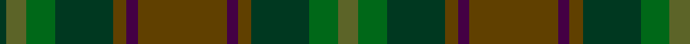

**Bands:** [GGGGBGBGGGGG](/stripes/ggggbgbggggg/) · **Stripes:** [Y G DG DY DP DY DP DY DG G Y DG](/stripes/stripes12/) Y G DG DY DP DY DP DY DG G Y DG

This was sourced from tartans-authority.  It is a [12 band tartan](/bands/bands12/).

Original link http://www.tartansauthority.com/tartan-ferret/display/10576/

## Thread count
DG/6 G18 Ga26 DG52 T12 DP10 T80 DP10 T12 DG52 Ga26 G/18

## Palette
Each colour and its ΔE from the base-6 reference it is a variant of.

| Colour | Shade | Base | ΔE (OKLab) |
|---|---|---|---|
| DG | <code style="background-color:#003820;">#003820</code> `#003820` | G <code style="background-color:#006100;">#006100</code> | 0.15 |
| DP | <code style="background-color:#440044;">#440044</code> `#440044` | B <code style="background-color:#2A418A;">#2A418A</code> | 0.18 |
| G | <code style="background-color:#5C6428;">#5C6428</code> `#5C6428` | G <code style="background-color:#006100;">#006100</code> | 0.10 |
| Ga | <code style="background-color:#006818;">#006818</code> `#006818` | G <code style="background-color:#006100;">#006100</code> | 0.02 |
| T | <code style="background-color:#604000;">#604000</code> `#604000` | G <code style="background-color:#006100;">#006100</code> | 0.14 |

## Nearest tartans

The nearest existing variants by ΔTartan distance.

1. [Unidentified Fragment #2](/setts/s15/dy8dg20db15dy6dg4dy8db4dy6dg20dy8db6dy4b2dy4db6/) — ΔT 1.61
1. [Devarr](/setts/s14/do22y26r4y26do22dy3do3dy3do3dy31do3dy3do3dy3~x2/) — ΔT 1.67
1. [Protheroe (Welsh Name)](/setts/s12/dg5dg2db2dg2db2dt5dg2dt1lo1dt1dg10db3~x4/) — ΔT 1.70
1. [Lunting Papi (Personal)](/setts/s7/o5r8dp13dg21dg34dg55o3/) — ΔT 1.72
1. [Bruma](/setts/s13/r2do1k1do10r1do10k13n4k1n11dy9n2lr1~x2/) — ΔT 1.76
1. [Cowal Highland Gathering](/setts/s9/dg2y8dt1y1dt1y1dt8dt9n1~x4/) — ΔT 1.79
1. [MacNaughton Htg](/setts/s9/dg1r1dg22dy21dg12r11dg22r1dg1~x2/) — ΔT 1.85
1. [Cowal Highland Games Corporate Tartan Tartan Number: 2536. Earliest known date: 1994 The Cowal Highland Gathering takes place on the last weekend of August each year in Dunoon, Argyllshire, on the Firth of Clyde and is the largest, most spectacular Highland Games in the world with thousands of dancers, pipers, drummers and athletes attending from all over the world. In 1994, the centenary year of the Gathering, this soft muted tartan in blues and greens was designed. Only available from Bells of Dunoon - michael.boyce@telco4u.net (Sept. 2004) See products available Copyright © Blair Urquhart, Comrie, 2015](/setts/s16/dt9dt8y1dt1y1dt1y8dg2y8dt1y1dt1y1dt8dt9n1~x4/) — ΔT 1.88
1. [Glens of Corbie](/setts/s9/lo3g30y20o6y3o3y3dt20r2~x2/) — ΔT 1.89
1. [House of Bruar](/setts/s10/do26dt28g26dt8y3dt8g26dt28do26dr6~x2/) — ΔT 1.92

## Neighbour map

Every grey dot is one of 14313 variants placed by the first two principal components of the ΔTartan feature space (44% of its variance). Red is this tartan; blue dots are its nearest — click one to open its page.

<svg viewBox="0 0 640 380" role="img" style="max-width:100%;height:auto;border:1px solid #e0e0e0;border-radius:4px;display:block" xmlns="http://www.w3.org/2000/svg"><image href="/nn/cloud.v1.png" width="640" height="380"/><a href="/setts/s15/dy8dg20db15dy6dg4dy8db4dy6dg20dy8db6dy4b2dy4db6/"><circle cx="298.8" cy="264.0" r="4" fill="#3465a4"><title>Unidentified Fragment #2</title></circle></a><a href="/setts/s14/do22y26r4y26do22dy3do3dy3do3dy31do3dy3do3dy3~x2/"><circle cx="330.1" cy="231.9" r="4" fill="#3465a4"><title>Devarr</title></circle></a><a href="/setts/s12/dg5dg2db2dg2db2dt5dg2dt1lo1dt1dg10db3~x4/"><circle cx="307.8" cy="248.0" r="4" fill="#3465a4"><title>Protheroe (Welsh Name)</title></circle></a><a href="/setts/s7/o5r8dp13dg21dg34dg55o3/"><circle cx="283.3" cy="217.6" r="4" fill="#3465a4"><title>Lunting Papi (Personal)</title></circle></a><a href="/setts/s13/r2do1k1do10r1do10k13n4k1n11dy9n2lr1~x2/"><circle cx="263.0" cy="210.8" r="4" fill="#3465a4"><title>Bruma</title></circle></a><a href="/setts/s9/dg2y8dt1y1dt1y1dt8dt9n1~x4/"><circle cx="255.9" cy="238.8" r="4" fill="#3465a4"><title>Cowal Highland Gathering</title></circle></a><a href="/setts/s9/dg1r1dg22dy21dg12r11dg22r1dg1~x2/"><circle cx="401.9" cy="242.2" r="4" fill="#3465a4"><title>MacNaughton Htg</title></circle></a><a href="/setts/s16/dt9dt8y1dt1y1dt1y8dg2y8dt1y1dt1y1dt8dt9n1~x4/"><circle cx="253.0" cy="216.3" r="4" fill="#3465a4"><title>Cowal Highland Games Corporate Tartan Tartan Number: 2536. Earliest known date: 1994 The Cowal Highland Gathering takes place on the last weekend of August each year in Dunoon, Argyllshire, on the Firth of Clyde and is the largest, most spectacular Highland Games in the world with thousands of dancers, pipers, drummers and athletes attending from all over the world. In 1994, the centenary year of the Gathering, this soft muted tartan in blues and greens was designed. Only available from Bells of Dunoon - michael.boyce@telco4u.net (Sept. 2004) See products available Copyright © Blair Urquhart, Comrie, 2015</title></circle></a><a href="/setts/s9/lo3g30y20o6y3o3y3dt20r2~x2/"><circle cx="238.2" cy="189.7" r="4" fill="#3465a4"><title>Glens of Corbie</title></circle></a><a href="/setts/s10/do26dt28g26dt8y3dt8g26dt28do26dr6~x2/"><circle cx="249.1" cy="267.8" r="4" fill="#3465a4"><title>House of Bruar</title></circle></a><circle cx="276.2" cy="231.8" r="5" fill="#c00000"/></svg>

ID: /setts/s12/y9g13dg26dy6dp5dy40dp5dy6dg26g13y9dg3~x2/
