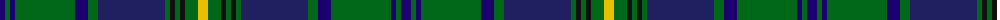

In pattern [BGBGBGBGKGKGY](/patterns/bgbgbgbgkgkgy/).

This was sourced from register-of-tartans.  It is a [13 stripes tartan](/stripes/stripes13/).

Original link https://www.tartanregister.gov.uk/tartanDetails.aspx?ref=3399

## Attestations

This cloth appears in 2 source records; the oldest owns this page.

- 01/01/2002 — Princess Beatrice Hunting (register-of-tartans, [record](https://www.tartanregister.gov.uk/tartanDetails.aspx?ref=3399))
- pre 2002 — Princess Beatrice Htg (STS) (Fashion (tartans-authority, [record](http://www.tartansauthority.com/tartan-ferret/display/545/))

## Thread count
DBa/10 G5 DBa5 G60 DBa13 G10 DB67 G5 K5 G5 K5 G13 Y/10

## Palette
Each colour and its ΔE from the base-6 reference it is a variant of.

| Colour | Shade | Base | ΔE (OKLab) |
|---|---|---|---|
| DB | <code style="background-color:#202060;">#202060</code> `#202060` | B <code style="background-color:#2C4084;">#2C4084</code> | 0.11 |
| DBa | <code style="background-color:#1C0070;">#1C0070</code> `#1C0070` | B <code style="background-color:#2C4084;">#2C4084</code> | 0.14 |
| G | <code style="background-color:#006818;">#006818</code> `#006818` | G <code style="background-color:#006400;">#006400</code> | 0.02 |
| K | <code style="background-color:#101010;">#101010</code> `#101010` | K <code style="background-color:#000000;">#000000</code> | 0.17 |
| Y | <code style="background-color:#E8C000;">#E8C000</code> `#E8C000` | Y <code style="background-color:#E8C000;">#E8C000</code> | 0.00 |

## Nearest tartans

The nearest existing variants by ΔTartan distance.

1. [Scottish Rugby Union (City of Nagasaki)](/setts/s11/g12k4g48k20b4ba4b4ba4b20k4w6-b14283c-ba9058d8-g006818-k101010-wc0c0c0/) — ΔT 0.82
1. [Semple](/setts/s16/b22k6b6k6b8k30g72w6g72k30b8k6b6k6b22r8-b1474b4-g006818-k101010-rc80000-wfcfcfc/) — ΔT 0.92
1. [Beatrice Princess.. (Hunting) Royal Family Tartan Tartan Number: 545. Earliest known date: pre 2003 Reduced by 1/6th to display. See products available Copyright © Blair Urquhart, Comrie, 2015](/setts/s14/b10r5g5r5g60b13g10ba67g5k5g5k5g13y10-b1c0070-ba202060-g006818-k101010-rc80000-ye8c000/) — ΔT 0.93
1. [Unidentified B'gowrie Unknown Tartan Tartan Number: 2144. Earliest known date: c. 1945 Do you recognise this tartan. It was discovered by Robin Birch of Connell Reid Kiltmakers in Blairgowrie, attached to a Teddy Bear that he thought had a regimental connection dating from 1945. The unidentified sample was recorded here on 2nd February, 1995. See products available Copyright © Blair Urquhart, Comrie, 2015](/setts/s15/g60y4g10y4g8k30b58r4b58k30g10y4g8y4g34-b2c2c80-g006818-k101010-rc80000-ye8c000/) — ΔT 0.97
1. [Lochcarron Hunting](/setts/s14/g6b20ba6b4ba4b4g6k10g4k10g44r4g6r4-b000064-ba346488-g004c00-k000000-r8c0000/) — ΔT 0.99
1. [Ontario (Official)](/setts/s13/g38r2g4r4g30r2b26w2ba4r4ba42r2w6-b1c1c1c-ba2c2c80-g006818-rc80000-we0e0e0/) — ΔT 1.03
1. [Urquhart White Line Clan Tartan Tartan Number: 623. Earliest known date: 1842 Sample in Paton's collection. The Setts No: 249. Innes No 110. W & A K Johnston, 1906 It is interesting to note that much of the forged sixteenth century manuscript on which the Vestiarium Scoticum was based was supposedly transcribed by Sir Richard Urquhart in 1721. See products available Copyright © Blair Urquhart, Comrie, 2015](/setts/s12/b4w2b24k3b3k3b8k24g48k3g3r2-b2c2c80-g006818-k101010-rc80000-we0e0e0/) — ΔT 1.06
1. [Princess Beatrice Hunting (MacKinlay strip)](/setts/s14/b12r6g6r6g72ba12g12b80g6k6g6k6g16y12-b2c2c80-ba0000e0-g006818-k000000-rc80000-ye8c000/) — ΔT 1.06
1. [Fraser Gathering, Green (1997)](/setts/s9/r4b24g4ga22g8b10ga4g48w4-b1c0070-g003820-ga006818-rc80000-wfcfcfc/) — ΔT 1.07
1. [Cochrane Clan Tartan Tartan Number: 994. Earliest known date: 1934 Lord Dundonald originally registered a version missing a red and a green stripe with Lord Lyon in 1974. There is a story that a fragment of this design was discovered in the foundations of a Perthshire house around the 1930's, thought to be of greater authenticity. However, other reports suggest that the missing stripes were simply a typing error. The sett is based on the old Lochaber district tartan which also provided a base for the MacDonald and the Cameron of Erracht. (All of which have four red stripes). The red and green have been restored in this version, which is now the approved tartan, and appears in the 'Appendix' of the Lyon Court Books dated 12th November 1984. See products available Copyright © Blair Urquhart, Comrie, 2015](/setts/s15/g32r4g4r2g6r2g4r4g24k24r2b32r4b16y4-b2c2c80-g006818-k101010-rc80000-ye8c000/) — ΔT 1.07

## Neighbour map

Every grey dot is one of 15726 variants placed by the first two principal components of the ΔTartan feature space (44% of its variance). Red is this tartan; blue dots are its nearest — click one to open its page.

<svg viewBox="0 0 640 380" role="img" style="max-width:100%;height:auto;border:1px solid #e0e0e0;border-radius:4px;display:block" xmlns="http://www.w3.org/2000/svg"><image href="/nn/cloud.v1.png" width="640" height="380"/><a href="/setts/s11/g12k4g48k20b4ba4b4ba4b20k4w6-b14283c-ba9058d8-g006818-k101010-wc0c0c0/"><circle cx="230.1" cy="155.9" r="4" fill="#3465a4"><title>Scottish Rugby Union (City of Nagasaki)</title></circle></a><a href="/setts/s16/b22k6b6k6b8k30g72w6g72k30b8k6b6k6b22r8-b1474b4-g006818-k101010-rc80000-wfcfcfc/"><circle cx="220.7" cy="136.9" r="4" fill="#3465a4"><title>Semple</title></circle></a><a href="/setts/s14/b10r5g5r5g60b13g10ba67g5k5g5k5g13y10-b1c0070-ba202060-g006818-k101010-rc80000-ye8c000/"><circle cx="216.9" cy="113.4" r="4" fill="#3465a4"><title>Beatrice Princess.. (Hunting) Royal Family Tartan Tartan Number: 545. Earliest known date: pre 2003 Reduced by 1/6th to display. See products available Copyright © Blair Urquhart, Comrie, 2015</title></circle></a><a href="/setts/s15/g60y4g10y4g8k30b58r4b58k30g10y4g8y4g34-b2c2c80-g006818-k101010-rc80000-ye8c000/"><circle cx="204.5" cy="141.8" r="4" fill="#3465a4"><title>Unidentified B'gowrie Unknown Tartan Tartan Number: 2144. Earliest known date: c. 1945 Do you recognise this tartan. It was discovered by Robin Birch of Connell Reid Kiltmakers in Blairgowrie, attached to a Teddy Bear that he thought had a regimental connection dating from 1945. The unidentified sample was recorded here on 2nd February, 1995. See products available Copyright © Blair Urquhart, Comrie, 2015</title></circle></a><a href="/setts/s14/g6b20ba6b4ba4b4g6k10g4k10g44r4g6r4-b000064-ba346488-g004c00-k000000-r8c0000/"><circle cx="245.4" cy="153.4" r="4" fill="#3465a4"><title>Lochcarron Hunting</title></circle></a><a href="/setts/s13/g38r2g4r4g30r2b26w2ba4r4ba42r2w6-b1c1c1c-ba2c2c80-g006818-rc80000-we0e0e0/"><circle cx="231.5" cy="118.7" r="4" fill="#3465a4"><title>Ontario (Official)</title></circle></a><a href="/setts/s12/b4w2b24k3b3k3b8k24g48k3g3r2-b2c2c80-g006818-k101010-rc80000-we0e0e0/"><circle cx="257.1" cy="119.6" r="4" fill="#3465a4"><title>Urquhart White Line Clan Tartan Tartan Number: 623. Earliest known date: 1842 Sample in Paton's collection. The Setts No: 249. Innes No 110. W &amp; A K Johnston, 1906 It is interesting to note that much of the forged sixteenth century manuscript on which the Vestiarium Scoticum was based was supposedly transcribed by Sir Richard Urquhart in 1721. See products available Copyright © Blair Urquhart, Comrie, 2015</title></circle></a><a href="/setts/s14/b12r6g6r6g72ba12g12b80g6k6g6k6g16y12-b2c2c80-ba0000e0-g006818-k000000-rc80000-ye8c000/"><circle cx="221.2" cy="108.6" r="4" fill="#3465a4"><title>Princess Beatrice Hunting (MacKinlay strip)</title></circle></a><a href="/setts/s9/r4b24g4ga22g8b10ga4g48w4-b1c0070-g003820-ga006818-rc80000-wfcfcfc/"><circle cx="246.2" cy="177.8" r="4" fill="#3465a4"><title>Fraser Gathering, Green (1997)</title></circle></a><a href="/setts/s15/g32r4g4r2g6r2g4r4g24k24r2b32r4b16y4-b2c2c80-g006818-k101010-rc80000-ye8c000/"><circle cx="213.7" cy="133.4" r="4" fill="#3465a4"><title>Cochrane Clan Tartan Tartan Number: 994. Earliest known date: 1934 Lord Dundonald originally registered a version missing a red and a green stripe with Lord Lyon in 1974. There is a story that a fragment of this design was discovered in the foundations of a Perthshire house around the 1930's, thought to be of greater authenticity. However, other reports suggest that the missing stripes were simply a typing error. The sett is based on the old Lochaber district tartan which also provided a base for the MacDonald and the Cameron of Erracht. (All of which have four red stripes). The red and green have been restored in this version, which is now the approved tartan, and appears in the 'Appendix' of the Lyon Court Books dated 12th November 1984. See products available Copyright © Blair Urquhart, Comrie, 2015</title></circle></a><circle cx="247.8" cy="138.2" r="5" fill="#c00000"/></svg>

ID: /setts/s13/b10g5b5g60b13g10ba67g5k5g5k5g13y10-b1c0070-ba202060-g006818-k101010-ye8c000/
