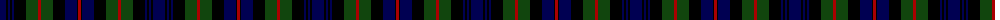

In pattern [BKBKBKGRGKBKR](/patterns/bkbkbkgrgkbkr/).

This was sourced from weddslist.  It is a [13 stripes tartan](/stripes/stripes13/).

Original link http://www.weddslist.com/cgi-bin/tartans/pg.pl?source=x

## Thread count
DB/12 K2 DB2 K2 DB2 K12 DG12 DR3 DG12 K12 DB12 K1 DR/3

## Palette
Each colour and its ΔE from the base-6 reference it is a variant of.

| Colour | Shade | Base | ΔE (OKLab) |
|---|---|---|---|
| DB | <code style="background-color:#000052;">#000052</code> `#000052` | B <code style="background-color:#2C4084;">#2C4084</code> | 0.20 |
| DG | <code style="background-color:#11450D;">#11450D</code> `#11450D` | G <code style="background-color:#006400;">#006400</code> | 0.10 |
| DR | <code style="background-color:#AA0000;">#AA0000</code> `#AA0000` | R <code style="background-color:#C80000;">#C80000</code> | 0.06 |
| K | <code style="background-color:#000000;">#000000</code> `#000000` | K <code style="background-color:#000000;">#000000</code> | 0.00 |

## Nearest tartans

The nearest existing variants by ΔTartan distance.

1. [Murray of Atholl](/setts/s13/b24k4b4k4b4k24g24r6g24k24b24k2r6-b000052-g11450d-k000000-raa0000/) — ΔT 0.00
1. [Murray of Atholl](/setts/s13/b12k2b2k2b2k12g12r3g12k12b12k1r3-b000064-g004c00-k000000-rc80000/) — ΔT 0.49
1. [MacDonald](/setts/s12/b16r2b4r6b24r2k24g24r6g4r2g16-b000052-g11450d-k000000-raa0000/) — ΔT 0.65
1. [MacKinlay](/setts/s15/b12k4b4k4b4k12g16k2r4k2g16k12b16k4b4-b000052-g11450d-k000000-raa0000/) — ΔT 0.80
1. [MacKinlay](/setts/s15/b12k4b4k4b4k12g16k2r4k2g16k12b16k4b4-b000064-g004c00-k000000-rc80000/) — ΔT 0.83
1. [Urquhart L](/setts/s13/g16k2g2k2g2k16b16r2b16k16g16k2g2-b000052-g11450d-k000000-raa0000/) — ΔT 0.84
1. [Urquhart L](/setts/s13/g8k1g1k1g1k8b8r1b8k8g8k1g1-b000052-g11450d-k000000-raa0000/) — ΔT 0.84
1. [Urquhart L](/setts/s13/g8k1g1k1g1k8b8r1b8k8g8k1g1-b000064-g004c00-k000000-rc80000/) — ΔT 0.89
1. [Forbes](/setts/s15/b16k2b4k2b4k12g16k2y4k2g16k12b16k2b4-b000052-g11450d-k000000-yaaaaaa/) — ΔT 0.94
1. [Forbes](/setts/s15/b8k1b2k1b2k6g8k1y2k1g8k6b8k1b2-b000052-g11450d-k000000-yaaaaaa/) — ΔT 0.94

## Neighbour map

Every grey dot is one of 15726 variants placed by the first two principal components of the ΔTartan feature space (44% of its variance). Red is this tartan; blue dots are its nearest — click one to open its page.

<svg viewBox="0 0 640 380" role="img" style="max-width:100%;height:auto;border:1px solid #e0e0e0;border-radius:4px;display:block" xmlns="http://www.w3.org/2000/svg"><image href="/nn/cloud.v1.png" width="640" height="380"/><a href="/setts/s13/b24k4b4k4b4k24g24r6g24k24b24k2r6-b000052-g11450d-k000000-raa0000/"><circle cx="179.5" cy="198.4" r="4" fill="#3465a4"><title>Murray of Atholl</title></circle></a><a href="/setts/s13/b12k2b2k2b2k12g12r3g12k12b12k1r3-b000064-g004c00-k000000-rc80000/"><circle cx="164.9" cy="191.9" r="4" fill="#3465a4"><title>Murray of Atholl</title></circle></a><a href="/setts/s12/b16r2b4r6b24r2k24g24r6g4r2g16-b000052-g11450d-k000000-raa0000/"><circle cx="180.5" cy="188.2" r="4" fill="#3465a4"><title>MacDonald</title></circle></a><a href="/setts/s15/b12k4b4k4b4k12g16k2r4k2g16k12b16k4b4-b000052-g11450d-k000000-raa0000/"><circle cx="174.6" cy="216.9" r="4" fill="#3465a4"><title>MacKinlay</title></circle></a><a href="/setts/s15/b12k4b4k4b4k12g16k2r4k2g16k12b16k4b4-b000064-g004c00-k000000-rc80000/"><circle cx="159.6" cy="210.4" r="4" fill="#3465a4"><title>MacKinlay</title></circle></a><a href="/setts/s13/g16k2g2k2g2k16b16r2b16k16g16k2g2-b000052-g11450d-k000000-raa0000/"><circle cx="192.4" cy="210.7" r="4" fill="#3465a4"><title>Urquhart L</title></circle></a><a href="/setts/s13/g8k1g1k1g1k8b8r1b8k8g8k1g1-b000052-g11450d-k000000-raa0000/"><circle cx="192.4" cy="210.7" r="4" fill="#3465a4"><title>Urquhart L</title></circle></a><a href="/setts/s13/g8k1g1k1g1k8b8r1b8k8g8k1g1-b000064-g004c00-k000000-rc80000/"><circle cx="178.3" cy="204.9" r="4" fill="#3465a4"><title>Urquhart L</title></circle></a><a href="/setts/s15/b16k2b4k2b4k12g16k2y4k2g16k12b16k2b4-b000052-g11450d-k000000-yaaaaaa/"><circle cx="185.8" cy="203.7" r="4" fill="#3465a4"><title>Forbes</title></circle></a><a href="/setts/s15/b8k1b2k1b2k6g8k1y2k1g8k6b8k1b2-b000052-g11450d-k000000-yaaaaaa/"><circle cx="185.8" cy="203.7" r="4" fill="#3465a4"><title>Forbes</title></circle></a><circle cx="179.5" cy="198.4" r="5" fill="#c00000"/></svg>

ID: /setts/s13/b12k2b2k2b2k12g12r3g12k12b12k1r3-b000052-g11450d-k000000-raa0000/
