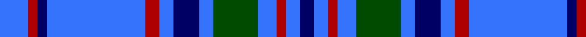

In pattern [BBRBGBBBRBBRB](/patterns/bbrbgbbbrbbrb/).

This was sourced from register-of-tartans.  It is a [13 stripes tartan](/stripes/stripes13/).

Original link https://www.tartanregister.gov.uk/tartanDetails.aspx?ref=253

## Thread count
B/12 DR4 DB4 B42 DR6 B6 DB11 B6 G19 B8 DR4 B6 DB/6

## Palette
Each colour and its ΔE from the base-6 reference it is a variant of.

| Colour | Shade | Base | ΔE (OKLab) |
|---|---|---|---|
| B | <code style="background-color:#3474FC;">#3474FC</code> `#3474FC` | B <code style="background-color:#2C4084;">#2C4084</code> | 0.23 |
| DB | <code style="background-color:#000064;">#000064</code> `#000064` | B <code style="background-color:#2C4084;">#2C4084</code> | 0.17 |
| DR | <code style="background-color:#B00000;">#B00000</code> `#B00000` | R <code style="background-color:#C80000;">#C80000</code> | 0.05 |
| G | <code style="background-color:#004C00;">#004C00</code> `#004C00` | G <code style="background-color:#006400;">#006400</code> | 0.08 |

## Nearest tartans

The nearest existing variants by ΔTartan distance.

1. [Bermuda Blue (1962) (District)](/setts/s13/b12r4ba4b42r6b6ba11b6g19b8r4b6ba6-b3474fc-ba000064-g007000-rb00000/) — ΔT 0.18
1. [Callaway (Name)](/setts/s9/r8b24ba72w8ba8b32w6ba12b6-b2474e8-ba2c2c80-rc80000-we0e0e0/) — ΔT 1.16
1. [Bermuda, Blue](/setts/s13/b12r4ba4b42r6b6ba11b6g19b8r4b6ba6-b8080d0-ba000050-g003000-rc00000/) — ΔT 1.46
1. [Pacific](/setts/s12/g8ga8g4ga56b8ga40b40ga8b56r4b8r8-b6840fc-g289c18-ga005448-r9c68a4/) — ΔT 1.50
1. [Mortell (Personal)](/setts/s10/b40ba4w10r4b20ba10b40ba4w10r10-b2c2c80-ba1870a4-rc80000-we0e0e0/) — ΔT 1.51
1. [Fujisankei Serene (Corporate)](/setts/s9/r4w24b16w4b64ba4b16ba24w4-b2c2c80-ba5c5c5c-r888888-wc0c0c0/) — ΔT 1.55
1. [Jethart (District)](/setts/s9/k44b32r6b32k4b32g6b6w10-b3850c8-g289c18-k101010-r880000-w98c8e8/) — ΔT 1.55
1. [Dunbarton Weft](/setts/s11/b60r4b4k10b6g4b6g44b6k4b6-b0596fa-g503c14-k101010-rdc0000/) — ΔT 1.65
1. [Yamaue](/setts/s13/w4r10b8g16b80r10w4r10b8g16b8r10w4-b0000ee-g008000-rcd0000-wffffff/) — ΔT 1.66
1. [Kinding](/setts/s7/k20b60g6b6g6b6r12-b0000cd-g00af33-k101010-rc82536/) — ΔT 1.66

## Neighbour map

Every grey dot is one of 15726 variants placed by the first two principal components of the ΔTartan feature space (44% of its variance). Red is this tartan; blue dots are its nearest — click one to open its page.

<svg viewBox="0 0 640 380" role="img" style="max-width:100%;height:auto;border:1px solid #e0e0e0;border-radius:4px;display:block" xmlns="http://www.w3.org/2000/svg"><image href="/nn/cloud.v1.png" width="640" height="380"/><a href="/setts/s13/b12r4ba4b42r6b6ba11b6g19b8r4b6ba6-b3474fc-ba000064-g007000-rb00000/"><circle cx="292.4" cy="166.8" r="4" fill="#3465a4"><title>Bermuda Blue (1962) (District)</title></circle></a><a href="/setts/s9/r8b24ba72w8ba8b32w6ba12b6-b2474e8-ba2c2c80-rc80000-we0e0e0/"><circle cx="299.6" cy="177.2" r="4" fill="#3465a4"><title>Callaway (Name)</title></circle></a><a href="/setts/s13/b12r4ba4b42r6b6ba11b6g19b8r4b6ba6-b8080d0-ba000050-g003000-rc00000/"><circle cx="295.3" cy="159.2" r="4" fill="#3465a4"><title>Bermuda, Blue</title></circle></a><a href="/setts/s12/g8ga8g4ga56b8ga40b40ga8b56r4b8r8-b6840fc-g289c18-ga005448-r9c68a4/"><circle cx="281.8" cy="170.0" r="4" fill="#3465a4"><title>Pacific</title></circle></a><a href="/setts/s10/b40ba4w10r4b20ba10b40ba4w10r10-b2c2c80-ba1870a4-rc80000-we0e0e0/"><circle cx="335.5" cy="185.6" r="4" fill="#3465a4"><title>Mortell (Personal)</title></circle></a><a href="/setts/s9/r4w24b16w4b64ba4b16ba24w4-b2c2c80-ba5c5c5c-r888888-wc0c0c0/"><circle cx="341.6" cy="165.8" r="4" fill="#3465a4"><title>Fujisankei Serene (Corporate)</title></circle></a><a href="/setts/s9/k44b32r6b32k4b32g6b6w10-b3850c8-g289c18-k101010-r880000-w98c8e8/"><circle cx="280.8" cy="184.6" r="4" fill="#3465a4"><title>Jethart (District)</title></circle></a><a href="/setts/s11/b60r4b4k10b6g4b6g44b6k4b6-b0596fa-g503c14-k101010-rdc0000/"><circle cx="322.7" cy="137.6" r="4" fill="#3465a4"><title>Dunbarton Weft</title></circle></a><a href="/setts/s13/w4r10b8g16b80r10w4r10b8g16b8r10w4-b0000ee-g008000-rcd0000-wffffff/"><circle cx="290.1" cy="108.3" r="4" fill="#3465a4"><title>Yamaue</title></circle></a><a href="/setts/s7/k20b60g6b6g6b6r12-b0000cd-g00af33-k101010-rc82536/"><circle cx="322.9" cy="188.2" r="4" fill="#3465a4"><title>Kinding</title></circle></a><circle cx="292.9" cy="167.1" r="5" fill="#c00000"/></svg>

ID: /setts/s13/b12r4ba4b42r6b6ba11b6g19b8r4b6ba6-b3474fc-ba000064-g004c00-rb00000/
