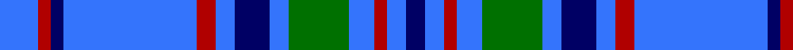

In pattern [BBRBGBBBRBBRB](/patterns/bbrbgbbbrbbrb/).

This was sourced from tartans-authority.  It is a [13 stripes tartan](/stripes/stripes13/).

Original link http://www.tartansauthority.com/tartan-ferret/display/2156/

## Thread count
B/12 DR4 DB4 B42 DR6 B6 DB11 B6 G19 B8 DR4 B6 DB/6

## Palette
Each colour and its ΔE from the base-6 reference it is a variant of.

| Colour | Shade | Base | ΔE (OKLab) |
|---|---|---|---|
| B | <code style="background-color:#3474FC;">#3474FC</code> `#3474FC` | B <code style="background-color:#2A418A;">#2A418A</code> | 0.22 |
| DB | <code style="background-color:#000064;">#000064</code> `#000064` | B <code style="background-color:#2A418A;">#2A418A</code> | 0.18 |
| DR | <code style="background-color:#B00000;">#B00000</code> `#B00000` | R <code style="background-color:#CC0000;">#CC0000</code> | 0.06 |
| G | <code style="background-color:#007000;">#007000</code> `#007000` | G <code style="background-color:#006100;">#006100</code> | 0.05 |

## Nearest tartans

The nearest existing variants by ΔTartan distance.

1. [Bermuda Blue](/setts/s13/b12r4ba4b42r6b6ba11b6g19b8r4b6ba6~b3474fc-ba000064-g004c00-rb00000/) — ΔT 0.18
1. [Callaway (Name)](/setts/s9/r4b12ba36w4ba4b16w3ba6b3~b2474e8-ba2c2c80-rc80000-we0e0e0~x2/) — ΔT 1.22
1. [Bermuda, Blue](/setts/s13/b12r4ba4b42r6b6ba11b6g19b8r4b6ba6~b8080d0-ba000050-g003000-rc00000/) — ΔT 1.46
1. [Pacific](/setts/s12/g2ga2g1ga14b2ga10b10ga2b14r1b2r2~b6840fc-g289c18-ga005448-r9c68a4~x4/) — ΔT 1.51
1. [Mortell (Personal)](/setts/s10/b20ba2w5r2b10ba5b20ba2w5r5~b2c2c80-ba1870a4-rc80000-we0e0e0~x2/) — ΔT 1.56
1. [Fujisankei Serene (Corporate)](/setts/s9/r1w6b4w1b16ba1b4ba6w1~b2c2c80-ba5c5c5c-r888888-wc0c0c0~x4/) — ΔT 1.56
1. [Dunbarton Weft](/setts/s11/b30r2b2k5b3g2b3g22b3k2b3~b0596fa-g503c14-k101010-rdc0000~x2/) — ΔT 1.58
1. [Jethart (District)](/setts/s9/k22b16r3b16k2b16g3b3w5~b3850c8-g289c18-k101010-r880000-w98c8e8~x2/) — ΔT 1.61
1. [Yamaue](/setts/s13/w2r5b4g8b40r5w2r5b4g8b4r5w2~b0000ee-g008000-rcd0000-wffffff~x2/) — ΔT 1.69
1. [Beck (Personal)](/setts/s15/k4w2b15r6b25w2k4w2b15w4k2w4k2w4k2~b2888c4-k101010-rcd0000-we0e0e0~x2/) — ΔT 1.74

## Neighbour map

Every grey dot is one of 15726 variants placed by the first two principal components of the ΔTartan feature space (44% of its variance). Red is this tartan; blue dots are its nearest — click one to open its page.

<svg viewBox="0 0 640 380" role="img" style="max-width:100%;height:auto;border:1px solid #e0e0e0;border-radius:4px;display:block" xmlns="http://www.w3.org/2000/svg"><image href="/nn/cloud.v1.png" width="640" height="380"/><a href="/setts/s13/b12r4ba4b42r6b6ba11b6g19b8r4b6ba6~b3474fc-ba000064-g004c00-rb00000/"><circle cx="293.6" cy="169.1" r="4" fill="#3465a4"><title>Bermuda Blue</title></circle></a><a href="/setts/s9/r4b12ba36w4ba4b16w3ba6b3~b2474e8-ba2c2c80-rc80000-we0e0e0~x2/"><circle cx="300.6" cy="178.7" r="4" fill="#3465a4"><title>Callaway (Name)</title></circle></a><a href="/setts/s13/b12r4ba4b42r6b6ba11b6g19b8r4b6ba6~b8080d0-ba000050-g003000-rc00000/"><circle cx="295.7" cy="161.4" r="4" fill="#3465a4"><title>Bermuda, Blue</title></circle></a><a href="/setts/s12/g2ga2g1ga14b2ga10b10ga2b14r1b2r2~b6840fc-g289c18-ga005448-r9c68a4~x4/"><circle cx="283.2" cy="170.6" r="4" fill="#3465a4"><title>Pacific</title></circle></a><a href="/setts/s10/b20ba2w5r2b10ba5b20ba2w5r5~b2c2c80-ba1870a4-rc80000-we0e0e0~x2/"><circle cx="335.2" cy="188.7" r="4" fill="#3465a4"><title>Mortell (Personal)</title></circle></a><a href="/setts/s9/r1w6b4w1b16ba1b4ba6w1~b2c2c80-ba5c5c5c-r888888-wc0c0c0~x4/"><circle cx="342.2" cy="168.2" r="4" fill="#3465a4"><title>Fujisankei Serene (Corporate)</title></circle></a><a href="/setts/s11/b30r2b2k5b3g2b3g22b3k2b3~b0596fa-g503c14-k101010-rdc0000~x2/"><circle cx="323.8" cy="139.9" r="4" fill="#3465a4"><title>Dunbarton Weft</title></circle></a><a href="/setts/s9/k22b16r3b16k2b16g3b3w5~b3850c8-g289c18-k101010-r880000-w98c8e8~x2/"><circle cx="281.0" cy="186.6" r="4" fill="#3465a4"><title>Jethart (District)</title></circle></a><a href="/setts/s13/w2r5b4g8b40r5w2r5b4g8b4r5w2~b0000ee-g008000-rcd0000-wffffff~x2/"><circle cx="291.7" cy="111.0" r="4" fill="#3465a4"><title>Yamaue</title></circle></a><a href="/setts/s15/k4w2b15r6b25w2k4w2b15w4k2w4k2w4k2~b2888c4-k101010-rcd0000-we0e0e0~x2/"><circle cx="284.0" cy="138.6" r="4" fill="#3465a4"><title>Beck (Personal)</title></circle></a><circle cx="293.1" cy="168.7" r="5" fill="#c00000"/></svg>

ID: /setts/s13/b12r4ba4b42r6b6ba11b6g19b8r4b6ba6~b3474fc-ba000064-g007000-rb00000/
