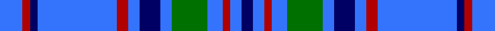

In pattern [BBRBGBBBRBBRB](/stripes/bbrbgbbbrbbrb/).

This was sourced from tartans-authority.  It is a [13 stripe tartan](/stripes/stripes13/).

Original link http://www.tartansauthority.com/tartan-ferret/display/2156/

## Also known as

This cloth is also recorded under:

- Bermuda, Blue

## Thread count
B/12 DR4 DB4 B42 DR6 B6 DB11 B6 G19 B8 DR4 B6 DB/6

## Palette
Each colour and the base-6 reference it is a variant of.

| Colour | Shade | Base |
|---|---|---|
| B | <code style="background-color:#3474FC;">#3474FC</code> `oklch(59.7% 0.214 262.7)` <small>#3474FC</small> | B <code style="background-color:#2A418A;">#2A418A</code> |
| DB | <code style="background-color:#000064;">#000064</code> `oklch(22.7% 0.158 264.1)` <small>#000064</small> | B <code style="background-color:#2A418A;">#2A418A</code> |
| DR | <code style="background-color:#B00000;">#B00000</code> `oklch(47.5% 0.195 29.2)` <small>#B00000</small> | R <code style="background-color:#CC0000;">#CC0000</code> |
| G | <code style="background-color:#007000;">#007000</code> `oklch(47.2% 0.161 142.5)` <small>#007000</small> | G <code style="background-color:#006100;">#006100</code> |

## Nearest tartans

The nearest existing variants by ΔTartan distance.

1. [Bermuda Blue](/setts/s13/b12r4db4b42r6b6db11b6dg19b8r4b6db6/) — ΔT 0.18
1. [Callaway (Name)](/setts/s9/r4b12db36w4db4b16w3db6b3~x2/) — ΔT 1.22
1. [Pacific](/setts/s12/g2dg2g1dg14b2dg10b10dg2b14m1b2m2~x4/) — ΔT 1.50
1. [Mortell (Personal)](/setts/s10/db20b2w5r2db10b5db20b2w5r5~x2/) — ΔT 1.56
1. [Fujisankei Serene (Corporate)](/setts/s9/o1lb6db4lb1db16n1db4n6lb1~x4/) — ΔT 1.56
1. [Dunbarton Weft](/setts/s11/b30r2b2k5b3dy2b3dy22b3k2b3~x2/) — ΔT 1.58
1. [Jethart (District)](/setts/s9/k22b16r3b16k2b16g3b3lb5~x2/) — ΔT 1.61
1. [Yamaue](/setts/s13/w2r5b4g8b40r5w2r5b4g8b4r5w2~x2/) — ΔT 1.69
1. [Beck (Personal)](/setts/s15/k4w2t15r6t25w2k4w2t15w4k2w4k2w4k2~x2/) — ΔT 1.73
1. [Kinding](/setts/s7/k10db30g3db3g3db3r6~x2/) — ΔT 1.75

## Neighbour map

Every grey dot is one of 14299 variants placed by the first two principal components of the ΔTartan feature space (44% of its variance). Red is this tartan; blue dots are its nearest — click one to open its page.

<svg viewBox="0 0 640 380" role="img" style="max-width:100%;height:auto;border:1px solid #e0e0e0;border-radius:4px;display:block" xmlns="http://www.w3.org/2000/svg"><image href="/nn/cloud.v1.png" width="640" height="380"/><a href="/setts/s13/b12r4db4b42r6b6db11b6dg19b8r4b6db6/"><circle cx="297.2" cy="169.8" r="4" fill="#3465a4"><title>Bermuda Blue</title></circle></a><a href="/setts/s9/r4b12db36w4db4b16w3db6b3~x2/"><circle cx="303.9" cy="180.6" r="4" fill="#3465a4"><title>Callaway (Name)</title></circle></a><a href="/setts/s12/g2dg2g1dg14b2dg10b10dg2b14m1b2m2~x4/"><circle cx="286.6" cy="174.2" r="4" fill="#3465a4"><title>Pacific</title></circle></a><a href="/setts/s10/db20b2w5r2db10b5db20b2w5r5~x2/"><circle cx="337.7" cy="186.6" r="4" fill="#3465a4"><title>Mortell (Personal)</title></circle></a><a href="/setts/s9/o1lb6db4lb1db16n1db4n6lb1~x4/"><circle cx="344.8" cy="168.2" r="4" fill="#3465a4"><title>Fujisankei Serene (Corporate)</title></circle></a><a href="/setts/s11/b30r2b2k5b3dy2b3dy22b3k2b3~x2/"><circle cx="327.1" cy="139.4" r="4" fill="#3465a4"><title>Dunbarton Weft</title></circle></a><a href="/setts/s9/k22b16r3b16k2b16g3b3lb5~x2/"><circle cx="284.3" cy="186.9" r="4" fill="#3465a4"><title>Jethart (District)</title></circle></a><a href="/setts/s13/w2r5b4g8b40r5w2r5b4g8b4r5w2~x2/"><circle cx="295.3" cy="109.3" r="4" fill="#3465a4"><title>Yamaue</title></circle></a><a href="/setts/s15/k4w2t15r6t25w2k4w2t15w4k2w4k2w4k2~x2/"><circle cx="286.9" cy="136.9" r="4" fill="#3465a4"><title>Beck (Personal)</title></circle></a><a href="/setts/s7/k10db30g3db3g3db3r6~x2/"><circle cx="327.0" cy="190.4" r="4" fill="#3465a4"><title>Kinding</title></circle></a><circle cx="296.6" cy="169.4" r="5" fill="#c00000"/></svg>

ID: /setts/s13/b12r4db4b42r6b6db11b6g19b8r4b6db6/
