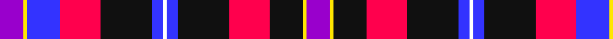

In pattern [BYBRKBWBKRKYB](/patterns/bybrkbwbkrkyb/).

This was sourced from register-of-tartans.  It is a [13 stripes tartan](/stripes/stripes13/).

Original link https://www.tartanregister.gov.uk/tartanDetails.aspx?ref=10683

## Attestations

This cloth appears in 2 source records; the oldest owns this page.

- 08/08/2012 — European Congress of Immunology 2012 (register-of-tartans, [record](https://www.tartanregister.gov.uk/tartanDetails.aspx?ref=10683))
- undated — European Congress of Immunology Corporate Tartan Tartan Number: 10683. Earliest known date: Created to commemorate the 3rd European Congress of Immunology, held in Glasgow in September 2012. The inspiration for this tartan comes from the City of Glasgow tartan, first woven in 1790 by Wilsons of Bannockburn. This modern interpretation incorporates the Congress colours of purple and lime green, and also features the white on blue of the Scottish Saltire. The width of the blue band is 12 threads to mark the year 2012. The colours of the tartan also embrace those of the EFIS (European Federation of Immunological Societies) and the BSI (British Society for Immunology). See products available Copyright © Blair Urquhart, Comrie, 2015 (house-of-tartan, [record](http://www.house-of-tartan.scotland.net/house/TartanViewjs.asp?colr=Def&tnam=10683))

## Thread count
P/13 Y2 B18 R22 K28 B6 W2 B6 K28 R22 K18 Y2 P/13

## Palette
Each colour and its ΔE from the base-6 reference it is a variant of.

| Colour | Shade | Base | ΔE (OKLab) |
|---|---|---|---|
| B | <code style="background-color:#3333FF;">#3333FF</code> `#3333FF` | B <code style="background-color:#2A418A;">#2A418A</code> | 0.19 |
| K | <code style="background-color:#101010;">#101010</code> `#101010` | K <code style="background-color:#000000;">#000000</code> | 0.17 |
| P | <code style="background-color:#9900CC;">#9900CC</code> `#9900CC` | B <code style="background-color:#2A418A;">#2A418A</code> | 0.22 |
| R | <code style="background-color:#FF004D;">#FF004D</code> `#FF004D` | R <code style="background-color:#CC0000;">#CC0000</code> | 0.12 |
| W | <code style="background-color:#FFFFFF;">#FFFFFF</code> `#FFFFFF` | W <code style="background-color:#F7F7F7;">#F7F7F7</code> | 0.02 |
| Y | <code style="background-color:#FFE600;">#FFE600</code> `#FFE600` | Y <code style="background-color:#F2BF00;">#F2BF00</code> | 0.10 |

## Nearest tartans

The nearest existing variants by ΔTartan distance.

1. [Dauphinee (Personal)](/setts/s11/r9k4w6k4b21y3b13k2w4k2r6~b2c2c80-k101010-rc80000-wfcfcfc-ybc8c00~x2/) — ΔT 1.54
1. [Stuart/Stewart Black](/setts/s12/b20ba6k8y2k4w4k4b13r7k4r4w2~b080848-ba0596fa-k101010-rdc0000-we0e0e0-ye8c000~x2/) — ΔT 1.58
1. [Tullis Russell](/setts/s12/b9k16b9r7b4r9w2r2ba2r9b4r7~b000064-ba0596fa-k101010-rc80028-we0e0e0~x2/) — ΔT 1.60
1. [Culloden, Grey](/setts/s8/g6k2g23k23w2b24ba3r6~b800080-ba304080-g808080-k000000-rc00000-we0e0e0~x2/) — ΔT 1.66
1. [Asman Dress Family Tartan Tartan Number: 2552. Earliest known date: 1989 Designed for David I Asman by Dr. Philip D. Smith, 1989. David Asman was an English armiger and lived at one time in New jersey, USA. The tartan was first woven by Peter MacDonald in the weaving shed at the Scottish Tartan Society's Comrie museum in the 1989. See products available Copyright © Blair Urquhart, Comrie, 2015](/setts/s11/b4y3b22r6w2k6w2ra6ra20k3ra4~b2c2c80-k101010-r888888-rac80000-wfcfcfc-ye8c000~x2/) — ΔT 1.70
1. [American Bi-Centennial](/setts/s13/b14ba2w2ba2b20k20r17w4r3w3r3w3r5~b2c2c80-ba5c8ca8-k101010-rc80000-we0e0e0~x2/) — ΔT 1.72
1. [Wcwm 1873-4](/setts/s11/r6b1r2b2r1b4ba14k4bb1k3y1~b3c2010-ba640064-bb0000e0-k000000-r8c8c8c-yc89800~x4/) — ΔT 1.76
1. [Royal Canadian Air Force (Military)](/setts/s18/r4w6k1r2k1w14k3wa3k2r2k2r2b4r2b6r2b6r2~b1c0070-k101010-rc80000-wa8ace8-wae0e0e0~x2/) — ΔT 1.78
1. [MacCreary (Personal)](/setts/s9/k4b12w3b4g8y2r24b4r4~b1c0070-g006818-k101010-rcc4438-wa8ace8-yd09800~x2/) — ΔT 1.79
1. [31, Bicentennial](/setts/s13/b14ba2w2ba2b20k20r17w4r3w3r3w3r5~b304080-ba5480b0-k000000-rc00000-we0e0e0~x2/) — ΔT 1.80

## Neighbour map

Every grey dot is one of 15726 variants placed by the first two principal components of the ΔTartan feature space (44% of its variance). Red is this tartan; blue dots are its nearest — click one to open its page.

<svg viewBox="0 0 640 380" role="img" style="max-width:100%;height:auto;border:1px solid #e0e0e0;border-radius:4px;display:block" xmlns="http://www.w3.org/2000/svg"><image href="/nn/cloud.v1.png" width="640" height="380"/><a href="/setts/s11/r9k4w6k4b21y3b13k2w4k2r6~b2c2c80-k101010-rc80000-wfcfcfc-ybc8c00~x2/"><circle cx="168.3" cy="150.5" r="4" fill="#3465a4"><title>Dauphinee (Personal)</title></circle></a><a href="/setts/s12/b20ba6k8y2k4w4k4b13r7k4r4w2~b080848-ba0596fa-k101010-rdc0000-we0e0e0-ye8c000~x2/"><circle cx="126.4" cy="144.9" r="4" fill="#3465a4"><title>Stuart/Stewart Black</title></circle></a><a href="/setts/s12/b9k16b9r7b4r9w2r2ba2r9b4r7~b000064-ba0596fa-k101010-rc80028-we0e0e0~x2/"><circle cx="156.2" cy="184.9" r="4" fill="#3465a4"><title>Tullis Russell</title></circle></a><a href="/setts/s8/g6k2g23k23w2b24ba3r6~b800080-ba304080-g808080-k000000-rc00000-we0e0e0~x2/"><circle cx="117.1" cy="141.3" r="4" fill="#3465a4"><title>Culloden, Grey</title></circle></a><a href="/setts/s11/b4y3b22r6w2k6w2ra6ra20k3ra4~b2c2c80-k101010-r888888-rac80000-wfcfcfc-ye8c000~x2/"><circle cx="151.7" cy="121.3" r="4" fill="#3465a4"><title>Asman Dress Family Tartan Tartan Number: 2552. Earliest known date: 1989 Designed for David I Asman by Dr. Philip D. Smith, 1989. David Asman was an English armiger and lived at one time in New jersey, USA. The tartan was first woven by Peter MacDonald in the weaving shed at the Scottish Tartan Society's Comrie museum in the 1989. See products available Copyright © Blair Urquhart, Comrie, 2015</title></circle></a><a href="/setts/s13/b14ba2w2ba2b20k20r17w4r3w3r3w3r5~b2c2c80-ba5c8ca8-k101010-rc80000-we0e0e0~x2/"><circle cx="131.4" cy="135.5" r="4" fill="#3465a4"><title>American Bi-Centennial</title></circle></a><a href="/setts/s11/r6b1r2b2r1b4ba14k4bb1k3y1~b3c2010-ba640064-bb0000e0-k000000-r8c8c8c-yc89800~x4/"><circle cx="147.4" cy="116.1" r="4" fill="#3465a4"><title>Wcwm 1873-4</title></circle></a><a href="/setts/s18/r4w6k1r2k1w14k3wa3k2r2k2r2b4r2b6r2b6r2~b1c0070-k101010-rc80000-wa8ace8-wae0e0e0~x2/"><circle cx="103.7" cy="110.2" r="4" fill="#3465a4"><title>Royal Canadian Air Force (Military)</title></circle></a><a href="/setts/s9/k4b12w3b4g8y2r24b4r4~b1c0070-g006818-k101010-rcc4438-wa8ace8-yd09800~x2/"><circle cx="180.8" cy="135.0" r="4" fill="#3465a4"><title>MacCreary (Personal)</title></circle></a><a href="/setts/s13/b14ba2w2ba2b20k20r17w4r3w3r3w3r5~b304080-ba5480b0-k000000-rc00000-we0e0e0~x2/"><circle cx="121.4" cy="133.4" r="4" fill="#3465a4"><title>31, Bicentennial</title></circle></a><circle cx="127.2" cy="128.0" r="5" fill="#c00000"/></svg>

ID: /setts/s13/b13y2ba18r22k28ba6w2ba6k28r22k18y2b13~b9900cc-ba3333ff-k101010-rff004d-wffffff-yffe600/
