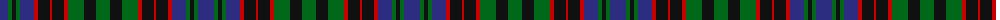

In pattern [BGKGBRKRKRGKG](/patterns/bgkgbrkrkrgkg/).

This was sourced from house-of-tartan.  It is a [13 stripes tartan](/stripes/stripes13/).

Original link http://www.house-of-tartan.scotland.net/house/TartanViewjs.asp?colr=Def&tnam=160

## Thread count
DB/16 G4 K4 G4 DB14 R4 K12 R2 K12 R4 G16 K12 G/14

## Palette
Each colour and its ΔE from the base-6 reference it is a variant of.

| Colour | Shade | Base | ΔE (OKLab) |
|---|---|---|---|
| DB | <code style="background-color:#2C2C80;">#2C2C80</code> `#2C2C80` | B <code style="background-color:#2C4084;">#2C4084</code> | 0.05 |
| G | <code style="background-color:#006818;">#006818</code> `#006818` | G <code style="background-color:#006400;">#006400</code> | 0.02 |
| K | <code style="background-color:#101010;">#101010</code> `#101010` | K <code style="background-color:#000000;">#000000</code> | 0.17 |
| R | <code style="background-color:#C80000;">#C80000</code> `#C80000` | R <code style="background-color:#C80000;">#C80000</code> | 0.00 |

ID: /setts/s13/b16g4k4g4b14r4k12r2k12r4g16k12g14-b2c2c80-g006818-k101010-rc80000/
