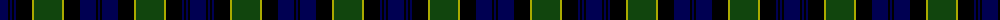

In pattern [BKBKBKYGYKBKB](/patterns/bkbkbkygykbkb/).

This was sourced from weddslist.  It is a [13 stripes tartan](/stripes/stripes13/).

Original link http://www.weddslist.com/cgi-bin/tartans/pg.pl?source=tinsel

## Thread count
DB/16 K2 DB2 K2 DB2 K16 LG2 DG28 LG2 K16 DB16 K2 DB/2

## Palette
Each colour and its ΔE from the base-6 reference it is a variant of.

| Colour | Shade | Base | ΔE (OKLab) |
|---|---|---|---|
| DB | <code style="background-color:#000052;">#000052</code> `#000052` | B <code style="background-color:#2C4084;">#2C4084</code> | 0.20 |
| DG | <code style="background-color:#11450D;">#11450D</code> `#11450D` | G <code style="background-color:#006400;">#006400</code> | 0.10 |
| K | <code style="background-color:#000000;">#000000</code> `#000000` | K <code style="background-color:#000000;">#000000</code> | 0.00 |
| LG | <code style="background-color:#AAAA00;">#AAAA00</code> `#AAAA00` | Y <code style="background-color:#E8C000;">#E8C000</code> | 0.11 |

## Nearest tartans

The nearest existing variants by ΔTartan distance.

1. [Breadalbane Fencibles](/setts/s13/b8k1b1k1b1k8y1g14y1k8b8k1b1-b000052-g11450d-k000000-yaaaa00/) — ΔT 0.00
1. [Breadalbane Fencibles](/setts/s13/b8k1b1k1b1k8y1g13y1k8b9k1b1-b00004c-g004c00-k000000-yffc800/) — ΔT 0.42
1. [Stewart Old](/setts/s17/b24k2g4k2g4k2b24r4k24r2k24r4g24k2b4k2g24-b000052-g11450d-k000000-raa0000/) — ΔT 0.74
1. [Stewart Old](/setts/s17/b24k2g4k2g4k2b24r4k24r2k24r4g24k2b4k2g24-b000064-g004c00-k000000-rc80000/) — ΔT 0.76
1. [MacKenzie](/setts/s15/b24k4b4k4b4k24g24k2y4k2g24k24b24k2r4-b000052-g11450d-k000000-raa0000-yaaaaaa/) — ΔT 1.03
1. [MacKenzie](/setts/s15/b12k2b2k2b2k12g12k1y2k1g12k12b12k1r2-b000052-g11450d-k000000-raa0000-yaaaaaa/) — ΔT 1.03
1. [Murray of Atholl](/setts/s13/b24k4b4k4b4k24g24r6g24k24b24k2r6-b000052-g11450d-k000000-raa0000/) — ΔT 1.05
1. [Murray of Atholl](/setts/s13/b12k2b2k2b2k12g12r3g12k12b12k1r3-b000052-g11450d-k000000-raa0000/) — ΔT 1.05
1. [MacDonald](/setts/s12/b16r2b4r6b24r2k24g24r6g4r2g16-b000052-g11450d-k000000-raa0000/) — ΔT 1.06
1. [MacEwan](/setts/s13/r4k2g24k24b24k2b4k2b24k24g24k2y4-b000052-g11450d-k000000-raa0000-yaaaa00/) — ΔT 1.07

## Neighbour map

Every grey dot is one of 15726 variants placed by the first two principal components of the ΔTartan feature space (44% of its variance). Red is this tartan; blue dots are its nearest — click one to open its page.

<svg viewBox="0 0 640 380" role="img" style="max-width:100%;height:auto;border:1px solid #e0e0e0;border-radius:4px;display:block" xmlns="http://www.w3.org/2000/svg"><image href="/nn/cloud.v1.png" width="640" height="380"/><a href="/setts/s13/b8k1b1k1b1k8y1g14y1k8b8k1b1-b000052-g11450d-k000000-yaaaa00/"><circle cx="213.7" cy="170.2" r="4" fill="#3465a4"><title>Breadalbane Fencibles</title></circle></a><a href="/setts/s13/b8k1b1k1b1k8y1g13y1k8b9k1b1-b00004c-g004c00-k000000-yffc800/"><circle cx="206.1" cy="169.7" r="4" fill="#3465a4"><title>Breadalbane Fencibles</title></circle></a><a href="/setts/s17/b24k2g4k2g4k2b24r4k24r2k24r4g24k2b4k2g24-b000052-g11450d-k000000-raa0000/"><circle cx="193.2" cy="168.1" r="4" fill="#3465a4"><title>Stewart Old</title></circle></a><a href="/setts/s17/b24k2g4k2g4k2b24r4k24r2k24r4g24k2b4k2g24-b000064-g004c00-k000000-rc80000/"><circle cx="178.9" cy="161.8" r="4" fill="#3465a4"><title>Stewart Old</title></circle></a><a href="/setts/s15/b24k4b4k4b4k24g24k2y4k2g24k24b24k2r4-b000052-g11450d-k000000-raa0000-yaaaaaa/"><circle cx="177.7" cy="165.2" r="4" fill="#3465a4"><title>MacKenzie</title></circle></a><a href="/setts/s15/b12k2b2k2b2k12g12k1y2k1g12k12b12k1r2-b000052-g11450d-k000000-raa0000-yaaaaaa/"><circle cx="177.7" cy="165.2" r="4" fill="#3465a4"><title>MacKenzie</title></circle></a><a href="/setts/s13/b24k4b4k4b4k24g24r6g24k24b24k2r6-b000052-g11450d-k000000-raa0000/"><circle cx="179.5" cy="198.4" r="4" fill="#3465a4"><title>Murray of Atholl</title></circle></a><a href="/setts/s13/b12k2b2k2b2k12g12r3g12k12b12k1r3-b000052-g11450d-k000000-raa0000/"><circle cx="179.5" cy="198.4" r="4" fill="#3465a4"><title>Murray of Atholl</title></circle></a><a href="/setts/s12/b16r2b4r6b24r2k24g24r6g4r2g16-b000052-g11450d-k000000-raa0000/"><circle cx="180.5" cy="188.2" r="4" fill="#3465a4"><title>MacDonald</title></circle></a><a href="/setts/s13/r4k2g24k24b24k2b4k2b24k24g24k2y4-b000052-g11450d-k000000-raa0000-yaaaa00/"><circle cx="170.3" cy="173.5" r="4" fill="#3465a4"><title>MacEwan</title></circle></a><circle cx="213.7" cy="170.2" r="5" fill="#c00000"/></svg>

ID: /setts/s13/b16k2b2k2b2k16y2g28y2k16b16k2b2-b000052-g11450d-k000000-yaaaa00/
