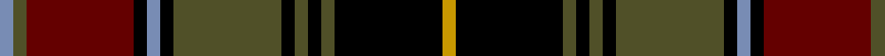

In pattern [BGRKBKGKGKGKY](/patterns/bgrkbkgkgkgky/).

This was sourced from register-of-tartans.  It is a [13 stripes tartan](/stripes/stripes13/).

Original link https://www.tartanregister.gov.uk/tartanDetails.aspx?ref=4264

## Register references

External register numbers recorded for this tartan.

- Scottish Register of Tartans: [4264](https://www.tartanregister.gov.uk/tartanDetails.aspx?ref=4264)
- Scottish Tartans Authority (ITI): 4731

## Thread count
B/4 G4 DR32 K4 B4 K4 G32 K4 G4 K4 G4 K32 DY/4

## Palette
Each colour and its ΔE from the base-6 reference it is a variant of.

| Colour | Shade | Base | ΔE (OKLab) |
|---|---|---|---|
| B | <code style="background-color:#788CB4;">#788CB4</code> `#788CB4` | B <code style="background-color:#2A418A;">#2A418A</code> | 0.25 |
| DR | <code style="background-color:#640000;">#640000</code> `#640000` | R <code style="background-color:#CC0000;">#CC0000</code> | 0.23 |
| DY | <code style="background-color:#C89800;">#C89800</code> `#C89800` | Y <code style="background-color:#F2BF00;">#F2BF00</code> | 0.12 |
| G | <code style="background-color:#505028;">#505028</code> `#505028` | G <code style="background-color:#006100;">#006100</code> | 0.10 |
| K | <code style="background-color:#000000;">#000000</code> `#000000` | K <code style="background-color:#000000;">#000000</code> | 0.00 |

## Nearest tartans

The nearest existing variants by ΔTartan distance.

1. [Okada, Yayoi (Personal)](/setts/s11/b1r1ra5k1g1k1g1k5b10g1ra1~b141e46-g003c14-k000000-r9c68a4-radc0000~x4/) — ΔT 1.03
1. [Deas](/setts/s14/b21k2b2k12y3k12g2k2g21k2r8k6r8k2~b2c2c80-g006818-k000000-rc80000-ye8c000~x2/) — ΔT 1.15
1. [Cumming (d)](/setts/s13/k1b1r1k8r1g6r6b1k6r1g8r1k1~b000052-g11450d-k000000-raa0000~x2/) — ΔT 1.18
1. [Lunar](/setts/s11/k10r1k3b7ba1b1ba1b1ba1b1ba7~b3c2010-ba646464-k000000-r8c0000~x4/) — ΔT 1.20
1. [Deas](/setts/s14/g21k2r8k6r8k2b21k2b2k12y3k12g2k2~b304080-g008000-k000000-rc00000-yf0c000~x2/) — ΔT 1.24
1. [Deas Clan Tartan Tartan Number: 2139. Earliest known date: pre 2003 The name Deas is described as an 'alias' for Davidson in historic records, and is a recognised sept of Clan Dhai (Davidson). See products available Copyright © Blair Urquhart, Comrie, 2015](/setts/s14/g21k2r8k6r8k2b21k2b2k12y3k12g2k2~b2c2c80-g006818-k101010-rc80000-ye8c000~x2/) — ΔT 1.29
1. [Quebec, Plaid du](/setts/s12/k25g5k2y2ka2r3g20r20k2w2ka2r2~g003820-k00002c-ka101010-rb40000-we0e0e0-yc4a000~x2/) — ΔT 1.31
1. [Thormanby Buccaneer Bay](/setts/s16/g17k2g2k2g2k15b15r7b15k15g2k2g2k2g17y2~b282060-g004810-k000000-rc80010-yff9823~x2/) — ΔT 1.33
1. [Quebec, Plaid du (District)](/setts/s13/k25g5k2y2ka2r2k2g20r20ka2w2ka2r2~g003820-k00002c-ka101010-rb40000-we0e0e0-yc4a000~x2/) — ΔT 1.33
1. [Fowdar (Personal)](/setts/s12/k9w6k46b24r8b6r6b6r16g6r6y6~b1c1c50-g5c6428-k101010-ra00000-we0e0e0-yecd880/) — ΔT 1.37

## Neighbour map

Every grey dot is one of 15726 variants placed by the first two principal components of the ΔTartan feature space (44% of its variance). Red is this tartan; blue dots are its nearest — click one to open its page.

<svg viewBox="0 0 640 380" role="img" style="max-width:100%;height:auto;border:1px solid #e0e0e0;border-radius:4px;display:block" xmlns="http://www.w3.org/2000/svg"><image href="/nn/cloud.v1.png" width="640" height="380"/><a href="/setts/s11/b1r1ra5k1g1k1g1k5b10g1ra1~b141e46-g003c14-k000000-r9c68a4-radc0000~x4/"><circle cx="179.4" cy="146.1" r="4" fill="#3465a4"><title>Okada, Yayoi (Personal)</title></circle></a><a href="/setts/s14/b21k2b2k12y3k12g2k2g21k2r8k6r8k2~b2c2c80-g006818-k000000-rc80000-ye8c000~x2/"><circle cx="131.4" cy="144.8" r="4" fill="#3465a4"><title>Deas</title></circle></a><a href="/setts/s13/k1b1r1k8r1g6r6b1k6r1g8r1k1~b000052-g11450d-k000000-raa0000~x2/"><circle cx="184.2" cy="184.1" r="4" fill="#3465a4"><title>Cumming (d)</title></circle></a><a href="/setts/s11/k10r1k3b7ba1b1ba1b1ba1b1ba7~b3c2010-ba646464-k000000-r8c0000~x4/"><circle cx="212.0" cy="177.0" r="4" fill="#3465a4"><title>Lunar</title></circle></a><a href="/setts/s14/g21k2r8k6r8k2b21k2b2k12y3k12g2k2~b304080-g008000-k000000-rc00000-yf0c000~x2/"><circle cx="125.9" cy="142.8" r="4" fill="#3465a4"><title>Deas</title></circle></a><a href="/setts/s14/g21k2r8k6r8k2b21k2b2k12y3k12g2k2~b2c2c80-g006818-k101010-rc80000-ye8c000~x2/"><circle cx="156.0" cy="151.9" r="4" fill="#3465a4"><title>Deas Clan Tartan Tartan Number: 2139. Earliest known date: pre 2003 The name Deas is described as an 'alias' for Davidson in historic records, and is a recognised sept of Clan Dhai (Davidson). See products available Copyright © Blair Urquhart, Comrie, 2015</title></circle></a><a href="/setts/s12/k25g5k2y2ka2r3g20r20k2w2ka2r2~g003820-k00002c-ka101010-rb40000-we0e0e0-yc4a000~x2/"><circle cx="160.2" cy="116.2" r="4" fill="#3465a4"><title>Quebec, Plaid du</title></circle></a><a href="/setts/s16/g17k2g2k2g2k15b15r7b15k15g2k2g2k2g17y2~b282060-g004810-k000000-rc80010-yff9823~x2/"><circle cx="149.9" cy="164.1" r="4" fill="#3465a4"><title>Thormanby Buccaneer Bay</title></circle></a><a href="/setts/s13/k25g5k2y2ka2r2k2g20r20ka2w2ka2r2~g003820-k00002c-ka101010-rb40000-we0e0e0-yc4a000~x2/"><circle cx="158.1" cy="110.2" r="4" fill="#3465a4"><title>Quebec, Plaid du (District)</title></circle></a><a href="/setts/s12/k9w6k46b24r8b6r6b6r16g6r6y6~b1c1c50-g5c6428-k101010-ra00000-we0e0e0-yecd880/"><circle cx="139.8" cy="144.5" r="4" fill="#3465a4"><title>Fowdar (Personal)</title></circle></a><circle cx="162.7" cy="147.5" r="5" fill="#c00000"/></svg>

ID: /setts/s13/b1g1r8k1b1k1g8k1g1k1g1k8y1~b788cb4-g505028-k000000-r640000-yc89800~x4/
