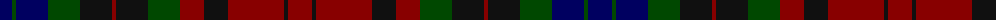

In pattern [BGBGKRKGRKRKR](/patterns/bgbgkrkgrkrkr/).

This was sourced from register-of-tartans.  It is a [13 stripes tartan](/stripes/stripes13/).

Original link https://www.tartanregister.gov.uk/tartanDetails.aspx?ref=1221

## Thread count
DB/24 G4 DB32 G32 K32 DR4 K32 G32 DR24 K24 DR56 K4 DR/24

## Palette
Each colour and its ΔE from the base-6 reference it is a variant of.

| Colour | Shade | Base | ΔE (OKLab) |
|---|---|---|---|
| DB | <code style="background-color:#000060;">#000060</code> `#000060` | B <code style="background-color:#2C4084;">#2C4084</code> | 0.18 |
| DR | <code style="background-color:#880000;">#880000</code> `#880000` | R <code style="background-color:#C80000;">#C80000</code> | 0.14 |
| G | <code style="background-color:#004800;">#004800</code> `#004800` | G <code style="background-color:#006400;">#006400</code> | 0.09 |
| K | <code style="background-color:#101010;">#101010</code> `#101010` | K <code style="background-color:#000000;">#000000</code> | 0.17 |

ID: /setts/s13/b24g4b32g32k32r4k32g32r24k24r56k4r24-b000060-g004800-k101010-r880000/
