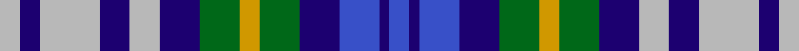

In pattern [BBBBGYGBYBYBY](/stripes/bbbbgygbybyby/).

This was sourced from tartans-authority.  It is a [13 stripe tartan](/stripes/stripes13/).

Original link http://www.tartansauthority.com/tartan-ferret/display/3784/

## Thread count
N/4 DB4 N12 DB6 N6 DB8 G8 DY4 G8 DB8 B8 DB2 B/4

## Palette
Each colour and the base-6 reference it is a variant of.

| Colour | Shade | Base |
|---|---|---|
| B | <code style="background-color:#3850C8;">#3850C8</code> `oklch(48.8% 0.188 269.4)` <small>#3850C8</small> | B <code style="background-color:#2A418A;">#2A418A</code> |
| DB | <code style="background-color:#1C0070;">#1C0070</code> `oklch(26.3% 0.162 277.1)` <small>#1C0070</small> | B <code style="background-color:#2A418A;">#2A418A</code> |
| DY | <code style="background-color:#D09800;">#D09800</code> `oklch(71.4% 0.147 82.1)` <small>#D09800</small> | Y <code style="background-color:#F2BF00;">#F2BF00</code> |
| G | <code style="background-color:#006818;">#006818</code> `oklch(45.0% 0.142 145.0)` <small>#006818</small> | G <code style="background-color:#006100;">#006100</code> |
| N | <code style="background-color:#B8B8B8;">#B8B8B8</code> `oklch(78.3% 0.000 89.9)` <small>#B8B8B8</small> | Y <code style="background-color:#F2BF00;">#F2BF00</code> |

## Nearest tartans

The nearest existing variants by ΔTartan distance.

1. [Calgary (Deerskin Trading Post)](/setts/s13/db2b1db4b4g4lo2g4b4lr3b3lr6b2lr2~x2/) — ΔT 0.55
1. [Hoban (Personal)](/setts/s16/lp9k3lp4k9g15k9db11w2db11k9g15k9lp4k3lp9ly3~x4/) — ΔT 1.44
1. [Rainbow (Canada)](/setts/s12/db6g2g4db12r3lr2r8lr3g6lr3g6lr3~x2/) — ΔT 1.45
1. [Palatine Union Personal Tartan Tartan Number: 6802. Earliest known date: 2004 Designed as a unique tartan for the wedding of Traepischke Graves (Trapper Graves) and Steve Lalor in Seattle. Palatine is an old Scottish name and also a district in Seattle. See products available Copyright © Blair Urquhart, Comrie, 2015](/setts/s15/db13k3db3k3db3k10t10w4r4w4t10k10db14k3db3~x2/) — ΔT 1.50
1. [Unidentified #47](/setts/s10/db10t5lo2t2lb2t5o4t2o4lb2~x4/) — ΔT 1.50
1. [Greer](/setts/s14/r12db10t3o3t3db3t16db3t3o3t3db10r12w4~x2/) — ΔT 1.65
1. [Caitriot](/setts/s9/w3t2n14lr8t14db16n13t2w3~x2/) — ΔT 1.65
1. [DunBroch](/setts/s11/db4t8k2t5lb2t5dg8dr7dg2dr7dg3~x2/) — ΔT 1.67
1. [Leel (Personal)](/setts/s15/g8db2g8db10lb2k8t6k2t3k2t6g6w2k2g2~x2/) — ΔT 1.69
1. [Anglicare (Corporate)](/setts/s12/db12w4db4k12db12k4db8db12t12w11r4w8/) — ΔT 1.69

## Neighbour map

Every grey dot is one of 14299 variants placed by the first two principal components of the ΔTartan feature space (44% of its variance). Red is this tartan; blue dots are its nearest — click one to open its page.

<svg viewBox="0 0 640 380" role="img" style="max-width:100%;height:auto;border:1px solid #e0e0e0;border-radius:4px;display:block" xmlns="http://www.w3.org/2000/svg"><image href="/nn/cloud.v1.png" width="640" height="380"/><a href="/setts/s13/db2b1db4b4g4lo2g4b4lr3b3lr6b2lr2~x2/"><circle cx="55.5" cy="218.6" r="4" fill="#3465a4"><title>Calgary (Deerskin Trading Post)</title></circle></a><a href="/setts/s16/lp9k3lp4k9g15k9db11w2db11k9g15k9lp4k3lp9ly3~x4/"><circle cx="47.1" cy="168.1" r="4" fill="#3465a4"><title>Hoban (Personal)</title></circle></a><a href="/setts/s12/db6g2g4db12r3lr2r8lr3g6lr3g6lr3~x2/"><circle cx="69.1" cy="197.5" r="4" fill="#3465a4"><title>Rainbow (Canada)</title></circle></a><a href="/setts/s15/db13k3db3k3db3k10t10w4r4w4t10k10db14k3db3~x2/"><circle cx="91.2" cy="200.2" r="4" fill="#3465a4"><title>Palatine Union Personal Tartan Tartan Number: 6802. Earliest known date: 2004 Designed as a unique tartan for the wedding of Traepischke Graves (Trapper Graves) and Steve Lalor in Seattle. Palatine is an old Scottish name and also a district in Seattle. See products available Copyright © Blair Urquhart, Comrie, 2015</title></circle></a><a href="/setts/s10/db10t5lo2t2lb2t5o4t2o4lb2~x4/"><circle cx="96.6" cy="205.5" r="4" fill="#3465a4"><title>Unidentified #47</title></circle></a><a href="/setts/s14/r12db10t3o3t3db3t16db3t3o3t3db10r12w4~x2/"><circle cx="86.1" cy="183.1" r="4" fill="#3465a4"><title>Greer</title></circle></a><a href="/setts/s9/w3t2n14lr8t14db16n13t2w3~x2/"><circle cx="114.1" cy="193.6" r="4" fill="#3465a4"><title>Caitriot</title></circle></a><a href="/setts/s11/db4t8k2t5lb2t5dg8dr7dg2dr7dg3~x2/"><circle cx="55.6" cy="222.2" r="4" fill="#3465a4"><title>DunBroch</title></circle></a><a href="/setts/s15/g8db2g8db10lb2k8t6k2t3k2t6g6w2k2g2~x2/"><circle cx="61.5" cy="188.6" r="4" fill="#3465a4"><title>Leel (Personal)</title></circle></a><a href="/setts/s12/db12w4db4k12db12k4db8db12t12w11r4w8/"><circle cx="14.0" cy="216.0" r="4" fill="#3465a4"><title>Anglicare (Corporate)</title></circle></a><circle cx="47.4" cy="215.2" r="5" fill="#c00000"/></svg>

ID: /setts/s13/b2db1b4db4g4lo2g4db4lr3db3lr6db2lr2~x2/
