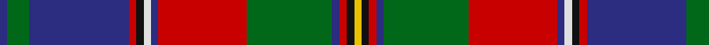

In pattern [BGBRKWBRGBRKY](/patterns/bgbrkwbrgbrky/).

This was sourced from house-of-tartan.  It is a [13 stripes tartan](/stripes/stripes13/).

Original link http://www.house-of-tartan.scotland.net/house/TartanViewjs.asp?colr=Def&tnam=1923

## Thread count
DB/4 G12 DB54 R4 K4 LN4 DB4 R48 G46 DB4 R4 K4 Y/4

## Palette
Each colour and its ΔE from the base-6 reference it is a variant of.

| Colour | Shade | Base | ΔE (OKLab) |
|---|---|---|---|
| DB | <code style="background-color:#2C2C80;">#2C2C80</code> `#2C2C80` | B <code style="background-color:#2A418A;">#2A418A</code> | 0.06 |
| G | <code style="background-color:#006818;">#006818</code> `#006818` | G <code style="background-color:#006100;">#006100</code> | 0.02 |
| K | <code style="background-color:#101010;">#101010</code> `#101010` | K <code style="background-color:#000000;">#000000</code> | 0.17 |
| LN | <code style="background-color:#E0E0E0;">#E0E0E0</code> `#E0E0E0` | W <code style="background-color:#F7F7F7;">#F7F7F7</code> | 0.07 |
| R | <code style="background-color:#C80000;">#C80000</code> `#C80000` | R <code style="background-color:#CC0000;">#CC0000</code> | 0.01 |
| Y | <code style="background-color:#E8C000;">#E8C000</code> `#E8C000` | Y <code style="background-color:#F2BF00;">#F2BF00</code> | 0.02 |

## Nearest tartans

The nearest existing variants by ΔTartan distance.

1. [Olympic](/setts/s13/r24b2w2k2r2b27g6b2y2k2r2b2g23x2~b202060-g285800-k101010-rc80000-wfcfcfc-yd8b000/) — ΔT 0.38
1. [Quebec Plaid Du.. Corporate Tartan Tartan Number: 1949. Earliest known date: 1965 The Scottish Tartans Society received a sample from A.C.Lumsden which is slightly different. (The black and the dark blue are almost indistinguishable). The colours of the tartan are taken from the Provincial Coat of Arms. The tartan is not registered with Lord Lyon. See products available Copyright © Blair Urquhart, Comrie, 2015](/setts/s12/b25g5b2y2k2r3g20r20b2w2k2r2x2~b202060-g006818-k101010-rc80000-we0e0e0-ye8c000/) — ΔT 0.42
1. [Olympic](/setts/s13/b2g6b27r2k2w2b2r24g23b2r2k2y2x2~b304080-g008000-k000000-rc00000-we0e0e0-yf0c000/) — ΔT 0.52
1. [Olympicana](/setts/s14/y2b2g6b27r2b2w2b2r24g23b2r2k2y2x2~b1c0070-g006818-k101010-r880000-wc0c0c0-yd09800/) — ΔT 0.70
1. [Scottish Wildcat](/setts/s14/b10w1ba1w2r10b8ba2k17ba2b7r19k3y1k1x2~b501400-ba441800-k101010-r888888-wfcfcfc-ye8c000/) — ΔT 1.05
1. [MacCandlish Dress Grey](/setts/s11/w3k1b12k1b1k2b1k6r12k1y1x4~b4c3428-k101010-r888888-wa8ace8-yd09800/) — ΔT 1.05
1. [Quebec, Plaid Du](/setts/s12/b25g5b2y2k2r3g20r20b2w2k2r2x2~b000050-g008000-k000000-rc00000-we0e0e0-yf0c000/) — ΔT 1.08
1. [Berwick-upon-Tweed (symmetric)](/setts/s14/r9ra5g2ra4g2ra5b38k5g2k4g2k5r8w4x2~b606060-g204000-k000000-r880000-rac82800-w94acfc/) — ΔT 1.09
1. [Belfast Tattoo](/setts/s11/g10w1b10r1b1g1b1g1r10y1r1x4~b2c2c80-g006818-rc80000-wfcfcfc-yfccc00/) — ΔT 1.11
1. [Oneness](/setts/s16/b12k3y2k3r12b12k2ya28k2y2k2ra2k2ya28k2b12x2~b202060-k101010-rd05054-ra888888-yc4bc68-yaa08858/) — ΔT 1.11

## Neighbour map

Every grey dot is one of 15726 variants placed by the first two principal components of the ΔTartan feature space (44% of its variance). Red is this tartan; blue dots are its nearest — click one to open its page.

<svg viewBox="0 0 640 380" role="img" style="max-width:100%;height:auto;border:1px solid #e0e0e0;border-radius:4px;display:block" xmlns="http://www.w3.org/2000/svg"><image href="/nn/cloud.v1.png" width="640" height="380"/><a href="/setts/s13/r24b2w2k2r2b27g6b2y2k2r2b2g23x2~b202060-g285800-k101010-rc80000-wfcfcfc-yd8b000/"><circle cx="173.9" cy="101.2" r="4" fill="#3465a4"><title>Olympic</title></circle></a><a href="/setts/s12/b25g5b2y2k2r3g20r20b2w2k2r2x2~b202060-g006818-k101010-rc80000-we0e0e0-ye8c000/"><circle cx="158.7" cy="110.7" r="4" fill="#3465a4"><title>Quebec Plaid Du.. Corporate Tartan Tartan Number: 1949. Earliest known date: 1965 The Scottish Tartans Society received a sample from A.C.Lumsden which is slightly different. (The black and the dark blue are almost indistinguishable). The colours of the tartan are taken from the Provincial Coat of Arms. The tartan is not registered with Lord Lyon. See products available Copyright © Blair Urquhart, Comrie, 2015</title></circle></a><a href="/setts/s13/b2g6b27r2k2w2b2r24g23b2r2k2y2x2~b304080-g008000-k000000-rc00000-we0e0e0-yf0c000/"><circle cx="164.1" cy="97.9" r="4" fill="#3465a4"><title>Olympic</title></circle></a><a href="/setts/s14/y2b2g6b27r2b2w2b2r24g23b2r2k2y2x2~b1c0070-g006818-k101010-r880000-wc0c0c0-yd09800/"><circle cx="180.7" cy="101.9" r="4" fill="#3465a4"><title>Olympicana</title></circle></a><a href="/setts/s14/b10w1ba1w2r10b8ba2k17ba2b7r19k3y1k1x2~b501400-ba441800-k101010-r888888-wfcfcfc-ye8c000/"><circle cx="155.2" cy="99.9" r="4" fill="#3465a4"><title>Scottish Wildcat</title></circle></a><a href="/setts/s11/w3k1b12k1b1k2b1k6r12k1y1x4~b4c3428-k101010-r888888-wa8ace8-yd09800/"><circle cx="176.3" cy="138.0" r="4" fill="#3465a4"><title>MacCandlish Dress Grey</title></circle></a><a href="/setts/s12/b25g5b2y2k2r3g20r20b2w2k2r2x2~b000050-g008000-k000000-rc00000-we0e0e0-yf0c000/"><circle cx="135.6" cy="105.3" r="4" fill="#3465a4"><title>Quebec, Plaid Du</title></circle></a><a href="/setts/s14/r9ra5g2ra4g2ra5b38k5g2k4g2k5r8w4x2~b606060-g204000-k000000-r880000-rac82800-w94acfc/"><circle cx="193.5" cy="80.2" r="4" fill="#3465a4"><title>Berwick-upon-Tweed (symmetric)</title></circle></a><a href="/setts/s11/g10w1b10r1b1g1b1g1r10y1r1x4~b2c2c80-g006818-rc80000-wfcfcfc-yfccc00/"><circle cx="170.1" cy="136.4" r="4" fill="#3465a4"><title>Belfast Tattoo</title></circle></a><a href="/setts/s16/b12k3y2k3r12b12k2ya28k2y2k2ra2k2ya28k2b12x2~b202060-k101010-rd05054-ra888888-yc4bc68-yaa08858/"><circle cx="192.5" cy="96.5" r="4" fill="#3465a4"><title>Oneness</title></circle></a><circle cx="171.5" cy="100.3" r="5" fill="#c00000"/></svg>

ID: /setts/s13/b2g6b27r2k2w2b2r24g23b2r2k2y2x2~b2c2c80-g006818-k101010-rc80000-we0e0e0-ye8c000/
