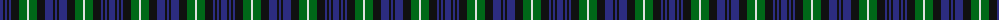

In pattern [BKBKBKGWGKBKB](/patterns/bkbkbkgwgkbkb/).

This was sourced from house-of-tartan.  It is a [13 stripes tartan](/stripes/stripes13/).

Original link http://www.house-of-tartan.scotland.net/house/TartanViewjs.asp?colr=Def&tnam=216

## Thread count
DB/6 K2 DB2 K2 DB2 K8 G8 LN2 G8 K8 DB8 K2 DB/2

## Palette
Each colour and its ΔE from the base-6 reference it is a variant of.

| Colour | Shade | Base | ΔE (OKLab) |
|---|---|---|---|
| DB | <code style="background-color:#2C2C80;">#2C2C80</code> `#2C2C80` | B <code style="background-color:#2C4084;">#2C4084</code> | 0.05 |
| G | <code style="background-color:#006818;">#006818</code> `#006818` | G <code style="background-color:#006400;">#006400</code> | 0.02 |
| K | <code style="background-color:#101010;">#101010</code> `#101010` | K <code style="background-color:#000000;">#000000</code> | 0.17 |
| LN | <code style="background-color:#E0E0E0;">#E0E0E0</code> `#E0E0E0` | W <code style="background-color:#F4F4F0;">#F4F4F0</code> | 0.06 |

ID: /setts/s13/b2k2b8k8g8w2g8k8b2k2b2k2b6-b2c2c80-g006818-k101010-we0e0e0/
