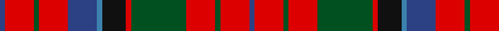

In pattern [BRGRBBKRGRGRB](/patterns/brgrbbkrgrgrb/).

This was sourced from register-of-tartans.  It is a [13 stripes tartan](/stripes/stripes13/).

Original link https://www.tartanregister.gov.uk/tartanDetails.aspx?ref=3139

## Register references

External register numbers recorded for this tartan.

- Scottish Register of Tartans: [3139](https://www.tartanregister.gov.uk/tartanDetails.aspx?ref=3139)
- Scottish Tartans World Register: 498

## Thread count
B/4 R22 G4 R22 B22 Ba4 K18 R4 G42 R22 G4 R22 B/4

## Palette
Each colour and its ΔE from the base-6 reference it is a variant of.

| Colour | Shade | Base | ΔE (OKLab) |
|---|---|---|---|
| B | <code style="background-color:#2C4084;">#2C4084</code> `#2C4084` | B <code style="background-color:#2A418A;">#2A418A</code> | 0.01 |
| Ba | <code style="background-color:#3C82AF;">#3C82AF</code> `#3C82AF` | B <code style="background-color:#2A418A;">#2A418A</code> | 0.19 |
| G | <code style="background-color:#005020;">#005020</code> `#005020` | G <code style="background-color:#006100;">#006100</code> | 0.07 |
| K | <code style="background-color:#101010;">#101010</code> `#101010` | K <code style="background-color:#000000;">#000000</code> | 0.17 |
| R | <code style="background-color:#DC0000;">#DC0000</code> `#DC0000` | R <code style="background-color:#CC0000;">#CC0000</code> | 0.03 |

## Nearest tartans

The nearest existing variants by ΔTartan distance.

1. [Nicholson Clan Tartan Tartan Number: 498. Earliest known date: 1845-7 Nothing See products available Copyright © Blair Urquhart, Comrie, 2015](/setts/s13/b2r11g2r11g21r2k9ba2b11r11g2r11b2~b2c2c80-ba5c8ca8-g006818-k101010-rc80000~x2/) — ΔT 0.26
1. [Nicolson](/setts/s13/b2r11g2r11g21r2k9ba2b11r11g2r11b2~b304080-ba5480b0-g008000-k000000-rc00000~x2/) — ΔT 0.65
1. [Unidentified Plaid #4](/setts/s13/y18r18g30r12b55r42g6r18g6r42ga44r12g12~b2c4084-g002814-ga005020-rdc0000-ye8c000/) — ΔT 0.68
1. [Prince Charles Edward (Edinburgh)](/setts/s13/y3r3k5r2b9r7k1r3k1r7g7r2k2~b2c2c80-g006818-k101010-rc80000-ye8c000~x2/) — ΔT 0.73
1. [MacKinnon #3](/setts/s14/b3r4g3ba3r7g17r3ba5g4r21g7b3r6w3~b5a008c-ba2c4084-g005020-rdc0000-we0e0e0~x2/) — ΔT 0.78
1. [Unidentified Plaid 16](/setts/s13/y18r18g30r12b55r42g6r18g6r42ga44r12g12~b304080-g003000-ga008000-rc00000-yf0c000/) — ΔT 0.80
1. [Cameron of Locheil](/setts/s13/k3r4b2r20b20r2g2r6g10r6w2r3k2~b304080-g008000-k000000-rc00000-we0e0e0~x2/) — ΔT 0.86
1. [MacKinnon #5](/setts/s14/k4r3g2b2r6g15r2b4g2r15g7k2r4w2~b2c4084-g005020-k101010-rdc0000-we0e0e0~x2/) — ΔT 0.89
1. [MacKinnon #8](/setts/s14/b2r3g2ba2r6g16r2ba4g2r16g8b2r4w2~b5a008c-ba2c4084-g005020-rdc0000-we0e0e0~x2/) — ΔT 0.91
1. [Sinclair](/setts/s10/r30g12k5w2b6r30b12w2k5g12~b2c2c80-g006818-k101010-rc80000-we0e0e0~x2/) — ΔT 0.92

## Neighbour map

Every grey dot is one of 15726 variants placed by the first two principal components of the ΔTartan feature space (44% of its variance). Red is this tartan; blue dots are its nearest — click one to open its page.

<svg viewBox="0 0 640 380" role="img" style="max-width:100%;height:auto;border:1px solid #e0e0e0;border-radius:4px;display:block" xmlns="http://www.w3.org/2000/svg"><image href="/nn/cloud.v1.png" width="640" height="380"/><a href="/setts/s13/b2r11g2r11g21r2k9ba2b11r11g2r11b2~b2c2c80-ba5c8ca8-g006818-k101010-rc80000~x2/"><circle cx="217.1" cy="159.4" r="4" fill="#3465a4"><title>Nicholson Clan Tartan Tartan Number: 498. Earliest known date: 1845-7 Nothing See products available Copyright © Blair Urquhart, Comrie, 2015</title></circle></a><a href="/setts/s13/b2r11g2r11g21r2k9ba2b11r11g2r11b2~b304080-ba5480b0-g008000-k000000-rc00000~x2/"><circle cx="199.7" cy="153.9" r="4" fill="#3465a4"><title>Nicolson</title></circle></a><a href="/setts/s13/y18r18g30r12b55r42g6r18g6r42ga44r12g12~b2c4084-g002814-ga005020-rdc0000-ye8c000/"><circle cx="171.7" cy="167.1" r="4" fill="#3465a4"><title>Unidentified Plaid #4</title></circle></a><a href="/setts/s13/y3r3k5r2b9r7k1r3k1r7g7r2k2~b2c2c80-g006818-k101010-rc80000-ye8c000~x2/"><circle cx="171.2" cy="168.9" r="4" fill="#3465a4"><title>Prince Charles Edward (Edinburgh)</title></circle></a><a href="/setts/s14/b3r4g3ba3r7g17r3ba5g4r21g7b3r6w3~b5a008c-ba2c4084-g005020-rdc0000-we0e0e0~x2/"><circle cx="205.9" cy="159.1" r="4" fill="#3465a4"><title>MacKinnon #3</title></circle></a><a href="/setts/s13/y18r18g30r12b55r42g6r18g6r42ga44r12g12~b304080-g003000-ga008000-rc00000-yf0c000/"><circle cx="176.7" cy="171.6" r="4" fill="#3465a4"><title>Unidentified Plaid 16</title></circle></a><a href="/setts/s13/k3r4b2r20b20r2g2r6g10r6w2r3k2~b304080-g008000-k000000-rc00000-we0e0e0~x2/"><circle cx="238.5" cy="138.4" r="4" fill="#3465a4"><title>Cameron of Locheil</title></circle></a><a href="/setts/s14/k4r3g2b2r6g15r2b4g2r15g7k2r4w2~b2c4084-g005020-k101010-rdc0000-we0e0e0~x2/"><circle cx="191.3" cy="155.9" r="4" fill="#3465a4"><title>MacKinnon #5</title></circle></a><a href="/setts/s14/b2r3g2ba2r6g16r2ba4g2r16g8b2r4w2~b5a008c-ba2c4084-g005020-rdc0000-we0e0e0~x2/"><circle cx="214.4" cy="149.4" r="4" fill="#3465a4"><title>MacKinnon #8</title></circle></a><a href="/setts/s10/r30g12k5w2b6r30b12w2k5g12~b2c2c80-g006818-k101010-rc80000-we0e0e0~x2/"><circle cx="257.1" cy="146.1" r="4" fill="#3465a4"><title>Sinclair</title></circle></a><circle cx="214.4" cy="156.6" r="5" fill="#c00000"/></svg>

ID: /setts/s13/b2r11g2r11g21r2k9ba2b11r11g2r11b2~b2c4084-ba3c82af-g005020-k101010-rdc0000~x2/
