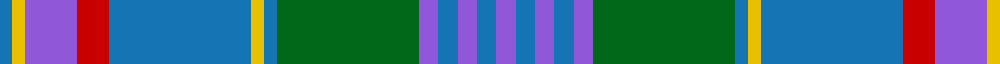

In pattern [BBBBBGBYBRBYB](/patterns/bbbbbgbybrbyb/).

This was sourced from tartans-authority.  It is a [13 stripes tartan](/stripes/stripes13/).

Original link http://www.tartansauthority.com/tartan-ferret/display/6727/

## Attestations

This cloth appears in 2 source records; the oldest owns this page.

- pre 2005 — Pitcairn Heritage Htg (Name) (tartans-authority, [record](http://www.tartansauthority.com/tartan-ferret/display/6727/))
- undated — Pitcairn Heritage Hunting (register-of-tartans, [record](https://www.tartanregister.gov.uk/tartanDetails.aspx?ref=5304))

## Thread count
B/4 Y4 P16 R10 B44 Y4 B4 G44 P6 B6 P6 B6 P/6

## Palette
Each colour and its ΔE from the base-6 reference it is a variant of.

| Colour | Shade | Base | ΔE (OKLab) |
|---|---|---|---|
| B | <code style="background-color:#1474B4;">#1474B4</code> `#1474B4` | B <code style="background-color:#2A418A;">#2A418A</code> | 0.15 |
| G | <code style="background-color:#006818;">#006818</code> `#006818` | G <code style="background-color:#006100;">#006100</code> | 0.02 |
| P | <code style="background-color:#9058D8;">#9058D8</code> `#9058D8` | B <code style="background-color:#2A418A;">#2A418A</code> | 0.21 |
| R | <code style="background-color:#C80000;">#C80000</code> `#C80000` | R <code style="background-color:#CC0000;">#CC0000</code> | 0.01 |
| Y | <code style="background-color:#E8C000;">#E8C000</code> `#E8C000` | Y <code style="background-color:#F2BF00;">#F2BF00</code> | 0.02 |

## Nearest tartans

The nearest existing variants by ΔTartan distance.

1. [Pitcairn Hunting Corporate Tartan Tartan Number: 6727. Earliest known date: Not Specified A hunting version of #2199 (original Scottish Tartans Authority reference) Pitcarin Heritage. It is presumed it was designed by the same Diene Duncan and it was woven by D C Dalgliesh of Selkirk. See #2199 (original Scottish Tartans Authority reference) for background and mention of the Pitcairn Heritage Trust which does not seem to exist any longer (Aug 2005)./Threadcount and colours aren't 100% original. Generated manually./ See products available Copyright © Blair Urquhart, Comrie, 2015](/setts/s13/b3ba3b3ba3b3g23ba2y2ba23r6b8y2ba2~ba468c4-ba20608c-g006818-rc80000-ye8c000~x2/) — ΔT 0.63
1. [Powys Welsh District Tartan Tartan Number: 5747. Earliest known date: 2002 Tartan the Welsh County of Powys in Mid Wales. Differing in warp and weft, the threads and colours create an unusual striped effect, designed and woven at the Cambrian Woollen Mill which has been in existence since c.1830. Woven for Wales Tartan Centres, Swansea. See products available Copyright © Blair Urquhart, Comrie, 2015](/setts/s12/g24b7g7b7g7ba22b7ba4y4ba4b40r14~b1474b4-ba2c2c80-g285800-rc80000-ye8c000/) — ΔT 0.97
1. [Pride of Lorient](/setts/s17/r2y8b1y4b2y3b3y1b15ba1b4ba2b2ba4b1ba9w2~b426581-ba2d3743-rcd3731-weee9e2-y8faec3~x2/) — ΔT 0.99
1. [Callum, Scotch House](/setts/s12/r4w2r2w3r20b6ba3b2ba2b2ba16ra3~b000050-ba5480b0-r806050-rac00000-we0e0e0~x2/) — ΔT 1.00
1. [Ellis (Welsh Name)](/setts/s12/k4b26k2b4k2b26k3ba36k3g30k3w2~b5c8ca8-ba3c3c60-g00643c-k101010-wfcfcfc/) — ΔT 1.04
1. [Glenfalloch Corporate Tartan Tartan Number: 2111. Earliest known date: 1990 'Glenfalloch' - Gaelic meaning "hidden valley" - was built as a private residence last century. Some years ago it was acquired by the Otago Peninsulsa Trust, to enable the people of Dunedin and visitors to the area, to enjoy the beautiful gardens. Colours were chosen to represent as follows: Navy Blue - dark shadows in valley, Green/Blue - Overall colours of sea/sky/trees, Salmon Pink/White/Maroon - Wild flowers in season. See products available Copyright © Blair Urquhart, Comrie, 2015](/setts/s12/b4r1b12w1r4w1g4w1ra4g12b1w2~b003c64-g0098a0-rd05054-ra901c38-we0e0e0~x2/) — ΔT 1.13
1. [Toronto Blue Jays](/setts/s11/r2b1ba13bb13b4bb4b4bb4ba13b1w2~b280034-ba2888c4-bb646464-rc80000-wfcfcfc~x2/) — ΔT 1.17
1. [Brown Ellis (Personal)](/setts/s12/k2b11k1b2k1b11k2ba14k2g14k1r2~b1474b4-ba2c2c80-g006818-k101010-rc80000~x2/) — ΔT 1.18
1. [Glenfalloch](/setts/s12/b4r1b12w1r4w1g4w1ra4g12b1w2~b003c64-g005448-re87878-ra901c38-we0e0e0~x2/) — ΔT 1.23
1. [Callum](/setts/s12/r3b16ba2b2ba2b3ba6ra20y3ra2y2ra3~b306084-ba000060-r880000-rab07430-yacacac~x2/) — ΔT 1.25

## Neighbour map

Every grey dot is one of 15726 variants placed by the first two principal components of the ΔTartan feature space (44% of its variance). Red is this tartan; blue dots are its nearest — click one to open its page.

<svg viewBox="0 0 640 380" role="img" style="max-width:100%;height:auto;border:1px solid #e0e0e0;border-radius:4px;display:block" xmlns="http://www.w3.org/2000/svg"><image href="/nn/cloud.v1.png" width="640" height="380"/><a href="/setts/s13/b3ba3b3ba3b3g23ba2y2ba23r6b8y2ba2~ba468c4-ba20608c-g006818-rc80000-ye8c000~x2/"><circle cx="216.5" cy="142.5" r="4" fill="#3465a4"><title>Pitcairn Hunting Corporate Tartan Tartan Number: 6727. Earliest known date: Not Specified A hunting version of #2199 (original Scottish Tartans Authority reference) Pitcarin Heritage. It is presumed it was designed by the same Diene Duncan and it was woven by D C Dalgliesh of Selkirk. See #2199 (original Scottish Tartans Authority reference) for background and mention of the Pitcairn Heritage Trust which does not seem to exist any longer (Aug 2005)./Threadcount and colours aren't 100% original. Generated manually./ See products available Copyright © Blair Urquhart, Comrie, 2015</title></circle></a><a href="/setts/s12/g24b7g7b7g7ba22b7ba4y4ba4b40r14~b1474b4-ba2c2c80-g285800-rc80000-ye8c000/"><circle cx="198.5" cy="173.1" r="4" fill="#3465a4"><title>Powys Welsh District Tartan Tartan Number: 5747. Earliest known date: 2002 Tartan the Welsh County of Powys in Mid Wales. Differing in warp and weft, the threads and colours create an unusual striped effect, designed and woven at the Cambrian Woollen Mill which has been in existence since c.1830. Woven for Wales Tartan Centres, Swansea. See products available Copyright © Blair Urquhart, Comrie, 2015</title></circle></a><a href="/setts/s17/r2y8b1y4b2y3b3y1b15ba1b4ba2b2ba4b1ba9w2~b426581-ba2d3743-rcd3731-weee9e2-y8faec3~x2/"><circle cx="229.1" cy="133.9" r="4" fill="#3465a4"><title>Pride of Lorient</title></circle></a><a href="/setts/s12/r4w2r2w3r20b6ba3b2ba2b2ba16ra3~b000050-ba5480b0-r806050-rac00000-we0e0e0~x2/"><circle cx="194.8" cy="144.3" r="4" fill="#3465a4"><title>Callum, Scotch House</title></circle></a><a href="/setts/s12/k4b26k2b4k2b26k3ba36k3g30k3w2~b5c8ca8-ba3c3c60-g00643c-k101010-wfcfcfc/"><circle cx="224.5" cy="136.2" r="4" fill="#3465a4"><title>Ellis (Welsh Name)</title></circle></a><a href="/setts/s12/b4r1b12w1r4w1g4w1ra4g12b1w2~b003c64-g0098a0-rd05054-ra901c38-we0e0e0~x2/"><circle cx="161.1" cy="140.8" r="4" fill="#3465a4"><title>Glenfalloch Corporate Tartan Tartan Number: 2111. Earliest known date: 1990 'Glenfalloch' - Gaelic meaning &quot;hidden valley&quot; - was built as a private residence last century. Some years ago it was acquired by the Otago Peninsulsa Trust, to enable the people of Dunedin and visitors to the area, to enjoy the beautiful gardens. Colours were chosen to represent as follows: Navy Blue - dark shadows in valley, Green/Blue - Overall colours of sea/sky/trees, Salmon Pink/White/Maroon - Wild flowers in season. See products available Copyright © Blair Urquhart, Comrie, 2015</title></circle></a><a href="/setts/s11/r2b1ba13bb13b4bb4b4bb4ba13b1w2~b280034-ba2888c4-bb646464-rc80000-wfcfcfc~x2/"><circle cx="214.0" cy="162.3" r="4" fill="#3465a4"><title>Toronto Blue Jays</title></circle></a><a href="/setts/s12/k2b11k1b2k1b11k2ba14k2g14k1r2~b1474b4-ba2c2c80-g006818-k101010-rc80000~x2/"><circle cx="197.4" cy="154.1" r="4" fill="#3465a4"><title>Brown Ellis (Personal)</title></circle></a><a href="/setts/s12/b4r1b12w1r4w1g4w1ra4g12b1w2~b003c64-g005448-re87878-ra901c38-we0e0e0~x2/"><circle cx="169.4" cy="146.1" r="4" fill="#3465a4"><title>Glenfalloch</title></circle></a><a href="/setts/s12/r3b16ba2b2ba2b3ba6ra20y3ra2y2ra3~b306084-ba000060-r880000-rab07430-yacacac~x2/"><circle cx="197.0" cy="144.1" r="4" fill="#3465a4"><title>Callum</title></circle></a><circle cx="207.7" cy="142.6" r="5" fill="#c00000"/></svg>

ID: /setts/s13/b3ba3b3ba3b3g22ba2y2ba22r5b8y2ba2~b9058d8-ba1474b4-g006818-rc80000-ye8c000~x2/
