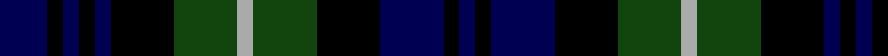

In pattern [BKBKBKGYGKBKB](/patterns/bkbkbkgygkbkb/).

This was sourced from weddslist.  It is a [13 stripes tartan](/stripes/stripes13/).

Original link http://www.weddslist.com/cgi-bin/tartans/pg.pl?source=x

## Thread count
DB/3 K1 DB1 K1 DB1 K4 DG4 N1 DG4 K4 DB4 K1 DB/1

## Palette
Each colour and its ΔE from the base-6 reference it is a variant of.

| Colour | Shade | Base | ΔE (OKLab) |
|---|---|---|---|
| DB | <code style="background-color:#000052;">#000052</code> `#000052` | B <code style="background-color:#2C4084;">#2C4084</code> | 0.20 |
| DG | <code style="background-color:#11450D;">#11450D</code> `#11450D` | G <code style="background-color:#006400;">#006400</code> | 0.10 |
| K | <code style="background-color:#000000;">#000000</code> `#000000` | K <code style="background-color:#000000;">#000000</code> | 0.00 |
| N | <code style="background-color:#AAAAAA;">#AAAAAA</code> `#AAAAAA` | Y <code style="background-color:#E8C000;">#E8C000</code> | 0.19 |

## Nearest tartans

The nearest existing variants by ΔTartan distance.

1. [Lamont](/setts/s13/b6k2b2k2b2k8g8y2g8k8b8k2b2-b000052-g11450d-k000000-yaaaaaa/) — ΔT 0.00
1. [Lamont](/setts/s13/b3k1b1k1b1k4g4w1g4k4b4k1b1-b000064-g004c00-k000000-wd0d0d0/) — ΔT 0.52
1. [Murray](/setts/s13/b6k1b1k1b1k6g6r2g6k6b6k1b2-b00004c-g004c00-k000000-rc80000/) — ΔT 0.70
1. [Lochinvar Marine Harvest](/setts/s13/g20k4g4k4g4k14b16ba4b16k14g16k4g4-b000050-ba800080-g004010-k000000/) — ΔT 0.71
1. [Murray](/setts/s13/b12k2b2k2b2k12g12r4g12k12b12k2b4-b000052-g11450d-k000000-raa0000/) — ΔT 0.77
1. [Murray](/setts/s13/b6k1b1k1b1k6g6r2g6k6b6k1b2-b000052-g11450d-k000000-raa0000/) — ΔT 0.77
1. [Arbuthnott](/setts/s17/b8k2b2k2b2k8g4y2g4b4g4y2g4k8b10k2b2-b000052-g11450d-k000000-yaaaaaa/) — ΔT 0.78
1. [Arbuthnott](/setts/s17/b4k1b1k1b1k4g2y1g2b2g2y1g2k4b5k1b1-b000052-g11450d-k000000-yaaaaaa/) — ΔT 0.78
1. [Gordon](/setts/s13/b24k4b4k4b4k24g24y4g24k24b22k4b4-b000052-g11450d-k000000-yaaaa00/) — ΔT 0.83
1. [Gordon](/setts/s13/b12k2b2k2b2k12g12y2g12k12b11k2b2-b000052-g11450d-k000000-yaaaa00/) — ΔT 0.83

## Neighbour map

Every grey dot is one of 15726 variants placed by the first two principal components of the ΔTartan feature space (44% of its variance). Red is this tartan; blue dots are its nearest — click one to open its page.

<svg viewBox="0 0 640 380" role="img" style="max-width:100%;height:auto;border:1px solid #e0e0e0;border-radius:4px;display:block" xmlns="http://www.w3.org/2000/svg"><image href="/nn/cloud.v1.png" width="640" height="380"/><a href="/setts/s13/b6k2b2k2b2k8g8y2g8k8b8k2b2-b000052-g11450d-k000000-yaaaaaa/"><circle cx="142.2" cy="249.7" r="4" fill="#3465a4"><title>Lamont</title></circle></a><a href="/setts/s13/b3k1b1k1b1k4g4w1g4k4b4k1b1-b000064-g004c00-k000000-wd0d0d0/"><circle cx="126.8" cy="243.2" r="4" fill="#3465a4"><title>Lamont</title></circle></a><a href="/setts/s13/b6k1b1k1b1k6g6r2g6k6b6k1b2-b00004c-g004c00-k000000-rc80000/"><circle cx="158.8" cy="228.2" r="4" fill="#3465a4"><title>Murray</title></circle></a><a href="/setts/s13/g20k4g4k4g4k14b16ba4b16k14g16k4g4-b000050-ba800080-g004010-k000000/"><circle cx="175.8" cy="246.3" r="4" fill="#3465a4"><title>Lochinvar Marine Harvest</title></circle></a><a href="/setts/s13/b12k2b2k2b2k12g12r4g12k12b12k2b4-b000052-g11450d-k000000-raa0000/"><circle cx="167.6" cy="231.9" r="4" fill="#3465a4"><title>Murray</title></circle></a><a href="/setts/s13/b6k1b1k1b1k6g6r2g6k6b6k1b2-b000052-g11450d-k000000-raa0000/"><circle cx="167.6" cy="231.9" r="4" fill="#3465a4"><title>Murray</title></circle></a><a href="/setts/s17/b8k2b2k2b2k8g4y2g4b4g4y2g4k8b10k2b2-b000052-g11450d-k000000-yaaaaaa/"><circle cx="147.6" cy="225.4" r="4" fill="#3465a4"><title>Arbuthnott</title></circle></a><a href="/setts/s17/b4k1b1k1b1k4g2y1g2b2g2y1g2k4b5k1b1-b000052-g11450d-k000000-yaaaaaa/"><circle cx="147.6" cy="225.4" r="4" fill="#3465a4"><title>Arbuthnott</title></circle></a><a href="/setts/s13/b24k4b4k4b4k24g24y4g24k24b22k4b4-b000052-g11450d-k000000-yaaaa00/"><circle cx="170.4" cy="225.0" r="4" fill="#3465a4"><title>Gordon</title></circle></a><a href="/setts/s13/b12k2b2k2b2k12g12y2g12k12b11k2b2-b000052-g11450d-k000000-yaaaa00/"><circle cx="170.4" cy="225.0" r="4" fill="#3465a4"><title>Gordon</title></circle></a><circle cx="142.2" cy="249.7" r="5" fill="#c00000"/></svg>

ID: /setts/s13/b3k1b1k1b1k4g4y1g4k4b4k1b1-b000052-g11450d-k000000-yaaaaaa/
