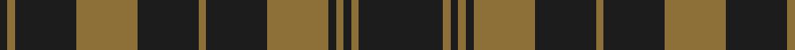

In pattern [BGBGBGBGBGBGB](/patterns/bgbgbgbgbgbgb/).

This was sourced from register-of-tartans.  It is a [13 stripes tartan](/stripes/stripes13/).

Original link https://www.tartanregister.gov.uk/tartanDetails.aspx?ref=4176

## Attestations

This cloth appears in 2 source records; the oldest owns this page.

- 01/01/1914 — Tyneside Scottish (Khaki) (register-of-tartans, [record](https://www.tartanregister.gov.uk/tartanDetails.aspx?ref=4176))
- 1914 — Tyneside Scottish Khaki (Milit/Dist) (tartans-authority, [record](http://www.tartansauthority.com/tartan-ferret/display/5082/))

## Thread count
K/4 LT4 K32 LT32 K32 LT4 K32 LT32 K4 LT4 K4 LT4 K/44

## Palette
Each colour and its ΔE from the base-6 reference it is a variant of.

| Colour | Shade | Base | ΔE (OKLab) |
|---|---|---|---|
| K | <code style="background-color:#1C1C1C;">#1C1C1C</code> `#1C1C1C` | B <code style="background-color:#2C4084;">#2C4084</code> | 0.20 |
| LT | <code style="background-color:#8C7038;">#8C7038</code> `#8C7038` | G <code style="background-color:#006400;">#006400</code> | 0.18 |

## Nearest tartans

The nearest existing variants by ΔTartan distance.

1. [Grey Spirit](/setts/s10/b90k34b12k34b12k34b12k34b90k8-b5c5c5c-k101010/) — ΔT 1.11
1. [Grey Breton](/setts/s9/b14k19b14k6b14k6b14k47b6-b666666-k101010/) — ΔT 1.42
1. [Grey Breton (District|)](/setts/s9/b14k19b14k6b14k6b14k47b6-b5c5c5c-k101010/) — ΔT 1.53
1. [Spirit of Glyndwr Grey (Fashion)](/setts/s8/k24b18k11b4k11b18k53b4-b5c5c5c-k101010/) — ΔT 1.58
1. [Spirit of Glyndwr Gold Welsh Fashion Tartan Tartan Number: 8351. Earliest known date: 25th May 2010 Ysbryd yr aur Glyndwr, a modern day plaid, designed and woven in Wales to commemorate Owain Glyn Dwr, crowned Welsh Prince 1406. Colours represent the slates and dark waters of Mid and North Wales, Glyndwrs homeland, with the added Gold yarn representing the gold colour in his standard (flag). Woven by the Cambrian Woollen Mill, Mid Wales exclusively for Wales Tartan Centres, Swansea. See products available Copyright © Blair Urquhart, Comrie, 2015](/setts/s8/k24b18k11b4k11b18k53y4-b5c5c5c-k101010-ybc8c00/) — ΔT 1.61
1. [MacArthur-Fox 2000 (Personal)](/setts/s10/g10k4g60r4k20g10k4g10k20r4-g5c6428-k101010-rc80000/) — ΔT 1.64
1. [Spirit of Glyndwr Gold (Fashion)](/setts/s8/k24b18k11b4k11b18k53r4-b5c5c5c-k101010-rc80000/) — ΔT 1.68
1. [Leeds, University of (Dance) #1](/setts/s14/g68r8g8r8g8r24g40w10g40r24g8r8g8r8-g006818-ra00048-we0e0e0/) — ΔT 1.68
1. [Bute Heather, Black](/setts/s10/k12g40k12g8k8g16g4k16g4k10-g808080-k101010/) — ΔT 1.70
1. [Unidentified #51](/setts/s14/r4g4y4g16r4g4r4g12r2g2r2g2r2y2-g004c00-r8c0000-yb0b0b0/) — ΔT 1.72

## Neighbour map

Every grey dot is one of 15726 variants placed by the first two principal components of the ΔTartan feature space (44% of its variance). Red is this tartan; blue dots are its nearest — click one to open its page.

<svg viewBox="0 0 640 380" role="img" style="max-width:100%;height:auto;border:1px solid #e0e0e0;border-radius:4px;display:block" xmlns="http://www.w3.org/2000/svg"><image href="/nn/cloud.v1.png" width="640" height="380"/><a href="/setts/s10/b90k34b12k34b12k34b12k34b90k8-b5c5c5c-k101010/"><circle cx="415.6" cy="243.0" r="4" fill="#3465a4"><title>Grey Spirit</title></circle></a><a href="/setts/s9/b14k19b14k6b14k6b14k47b6-b666666-k101010/"><circle cx="366.7" cy="257.0" r="4" fill="#3465a4"><title>Grey Breton</title></circle></a><a href="/setts/s9/b14k19b14k6b14k6b14k47b6-b5c5c5c-k101010/"><circle cx="383.2" cy="264.9" r="4" fill="#3465a4"><title>Grey Breton (District|)</title></circle></a><a href="/setts/s8/k24b18k11b4k11b18k53b4-b5c5c5c-k101010/"><circle cx="488.8" cy="254.3" r="4" fill="#3465a4"><title>Spirit of Glyndwr Grey (Fashion)</title></circle></a><a href="/setts/s8/k24b18k11b4k11b18k53y4-b5c5c5c-k101010-ybc8c00/"><circle cx="453.6" cy="232.9" r="4" fill="#3465a4"><title>Spirit of Glyndwr Gold Welsh Fashion Tartan Tartan Number: 8351. Earliest known date: 25th May 2010 Ysbryd yr aur Glyndwr, a modern day plaid, designed and woven in Wales to commemorate Owain Glyn Dwr, crowned Welsh Prince 1406. Colours represent the slates and dark waters of Mid and North Wales, Glyndwrs homeland, with the added Gold yarn representing the gold colour in his standard (flag). Woven by the Cambrian Woollen Mill, Mid Wales exclusively for Wales Tartan Centres, Swansea. See products available Copyright © Blair Urquhart, Comrie, 2015</title></circle></a><a href="/setts/s10/g10k4g60r4k20g10k4g10k20r4-g5c6428-k101010-rc80000/"><circle cx="413.1" cy="187.3" r="4" fill="#3465a4"><title>MacArthur-Fox 2000 (Personal)</title></circle></a><a href="/setts/s8/k24b18k11b4k11b18k53r4-b5c5c5c-k101010-rc80000/"><circle cx="460.3" cy="235.1" r="4" fill="#3465a4"><title>Spirit of Glyndwr Gold (Fashion)</title></circle></a><a href="/setts/s14/g68r8g8r8g8r24g40w10g40r24g8r8g8r8-g006818-ra00048-we0e0e0/"><circle cx="396.7" cy="202.7" r="4" fill="#3465a4"><title>Leeds, University of (Dance) #1</title></circle></a><a href="/setts/s10/k12g40k12g8k8g16g4k16g4k10-g808080-k101010/"><circle cx="340.1" cy="228.1" r="4" fill="#3465a4"><title>Bute Heather, Black</title></circle></a><a href="/setts/s14/r4g4y4g16r4g4r4g12r2g2r2g2r2y2-g004c00-r8c0000-yb0b0b0/"><circle cx="368.3" cy="212.2" r="4" fill="#3465a4"><title>Unidentified #51</title></circle></a><circle cx="428.6" cy="222.1" r="5" fill="#c00000"/></svg>

ID: /setts/s13/b44g4b4g4b4g32b32g4b32g32b32g4b4-b1c1c1c-g8c7038/
