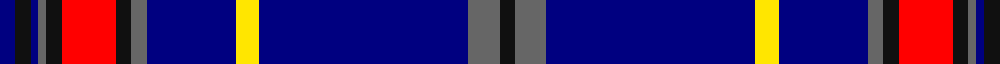

In pattern [BKBBKRKBBYBBK](/patterns/bkbbkrkbbybbk/).

This was sourced from register-of-tartans.  It is a [13 stripes tartan](/stripes/stripes13/).

Original link https://www.tartanregister.gov.uk/tartanDetails.aspx?ref=10463

## Register references

External register numbers recorded for this tartan.

- Scottish Register of Tartans: [10463](https://www.tartanregister.gov.uk/tartanDetails.aspx?ref=10463)

## Thread count
DB/4 K4 DB2 N2 K4 R14 K4 N4 DB23 Y6 DB54 N8 K/4

## Palette
Each colour and its ΔE from the base-6 reference it is a variant of.

| Colour | Shade | Base | ΔE (OKLab) |
|---|---|---|---|
| DB | <code style="background-color:#000080;">#000080</code> `#000080` | B <code style="background-color:#2A418A;">#2A418A</code> | 0.14 |
| K | <code style="background-color:#101010;">#101010</code> `#101010` | K <code style="background-color:#000000;">#000000</code> | 0.17 |
| N | <code style="background-color:#666666;">#666666</code> `#666666` | B <code style="background-color:#2A418A;">#2A418A</code> | 0.17 |
| R | <code style="background-color:#FF0000;">#FF0000</code> `#FF0000` | R <code style="background-color:#CC0000;">#CC0000</code> | 0.11 |
| Y | <code style="background-color:#FFE600;">#FFE600</code> `#FFE600` | Y <code style="background-color:#F2BF00;">#F2BF00</code> | 0.10 |

## Nearest tartans

The nearest existing variants by ΔTartan distance.

1. [X Marks the Scot](/setts/s10/w6b32r3b3r1b3r2ba4b1y2~b202060-ba2c2c80-r888888-we0e0e0-ye8c000~x2/) — ΔT 1.23
1. [Kang (Personal)](/setts/s11/b44k3b3k3b3k14y4k3w2k2w2~b38409c-k000000-we0e0e0-ye8dc14~x2/) — ΔT 1.26
1. [Niagara Region](/setts/s12/w4k2w2k28b4k2b2r1k13r1g13r2~b1c4c60-g003c28-k00002c-rc80000-we0e0e0~x2/) — ΔT 1.27
1. [Crombie, Harry (Personal)](/setts/s14/b5g1ba30y2ba4y3ba3y4ba2y5ba2bb9ba1w2~b64008c-ba141e46-bb0596fa-g146400-wf8f8f8-y48a4c0~x2/) — ΔT 1.30
1. [Blue Rust](/setts/s8/b21ba2w1ba2b1r2b1ra6~b000088-ba606060-r880000-ra886024-wffffff~x4/) — ΔT 1.33
1. [Wcwm 1105](/setts/s12/b84r3k16y4k4w4k4g20b8k4b8w4~b00008c-g004c00-k000000-r8c0000-wc8c8c8-yc89800/) — ΔT 1.35
1. [Gemmell Blue (2001) (Personal)](/setts/s10/k5w2k2b5ba48w7bb6w2r2w2~b2474e8-ba1c0070-bb3850c8-k101010-r880000-wc0c0c0~x2/) — ΔT 1.35
1. [British Caledonian Airways #3](/setts/s12/b68r5k9r3k3w3k3ba20b9k3b5w4~b1c0070-ba5c5c5c-k101010-r98481c-wc0c0c0/) — ΔT 1.36
1. [Suffolk County Police (Corporate)](/setts/s11/b74r6k12y3k3w3r16b8k3r4w3~b2c2c80-k101010-rc80000-we0e0e0-ye8c000~x2/) — ΔT 1.37
1. [Anthony Plaid Blue](/setts/s10/b18g1y3g1ya1b1r2g2r2ya2~b1c0070-g006818-r880000-ye8c000-yab8b8b8~x4/) — ΔT 1.37

## Neighbour map

Every grey dot is one of 15726 variants placed by the first two principal components of the ΔTartan feature space (44% of its variance). Red is this tartan; blue dots are its nearest — click one to open its page.

<svg viewBox="0 0 640 380" role="img" style="max-width:100%;height:auto;border:1px solid #e0e0e0;border-radius:4px;display:block" xmlns="http://www.w3.org/2000/svg"><image href="/nn/cloud.v1.png" width="640" height="380"/><a href="/setts/s10/w6b32r3b3r1b3r2ba4b1y2~b202060-ba2c2c80-r888888-we0e0e0-ye8c000~x2/"><circle cx="411.9" cy="93.7" r="4" fill="#3465a4"><title>X Marks the Scot</title></circle></a><a href="/setts/s11/b44k3b3k3b3k14y4k3w2k2w2~b38409c-k000000-we0e0e0-ye8dc14~x2/"><circle cx="358.9" cy="113.4" r="4" fill="#3465a4"><title>Kang (Personal)</title></circle></a><a href="/setts/s12/w4k2w2k28b4k2b2r1k13r1g13r2~b1c4c60-g003c28-k00002c-rc80000-we0e0e0~x2/"><circle cx="336.3" cy="110.5" r="4" fill="#3465a4"><title>Niagara Region</title></circle></a><a href="/setts/s14/b5g1ba30y2ba4y3ba3y4ba2y5ba2bb9ba1w2~b64008c-ba141e46-bb0596fa-g146400-wf8f8f8-y48a4c0~x2/"><circle cx="300.8" cy="72.4" r="4" fill="#3465a4"><title>Crombie, Harry (Personal)</title></circle></a><a href="/setts/s8/b21ba2w1ba2b1r2b1ra6~b000088-ba606060-r880000-ra886024-wffffff~x4/"><circle cx="380.2" cy="132.5" r="4" fill="#3465a4"><title>Blue Rust</title></circle></a><a href="/setts/s12/b84r3k16y4k4w4k4g20b8k4b8w4~b00008c-g004c00-k000000-r8c0000-wc8c8c8-yc89800/"><circle cx="339.4" cy="80.7" r="4" fill="#3465a4"><title>Wcwm 1105</title></circle></a><a href="/setts/s10/k5w2k2b5ba48w7bb6w2r2w2~b2474e8-ba1c0070-bb3850c8-k101010-r880000-wc0c0c0~x2/"><circle cx="321.7" cy="81.6" r="4" fill="#3465a4"><title>Gemmell Blue (2001) (Personal)</title></circle></a><a href="/setts/s12/b68r5k9r3k3w3k3ba20b9k3b5w4~b1c0070-ba5c5c5c-k101010-r98481c-wc0c0c0/"><circle cx="377.3" cy="110.8" r="4" fill="#3465a4"><title>British Caledonian Airways #3</title></circle></a><a href="/setts/s11/b74r6k12y3k3w3r16b8k3r4w3~b2c2c80-k101010-rc80000-we0e0e0-ye8c000~x2/"><circle cx="369.3" cy="93.1" r="4" fill="#3465a4"><title>Suffolk County Police (Corporate)</title></circle></a><a href="/setts/s10/b18g1y3g1ya1b1r2g2r2ya2~b1c0070-g006818-r880000-ye8c000-yab8b8b8~x4/"><circle cx="303.0" cy="107.5" r="4" fill="#3465a4"><title>Anthony Plaid Blue</title></circle></a><circle cx="345.2" cy="97.7" r="5" fill="#c00000"/></svg>

ID: /setts/s13/b4k4b2ba2k4r14k4ba4b23y6b54ba8k4~b000080-ba666666-k101010-rff0000-yffe600/
