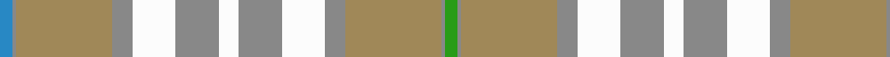

In pattern [BRYRWRWRWRYRG](/patterns/bryrwrwrwryrg/).

This was sourced from tartans-authority.  It is a [13 stripes tartan](/stripes/stripes13/).

Original link http://www.tartansauthority.com/tartan-ferret/display/10527/

## Thread count
B/8 N2 LT58 N12 W26 N26 W12 N26 W26 N12 LT58 N2 G/8

## Palette
Each colour and its ΔE from the base-6 reference it is a variant of.

| Colour | Shade | Base | ΔE (OKLab) |
|---|---|---|---|
| B | <code style="background-color:#2888C4;">#2888C4</code> `#2888C4` | B <code style="background-color:#2A418A;">#2A418A</code> | 0.21 |
| G | <code style="background-color:#289C18;">#289C18</code> `#289C18` | G <code style="background-color:#006100;">#006100</code> | 0.19 |
| LT | <code style="background-color:#A08858;">#A08858</code> `#A08858` | Y <code style="background-color:#F2BF00;">#F2BF00</code> | 0.21 |
| N | <code style="background-color:#888888;">#888888</code> `#888888` | R <code style="background-color:#CC0000;">#CC0000</code> | 0.24 |
| W | <code style="background-color:#FCFCFC;">#FCFCFC</code> `#FCFCFC` | W <code style="background-color:#F7F7F7;">#F7F7F7</code> | 0.01 |

## Nearest tartans

The nearest existing variants by ΔTartan distance.

1. [Rutlin (Personal)](/setts/s9/g6b2g1w17g1b2g16y27ga2~b2c4084-g808080-ga005020-we0e0e0-ybe9650~x2/) — ΔT 1.19
1. [Delta Dental Association](/setts/s13/w4b1y29b6wa13b13wa6b13wa13b6y29b1ya4~b666666-wd3e1ff-waffffff-yd9bc9a-ya9ee07c~x2/) — ΔT 1.21
1. [Bouguet, Adrian Dress (Personal)](/setts/s11/w16g5y20wa3g3wa3y4ga14y2wa2r1~g306754-ga767e52-ra00000-w98c8e8-wac8c8c8-yebb790~x2/) — ΔT 1.52
1. [Alloway Primary (Corporate)](/setts/s8/y18r10w4b1wa30b1w4r10~b2c2c80-r888888-we0e0e0-wa98c8e8-yd8d458~x2/) — ΔT 1.54
1. [Alloway Primary School (Ayr)](/setts/s8/y18g10w4b1wa30b1w4g10~b14256b-g798a92-wffffff-wab2e5ff-yebaf01~x2/) — ΔT 1.56
1. [Ailsa, Grey (Fashion)](/setts/s9/r9w9r9b25r1w1r1w1g3~b5c5c5c-g00881c-r888888-we0e0e0~x2/) — ΔT 1.78
1. [Nike Golf Light](/setts/s17/r5w20y1w2y1w2y2w2y5ra2y2ra2y2ra3y2ra10w3~rff0000-ra888888-weeeeee-ybbbbbb~x2/) — ΔT 1.81
1. [O'Rourke (Estimated threadcount)](/setts/s9/b25k1g6k1y10w3y10k1ya3~b5c8ca8-g603800-k101010-wf8f8f8-ya0a0a0-yae8c000~x4/) — ΔT 1.81
1. [Sakura (Japanese Four Seasons)](/setts/s14/w6wa2w25g2wa9y2ya4y2wa9y2ya15g2ya2g4~g604000-wf4c8c8-wae0e0e0-y00c02c-yaa0d090~x2/) — ΔT 1.86
1. [Hilton Hotel Hong Kong (Corporate)](/setts/s10/r4g10r2g2r24g2r2g16r2g1~g006818-rb468ac~x2/) — ΔT 1.91

## Neighbour map

Every grey dot is one of 15726 variants placed by the first two principal components of the ΔTartan feature space (44% of its variance). Red is this tartan; blue dots are its nearest — click one to open its page.

<svg viewBox="0 0 640 380" role="img" style="max-width:100%;height:auto;border:1px solid #e0e0e0;border-radius:4px;display:block" xmlns="http://www.w3.org/2000/svg"><image href="/nn/cloud.v1.png" width="640" height="380"/><a href="/setts/s9/g6b2g1w17g1b2g16y27ga2~b2c4084-g808080-ga005020-we0e0e0-ybe9650~x2/"><circle cx="251.0" cy="122.3" r="4" fill="#3465a4"><title>Rutlin (Personal)</title></circle></a><a href="/setts/s13/w4b1y29b6wa13b13wa6b13wa13b6y29b1ya4~b666666-wd3e1ff-waffffff-yd9bc9a-ya9ee07c~x2/"><circle cx="222.9" cy="106.4" r="4" fill="#3465a4"><title>Delta Dental Association</title></circle></a><a href="/setts/s11/w16g5y20wa3g3wa3y4ga14y2wa2r1~g306754-ga767e52-ra00000-w98c8e8-wac8c8c8-yebb790~x2/"><circle cx="192.7" cy="117.7" r="4" fill="#3465a4"><title>Bouguet, Adrian Dress (Personal)</title></circle></a><a href="/setts/s8/y18r10w4b1wa30b1w4r10~b2c2c80-r888888-we0e0e0-wa98c8e8-yd8d458~x2/"><circle cx="257.3" cy="137.4" r="4" fill="#3465a4"><title>Alloway Primary (Corporate)</title></circle></a><a href="/setts/s8/y18g10w4b1wa30b1w4g10~b14256b-g798a92-wffffff-wab2e5ff-yebaf01~x2/"><circle cx="224.4" cy="120.8" r="4" fill="#3465a4"><title>Alloway Primary School (Ayr)</title></circle></a><a href="/setts/s9/r9w9r9b25r1w1r1w1g3~b5c5c5c-g00881c-r888888-we0e0e0~x2/"><circle cx="296.0" cy="144.0" r="4" fill="#3465a4"><title>Ailsa, Grey (Fashion)</title></circle></a><a href="/setts/s17/r5w20y1w2y1w2y2w2y5ra2y2ra2y2ra3y2ra10w3~rff0000-ra888888-weeeeee-ybbbbbb~x2/"><circle cx="276.1" cy="108.7" r="4" fill="#3465a4"><title>Nike Golf Light</title></circle></a><a href="/setts/s9/b25k1g6k1y10w3y10k1ya3~b5c8ca8-g603800-k101010-wf8f8f8-ya0a0a0-yae8c000~x4/"><circle cx="236.3" cy="109.9" r="4" fill="#3465a4"><title>O'Rourke (Estimated threadcount)</title></circle></a><a href="/setts/s14/w6wa2w25g2wa9y2ya4y2wa9y2ya15g2ya2g4~g604000-wf4c8c8-wae0e0e0-y00c02c-yaa0d090~x2/"><circle cx="193.3" cy="128.5" r="4" fill="#3465a4"><title>Sakura (Japanese Four Seasons)</title></circle></a><a href="/setts/s10/r4g10r2g2r24g2r2g16r2g1~g006818-rb468ac~x2/"><circle cx="293.9" cy="129.3" r="4" fill="#3465a4"><title>Hilton Hotel Hong Kong (Corporate)</title></circle></a><circle cx="251.2" cy="122.3" r="5" fill="#c00000"/></svg>

ID: /setts/s13/b4r1y29r6w13r13w6r13w13r6y29r1g4~b2888c4-g289c18-r888888-wfcfcfc-ya08858~x2/
