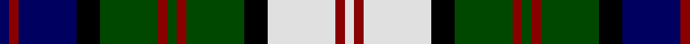

In pattern [BRBKGRGRGKWRW](/patterns/brbkgrgrgkwrw/).

This was sourced from register-of-tartans.  It is a [13 stripes tartan](/stripes/stripes13/).

Original link https://www.tartanregister.gov.uk/tartanDetails.aspx?ref=292

## Attestations

This cloth appears in 2 source records; the oldest owns this page.

- 01/01/1989 — Blair Dress (register-of-tartans, [record](https://www.tartanregister.gov.uk/tartanDetails.aspx?ref=292))
- 1989 — Blair Dress (Name) (tartans-authority, [record](http://www.tartansauthority.com/tartan-ferret/display/483/))

## Thread count
DB/4 DR4 DB24 K10 G24 DR4 G4 DR4 G24 K10 LN28 DR4 LN/4

## Palette
Each colour and its ΔE from the base-6 reference it is a variant of.

| Colour | Shade | Base | ΔE (OKLab) |
|---|---|---|---|
| DB | <code style="background-color:#000060;">#000060</code> `#000060` | B <code style="background-color:#2C4084;">#2C4084</code> | 0.18 |
| DR | <code style="background-color:#880000;">#880000</code> `#880000` | R <code style="background-color:#C80000;">#C80000</code> | 0.14 |
| G | <code style="background-color:#004800;">#004800</code> `#004800` | G <code style="background-color:#006400;">#006400</code> | 0.09 |
| K | <code style="background-color:#000000;">#000000</code> `#000000` | K <code style="background-color:#000000;">#000000</code> | 0.00 |
| LN | <code style="background-color:#E0E0E0;">#E0E0E0</code> `#E0E0E0` | W <code style="background-color:#F4F4F0;">#F4F4F0</code> | 0.06 |
| N | <code style="background-color:#B0B0B0;">#B0B0B0</code> `#B0B0B0` | Y <code style="background-color:#E8C000;">#E8C000</code> | 0.18 |

## Nearest tartans

The nearest existing variants by ΔTartan distance.

1. [Scottish National Dress](/setts/s14/b24w4b4r4b6k22g24k4g6k4g24b24w26r4-b1c1c50-g006818-k101010-rc80000-wfcfcfc/) — ΔT 0.54
1. [Gordon Dress #2](/setts/s13/w40k6w6k6w6k32g34y10g34k32b32k6b6-b2c4084-g005020-k101010-we0e0e0-ye8c000/) — ΔT 0.59
1. [MacSporran](/setts/s13/b34r6b8r10b40r6k40g40r10g8r6k6y22-b304080-g008000-k000000-rc00000-yf0c000/) — ΔT 0.62
1. [Gordon, dress 4](/setts/s13/w40k6w6k6w6k32g34y10g34k32b32k6b6-b304080-g008000-k000000-we0e0e0-yf0c000/) — ΔT 0.71
1. [MacLeod's Highlanders](/setts/s15/b24r4w4r4w4k24g22k4w4k4g22k24b22k4r4-b304080-g008000-k000000-rc00000-we0e0e0/) — ΔT 0.75
1. [MacDonald of Clanranald 4](/setts/s13/b12r4b4r6b24r4k22w4g22r6g4r4g12-b304080-g008000-k000000-rc00000-we0e0e0/) — ΔT 0.77
1. [Bowlers](/setts/s11/w8b40g10k12g4w6g4k12g26ba16g4-b304080-ba800080-g008000-k000000-we0e0e0/) — ΔT 0.78
1. [Unnamed, No 22](/setts/s11/b4k2b2ba4g16r4k16ba4b2k2b4-b5480b0-ba304080-g008000-k000000-rc00000/) — ΔT 0.82
1. [Kinloch Anderson, hunting](/setts/s12/r8g28ra4g8ra4k12g6k12b28r4b8r8-b304080-g008000-k000000-r802040-raf07040/) — ΔT 0.82
1. [MacKenzie Dress - 1950 (Clan)](/setts/s14/w6k4w14k4w4k14g16k2w4k2g16k14b14r4-b2c2c80-g006818-k101010-rc80000-we0e0e0/) — ΔT 0.86

## Neighbour map

Every grey dot is one of 15726 variants placed by the first two principal components of the ΔTartan feature space (44% of its variance). Red is this tartan; blue dots are its nearest — click one to open its page.

<svg viewBox="0 0 640 380" role="img" style="max-width:100%;height:auto;border:1px solid #e0e0e0;border-radius:4px;display:block" xmlns="http://www.w3.org/2000/svg"><image href="/nn/cloud.v1.png" width="640" height="380"/><a href="/setts/s14/b24w4b4r4b6k22g24k4g6k4g24b24w26r4-b1c1c50-g006818-k101010-rc80000-wfcfcfc/"><circle cx="67.2" cy="166.0" r="4" fill="#3465a4"><title>Scottish National Dress</title></circle></a><a href="/setts/s13/w40k6w6k6w6k32g34y10g34k32b32k6b6-b2c4084-g005020-k101010-we0e0e0-ye8c000/"><circle cx="68.0" cy="171.6" r="4" fill="#3465a4"><title>Gordon Dress #2</title></circle></a><a href="/setts/s13/b34r6b8r10b40r6k40g40r10g8r6k6y22-b304080-g008000-k000000-rc00000-yf0c000/"><circle cx="83.1" cy="165.5" r="4" fill="#3465a4"><title>MacSporran</title></circle></a><a href="/setts/s13/w40k6w6k6w6k32g34y10g34k32b32k6b6-b304080-g008000-k000000-we0e0e0-yf0c000/"><circle cx="54.8" cy="168.1" r="4" fill="#3465a4"><title>Gordon, dress 4</title></circle></a><a href="/setts/s15/b24r4w4r4w4k24g22k4w4k4g22k24b22k4r4-b304080-g008000-k000000-rc00000-we0e0e0/"><circle cx="80.4" cy="166.5" r="4" fill="#3465a4"><title>MacLeod's Highlanders</title></circle></a><a href="/setts/s13/b12r4b4r6b24r4k22w4g22r6g4r4g12-b304080-g008000-k000000-rc00000-we0e0e0/"><circle cx="77.8" cy="174.8" r="4" fill="#3465a4"><title>MacDonald of Clanranald 4</title></circle></a><a href="/setts/s11/w8b40g10k12g4w6g4k12g26ba16g4-b304080-ba800080-g008000-k000000-we0e0e0/"><circle cx="98.6" cy="157.6" r="4" fill="#3465a4"><title>Bowlers</title></circle></a><a href="/setts/s11/b4k2b2ba4g16r4k16ba4b2k2b4-b5480b0-ba304080-g008000-k000000-rc00000/"><circle cx="99.6" cy="161.3" r="4" fill="#3465a4"><title>Unnamed, No 22</title></circle></a><a href="/setts/s12/r8g28ra4g8ra4k12g6k12b28r4b8r8-b304080-g008000-k000000-r802040-raf07040/"><circle cx="87.9" cy="178.7" r="4" fill="#3465a4"><title>Kinloch Anderson, hunting</title></circle></a><a href="/setts/s14/w6k4w14k4w4k14g16k2w4k2g16k14b14r4-b2c2c80-g006818-k101010-rc80000-we0e0e0/"><circle cx="72.0" cy="166.7" r="4" fill="#3465a4"><title>MacKenzie Dress - 1950 (Clan)</title></circle></a><circle cx="77.3" cy="159.2" r="5" fill="#c00000"/></svg>

ID: /setts/s13/b4r4b24k10g24r4g4r4g24k10w28r4w4-b000060-g004800-k000000-r880000-we0e0e0/
