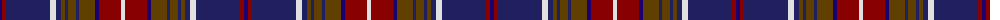

In pattern [BRBWBGBGBGBRW](/patterns/brbwbgbgbgbrw/).

This was sourced from house-of-tartan.  It is a [13 stripes tartan](/stripes/stripes13/).

Original link http://www.house-of-tartan.scotland.net/house/TartanViewjs.asp?colr=Def&tnam=478

## Thread count
DBa/4 DR4 DB44 LN6 DB5 T4 DB3 T8 DB3 T16 DBa4 DR22 LN/4

## Palette
Each colour and its ΔE from the base-6 reference it is a variant of.

| Colour | Shade | Base | ΔE (OKLab) |
|---|---|---|---|
| DB | <code style="background-color:#202060;">#202060</code> `#202060` | B <code style="background-color:#2C4084;">#2C4084</code> | 0.11 |
| DBa | <code style="background-color:#1C0070;">#1C0070</code> `#1C0070` | B <code style="background-color:#2C4084;">#2C4084</code> | 0.14 |
| DR | <code style="background-color:#880000;">#880000</code> `#880000` | R <code style="background-color:#C80000;">#C80000</code> | 0.14 |
| LN | <code style="background-color:#E0E0E0;">#E0E0E0</code> `#E0E0E0` | W <code style="background-color:#F4F4F0;">#F4F4F0</code> | 0.06 |
| T | <code style="background-color:#604000;">#604000</code> `#604000` | G <code style="background-color:#006400;">#006400</code> | 0.14 |

## Nearest tartans

The nearest existing variants by ΔTartan distance.

1. [Kormylo (Personal)](/setts/s12/w4b4r36b4g40r4b80r4g24b6r18y4-b202060-g003820-rc80000-wfcfcfc-ye8c000/) — ΔT 0.78
1. [MacMichael Family Tartan Tartan Number: 2063. Earliest known date: 1991 See products available Copyright © Blair Urquhart, Comrie, 2015](/setts/s11/g2b2g16w2k4b32k4w2r16b2r2-b2c2c80-g006818-k101010-rc80000-we0e0e0/) — ΔT 0.86
1. [MacMichael](/setts/s11/g4b4g32w4k8b64k8w4r32b4r4-b1c0070-g006818-k101010-r880000-wc0c0c0/) — ΔT 0.86
1. [Westmeath County Crest (Fashion)](/setts/s16/r8k2b16k2y6k4b8y12b8w6k4b40k8r42k2y6-b1c1c50-k101010-r880000-we0e0e0-ybc8c00/) — ΔT 1.04
1. [Griffiths of Llangynin (Personal)](/setts/s18/b80k16r8k8r16k8r8k16g80k16r8k8r16k8r8k16b80y6-b202060-g285800-k101010-rc80000-ye8c000/) — ΔT 1.09
1. [Broz Sanz Elementary School](/setts/s12/b80r8ba16w8ba16r8ba16k4ba4k4ba4k16-b5c5c5c-ba2c2c80-k101010-rc80000-wc0c0c0/) — ΔT 1.11
1. [MacDonald of Clanranald #5](/setts/s14/b20r2b2r5b30r2k32w2g30r5g4r2g4w2-b2c4084-g005020-k101010-rdc0000-we0e0e0/) — ΔT 1.12
1. [Largs](/setts/s13/g4r4b44w6b5ra4b3ra8b3ra16g4r22w4-b000050-g30a010-r800000-ra806050-we0e0e0/) — ΔT 1.14
1. [KPMG (Corporate)](/setts/s10/r24y4b6k6b60k40ba12k20y4ba8-b2c2c80-ba680028-k101010-rc80000-ya08858/) — ΔT 1.18
1. [Army Medical Services](/setts/s12/r32b4r4b4r4b32g32y2r32b32r4ya4-b000048-g285800-r960028-yfccc00-yab0b0b0/) — ΔT 1.19

## Neighbour map

Every grey dot is one of 15726 variants placed by the first two principal components of the ΔTartan feature space (44% of its variance). Red is this tartan; blue dots are its nearest — click one to open its page.

<svg viewBox="0 0 640 380" role="img" style="max-width:100%;height:auto;border:1px solid #e0e0e0;border-radius:4px;display:block" xmlns="http://www.w3.org/2000/svg"><image href="/nn/cloud.v1.png" width="640" height="380"/><a href="/setts/s12/w4b4r36b4g40r4b80r4g24b6r18y4-b202060-g003820-rc80000-wfcfcfc-ye8c000/"><circle cx="244.6" cy="117.4" r="4" fill="#3465a4"><title>Kormylo (Personal)</title></circle></a><a href="/setts/s11/g2b2g16w2k4b32k4w2r16b2r2-b2c2c80-g006818-k101010-rc80000-we0e0e0/"><circle cx="219.6" cy="120.9" r="4" fill="#3465a4"><title>MacMichael Family Tartan Tartan Number: 2063. Earliest known date: 1991 See products available Copyright © Blair Urquhart, Comrie, 2015</title></circle></a><a href="/setts/s11/g4b4g32w4k8b64k8w4r32b4r4-b1c0070-g006818-k101010-r880000-wc0c0c0/"><circle cx="227.4" cy="129.4" r="4" fill="#3465a4"><title>MacMichael</title></circle></a><a href="/setts/s16/r8k2b16k2y6k4b8y12b8w6k4b40k8r42k2y6-b1c1c50-k101010-r880000-we0e0e0-ybc8c00/"><circle cx="219.2" cy="103.7" r="4" fill="#3465a4"><title>Westmeath County Crest (Fashion)</title></circle></a><a href="/setts/s18/b80k16r8k8r16k8r8k16g80k16r8k8r16k8r8k16b80y6-b202060-g285800-k101010-rc80000-ye8c000/"><circle cx="206.8" cy="125.0" r="4" fill="#3465a4"><title>Griffiths of Llangynin (Personal)</title></circle></a><a href="/setts/s12/b80r8ba16w8ba16r8ba16k4ba4k4ba4k16-b5c5c5c-ba2c2c80-k101010-rc80000-wc0c0c0/"><circle cx="274.6" cy="121.3" r="4" fill="#3465a4"><title>Broz Sanz Elementary School</title></circle></a><a href="/setts/s14/b20r2b2r5b30r2k32w2g30r5g4r2g4w2-b2c4084-g005020-k101010-rdc0000-we0e0e0/"><circle cx="197.5" cy="126.9" r="4" fill="#3465a4"><title>MacDonald of Clanranald #5</title></circle></a><a href="/setts/s13/g4r4b44w6b5ra4b3ra8b3ra16g4r22w4-b000050-g30a010-r800000-ra806050-we0e0e0/"><circle cx="196.2" cy="116.2" r="4" fill="#3465a4"><title>Largs</title></circle></a><a href="/setts/s10/r24y4b6k6b60k40ba12k20y4ba8-b2c2c80-ba680028-k101010-rc80000-ya08858/"><circle cx="213.0" cy="159.3" r="4" fill="#3465a4"><title>KPMG (Corporate)</title></circle></a><a href="/setts/s12/r32b4r4b4r4b32g32y2r32b32r4ya4-b000048-g285800-r960028-yfccc00-yab0b0b0/"><circle cx="225.7" cy="144.4" r="4" fill="#3465a4"><title>Army Medical Services</title></circle></a><circle cx="227.9" cy="127.6" r="5" fill="#c00000"/></svg>

ID: /setts/s13/b4r4ba44w6ba5g4ba3g8ba3g16b4r22w4-b1c0070-ba202060-g604000-r880000-we0e0e0/
