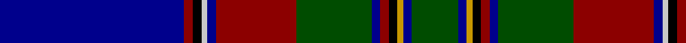

In pattern [BRKWBRGBRKYBG](/patterns/brkwbrgbrkybg/).

This was sourced from register-of-tartans.  It is a [13 stripes tartan](/stripes/stripes13/).

Original link https://www.tartanregister.gov.uk/tartanDetails.aspx?ref=4531

## Register references

External register numbers recorded for this tartan.

- Scottish Register of Tartans: [4531](https://www.tartanregister.gov.uk/tartanDetails.aspx?ref=4531)
- Scottish Tartans Authority (ITI): 4300

## Thread count
DB/128 DR6 K6 N4 DB6 DR56 G52 DB6 DR6 K6 DY4 DB6 G/32

## Palette
Each colour and its ΔE from the base-6 reference it is a variant of.

| Colour | Shade | Base | ΔE (OKLab) |
|---|---|---|---|
| DB | <code style="background-color:#00008C;">#00008C</code> `#00008C` | B <code style="background-color:#2A418A;">#2A418A</code> | 0.13 |
| DR | <code style="background-color:#8C0000;">#8C0000</code> `#8C0000` | R <code style="background-color:#CC0000;">#CC0000</code> | 0.14 |
| DY | <code style="background-color:#C89800;">#C89800</code> `#C89800` | Y <code style="background-color:#F2BF00;">#F2BF00</code> | 0.12 |
| G | <code style="background-color:#004C00;">#004C00</code> `#004C00` | G <code style="background-color:#006100;">#006100</code> | 0.07 |
| K | <code style="background-color:#000000;">#000000</code> `#000000` | K <code style="background-color:#000000;">#000000</code> | 0.00 |
| N | <code style="background-color:#C8C8C8;">#C8C8C8</code> `#C8C8C8` | W <code style="background-color:#F7F7F7;">#F7F7F7</code> | 0.14 |

## Nearest tartans

The nearest existing variants by ΔTartan distance.

1. [St. Lawrence](/setts/s17/k3b2g2b26ba1b1ba1b1ba1b1ba3y2k10b3g14k3r3~b1c0070-ba2474e8-g006818-k101010-ra00000-y48a4c0~x2/) — ΔT 0.87
1. [Voluntary Service Aberdeen](/setts/s10/r4w1k35b1ba2ra4w1ba14ra8w1~b5c5c5c-ba003c64-k101010-r888888-ra984c90-we0e0e0~x2/) — ΔT 0.89
1. [Huaum, Patrick Antoine (Personal))](/setts/s11/g10b9ba4r2ba4g6k10w4g24b60k4~b2c2c80-ba780078-g006818-k101010-r880000-we0e0e0/) — ΔT 0.96
1. [Scragg, Moran (Personal)](/setts/s10/g1b28k11r5w1r5k11y1k2g1~b3850c8-g006818-k101010-r880000-we0e0e0-yc4bc68~x2/) — ΔT 1.02
1. [Heart of Oak](/setts/s10/b3g3w1k25ba25k2ba2g1r3w2~b440044-ba000064-g006400-k101010-rdc0000-wffffff~x2/) — ΔT 1.04
1. [St Lawrence District Tartan Tartan Number: 1030. Earliest known date: pre 1963 Presented to the STS collection by Mr A Yule in 1963. designed by Mrs. Helene Cobb of Clayton and is the registered trademark of the Thousand Islands Museum in Clayton, New York State - www.timuseum.org Woven by Peter MacArthur of Biggar, Scotland. The greens are for the cedars along the shore, the blues are for the St Lawrence River, and the red is the sunset over the Islands. John Fitzpatrick in his review of Canadian tartans in July 2008, pointed out that there were two slightly different thread counts given in the CIDD. See products available Copyright © Blair Urquhart, Comrie, 2015](/setts/s17/k3b2g2b26ba1b1ba1b1ba1b1ba3bb2k10b3g14k3r3~b2c2c80-ba2888c4-bb5c8ca8-g006818-k101010-rc80000~x2/) — ΔT 1.05
1. [Astrobiology](/setts/s15/k23b1g1r3b2r1b12y1k1w1k6b4g2k2g3~b1c0070-g00643c-k101010-rff0000-wffffff-yffff00~x2/) — ΔT 1.07
1. [Royal Navy](/setts/s12/b4ba8b3ba2b64bb24r4bc3bb4bc3w8r4~b141e46-ba5a008c-bb3c82af-bc000064-rdc0000-we0e0e0/) — ΔT 1.07
1. [Hororata (District)](/setts/s11/r2k1b30k6g12y1b2y1g12k3w1~b202060-g006818-k101010-rc80000-wfcfcfc-yfccc00~x2/) — ΔT 1.08
1. [Earthrise](/setts/s12/k4b6k4r4b29r6k64ba10k4ba6bb4w2~b5c5c5c-ba202060-bb5c8ca8-k101010-r888888-wfcfcfc/) — ΔT 1.10

## Neighbour map

Every grey dot is one of 15726 variants placed by the first two principal components of the ΔTartan feature space (44% of its variance). Red is this tartan; blue dots are its nearest — click one to open its page.

<svg viewBox="0 0 640 380" role="img" style="max-width:100%;height:auto;border:1px solid #e0e0e0;border-radius:4px;display:block" xmlns="http://www.w3.org/2000/svg"><image href="/nn/cloud.v1.png" width="640" height="380"/><a href="/setts/s17/k3b2g2b26ba1b1ba1b1ba1b1ba3y2k10b3g14k3r3~b1c0070-ba2474e8-g006818-k101010-ra00000-y48a4c0~x2/"><circle cx="240.6" cy="76.7" r="4" fill="#3465a4"><title>St. Lawrence</title></circle></a><a href="/setts/s10/r4w1k35b1ba2ra4w1ba14ra8w1~b5c5c5c-ba003c64-k101010-r888888-ra984c90-we0e0e0~x2/"><circle cx="286.0" cy="81.1" r="4" fill="#3465a4"><title>Voluntary Service Aberdeen</title></circle></a><a href="/setts/s11/g10b9ba4r2ba4g6k10w4g24b60k4~b2c2c80-ba780078-g006818-k101010-r880000-we0e0e0/"><circle cx="301.1" cy="99.3" r="4" fill="#3465a4"><title>Huaum, Patrick Antoine (Personal))</title></circle></a><a href="/setts/s10/g1b28k11r5w1r5k11y1k2g1~b3850c8-g006818-k101010-r880000-we0e0e0-yc4bc68~x2/"><circle cx="244.0" cy="96.3" r="4" fill="#3465a4"><title>Scragg, Moran (Personal)</title></circle></a><a href="/setts/s10/b3g3w1k25ba25k2ba2g1r3w2~b440044-ba000064-g006400-k101010-rdc0000-wffffff~x2/"><circle cx="245.0" cy="101.7" r="4" fill="#3465a4"><title>Heart of Oak</title></circle></a><a href="/setts/s17/k3b2g2b26ba1b1ba1b1ba1b1ba3bb2k10b3g14k3r3~b2c2c80-ba2888c4-bb5c8ca8-g006818-k101010-rc80000~x2/"><circle cx="249.8" cy="78.2" r="4" fill="#3465a4"><title>St Lawrence District Tartan Tartan Number: 1030. Earliest known date: pre 1963 Presented to the STS collection by Mr A Yule in 1963. designed by Mrs. Helene Cobb of Clayton and is the registered trademark of the Thousand Islands Museum in Clayton, New York State - www.timuseum.org Woven by Peter MacArthur of Biggar, Scotland. The greens are for the cedars along the shore, the blues are for the St Lawrence River, and the red is the sunset over the Islands. John Fitzpatrick in his review of Canadian tartans in July 2008, pointed out that there were two slightly different thread counts given in the CIDD. See products available Copyright © Blair Urquhart, Comrie, 2015</title></circle></a><a href="/setts/s15/k23b1g1r3b2r1b12y1k1w1k6b4g2k2g3~b1c0070-g00643c-k101010-rff0000-wffffff-yffff00~x2/"><circle cx="277.6" cy="85.5" r="4" fill="#3465a4"><title>Astrobiology</title></circle></a><a href="/setts/s12/b4ba8b3ba2b64bb24r4bc3bb4bc3w8r4~b141e46-ba5a008c-bb3c82af-bc000064-rdc0000-we0e0e0/"><circle cx="302.5" cy="68.0" r="4" fill="#3465a4"><title>Royal Navy</title></circle></a><a href="/setts/s11/r2k1b30k6g12y1b2y1g12k3w1~b202060-g006818-k101010-rc80000-wfcfcfc-yfccc00~x2/"><circle cx="265.5" cy="93.7" r="4" fill="#3465a4"><title>Hororata (District)</title></circle></a><a href="/setts/s12/k4b6k4r4b29r6k64ba10k4ba6bb4w2~b5c5c5c-ba202060-bb5c8ca8-k101010-r888888-wfcfcfc/"><circle cx="317.5" cy="84.5" r="4" fill="#3465a4"><title>Earthrise</title></circle></a><circle cx="269.4" cy="77.0" r="5" fill="#c00000"/></svg>

ID: /setts/s13/b64r3k3w2b3r28g26b3r3k3y2b3g16~b00008c-g004c00-k000000-r8c0000-wc8c8c8-yc89800~x2/
