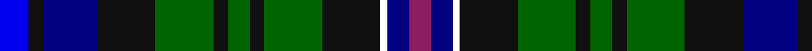

In pattern [BKBKGKGKGKWBR](/stripes/bkbkgkgkgkwbr/).

This was sourced from register-of-tartans.  It is a [13 stripe tartan](/stripes/stripes13/).

Original link https://www.tartanregister.gov.uk/tartanDetails.aspx?ref=10156

## Register references

External register numbers recorded for this tartan.

- Scottish Register of Tartans: [10156](https://www.tartanregister.gov.uk/tartanDetails.aspx?ref=10156)

## Thread count
B/8 K4 DB15 K16 G16 K4 G6 K4 G16 K16 W2 DB6 P/6

## Palette
Each colour and the base-6 reference it is a variant of.

| Colour | Shade | Base |
|---|---|---|
| B | <code style="background-color:#0000EE;">#0000EE</code> `oklch(42.9% 0.297 264.1)` <small>#0000EE</small> | B <code style="background-color:#2A418A;">#2A418A</code> |
| DB | <code style="background-color:#000080;">#000080</code> `oklch(27.1% 0.188 264.1)` <small>#000080</small> | B <code style="background-color:#2A418A;">#2A418A</code> |
| G | <code style="background-color:#006400;">#006400</code> `oklch(43.6% 0.148 142.5)` <small>#006400</small> | G <code style="background-color:#006100;">#006100</code> |
| K | <code style="background-color:#101010;">#101010</code> `oklch(17.3% 0.000 89.9)` <small>#101010</small> | K <code style="background-color:#000000;">#000000</code> |
| P | <code style="background-color:#8B1C62;">#8B1C62</code> `oklch(43.7% 0.160 347.3)` <small>#8B1C62</small> | R <code style="background-color:#CC0000;">#CC0000</code> |
| W | <code style="background-color:#FFFFFF;">#FFFFFF</code> `oklch(100.0% 0.000 89.9)` <small>#FFFFFF</small> | W <code style="background-color:#F7F7F7;">#F7F7F7</code> |

## Nearest tartans

The nearest existing variants by ΔTartan distance, with this tartan at the top so the swatches line up against it.

ΔTartan

Tartan

Sett

—

<a href="/ttd/edit/#slug=b8k4db15k16g16k4g6k4g16k16w2db6m6">Free (Wishaw)</a> <a class="nn-out" href="/setts/s13/b8k4db15k16g16k4g6k4g16k16w2db6m6/" title="open its dictionary page">↗</a>

0.81

<a href="/ttd/edit/#slug=db8k4dt15k16g16k4g6k4g16k16w2dt6m6">Free (Universal)</a> <a class="nn-out" href="/setts/s13/db8k4dt15k16g16k4g6k4g16k16w2dt6m6/" title="open its dictionary page">↗</a>

1.05

<a href="/ttd/edit/#slug=r3k1g12k12db12db3db12k12g12k1ly3~x2">Gow Hunting (Clan)</a> <a class="nn-out" href="/setts/s11/r3k1g12k12db12db3db12k12g12k1ly3~x2/" title="open its dictionary page">↗</a>

1.06

<a href="/ttd/edit/#slug=k20g18k2w2k5ly2k2g18k20db18b4db4b4db18~x2">Shandon (Personal)</a> <a class="nn-out" href="/setts/s14/k20g18k2w2k5ly2k2g18k20db18b4db4b4db18~x2/" title="open its dictionary page">↗</a>

1.08

<a href="/ttd/edit/#slug=p3db13y2db4w2db8k13g10k2g8p3~x2">Smithers</a> <a class="nn-out" href="/setts/s11/p3db13y2db4w2db8k13g10k2g8p3~x2/" title="open its dictionary page">↗</a>

1.09

<a href="/ttd/edit/#slug=k1ly1k1g6k6db6r1db1r1db6k6g6k1b1~x4">Malcolm</a> <a class="nn-out" href="/setts/s14/k1ly1k1g6k6db6r1db1r1db6k6g6k1b1~x4/" title="open its dictionary page">↗</a>

1.10

<a href="/ttd/edit/#slug=r1db6g1k1g1k1g6k1t1k1db3k3g3w1~x8">Elgin-Landshut</a> <a class="nn-out" href="/setts/s14/r1db6g1k1g1k1g6k1t1k1db3k3g3w1~x8/" title="open its dictionary page">↗</a>

1.10

<a href="/ttd/edit/#slug=db2lo1db6r1db2r2k2g6t1g2~x4">Nance (1998)</a> <a class="nn-out" href="/setts/s10/db2lo1db6r1db2r2k2g6t1g2~x4/" title="open its dictionary page">↗</a>

1.15

<a href="/ttd/edit/#slug=db2k1db8k7g8ly2g8k7db8k1r2~x4">Scottish Economics Society 'Adam Smith'</a> <a class="nn-out" href="/setts/s11/db2k1db8k7g8ly2g8k7db8k1r2~x4/" title="open its dictionary page">↗</a>

1.16

<a href="/ttd/edit/#slug=r2db10k10g10w1k4w1g10k10db10r1~x4">Rose</a> <a class="nn-out" href="/setts/s11/r2db10k10g10w1k4w1g10k10db10r1~x4/" title="open its dictionary page">↗</a>

1.16

<a href="/ttd/edit/#slug=r2k1dt8k7g8ly2g8k7dt8k1b2~x4">Adam Smith (Corporate)</a> <a class="nn-out" href="/setts/s11/r2k1dt8k7g8ly2g8k7dt8k1b2~x4/" title="open its dictionary page">↗</a>

## Neighbour map

Every grey dot is one of 14299 variants placed by the first two principal components of the ΔTartan feature space (44% of its variance). Red is this tartan; blue dots are its nearest — click one to open its page.

<svg viewBox="0 0 640 380" role="img" style="max-width:100%;height:auto;border:1px solid #e0e0e0;border-radius:4px;display:block" xmlns="http://www.w3.org/2000/svg"><image href="/nn/cloud.v1.png" width="640" height="380"/><a href="/setts/s13/db8k4dt15k16g16k4g6k4g16k16w2dt6m6/"><circle cx="124.4" cy="197.8" r="4" fill="#3465a4"><title>Free (Universal)</title></circle></a><a href="/setts/s11/r3k1g12k12db12db3db12k12g12k1ly3~x2/"><circle cx="122.4" cy="178.4" r="4" fill="#3465a4"><title>Gow Hunting (Clan)</title></circle></a><a href="/setts/s14/k20g18k2w2k5ly2k2g18k20db18b4db4b4db18~x2/"><circle cx="135.9" cy="157.3" r="4" fill="#3465a4"><title>Shandon (Personal)</title></circle></a><a href="/setts/s11/p3db13y2db4w2db8k13g10k2g8p3~x2/"><circle cx="84.7" cy="179.8" r="4" fill="#3465a4"><title>Smithers</title></circle></a><a href="/setts/s14/k1ly1k1g6k6db6r1db1r1db6k6g6k1b1~x4/"><circle cx="118.3" cy="179.9" r="4" fill="#3465a4"><title>Malcolm</title></circle></a><a href="/setts/s14/r1db6g1k1g1k1g6k1t1k1db3k3g3w1~x8/"><circle cx="112.1" cy="169.5" r="4" fill="#3465a4"><title>Elgin-Landshut</title></circle></a><a href="/setts/s10/db2lo1db6r1db2r2k2g6t1g2~x4/"><circle cx="134.5" cy="195.4" r="4" fill="#3465a4"><title>Nance (1998)</title></circle></a><a href="/setts/s11/db2k1db8k7g8ly2g8k7db8k1r2~x4/"><circle cx="62.3" cy="180.3" r="4" fill="#3465a4"><title>Scottish Economics Society 'Adam Smith'</title></circle></a><a href="/setts/s11/r2db10k10g10w1k4w1g10k10db10r1~x4/"><circle cx="150.4" cy="198.0" r="4" fill="#3465a4"><title>Rose</title></circle></a><a href="/setts/s11/r2k1dt8k7g8ly2g8k7dt8k1b2~x4/"><circle cx="102.4" cy="200.1" r="4" fill="#3465a4"><title>Adam Smith (Corporate)</title></circle></a><circle cx="108.6" cy="190.9" r="5" fill="#c00000"/></svg>

ID: /setts/s13/b8k4db15k16g16k4g6k4g16k16w2db6m6/
