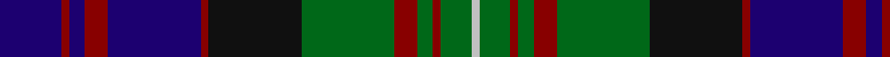

In pattern [BRBRBRKGRGRGW](/patterns/brbrbrkgrgrgw/).

This was sourced from tartans-authority.  It is a [13 stripes tartan](/stripes/stripes13/).

Original link http://www.tartansauthority.com/tartan-ferret/display/471/

## Thread count
DB/16 DR2 DB4 DR6 DB24 DR2 K24 G24 DR6 G4 DR2 G8 N/2

## Palette
Each colour and its ΔE from the base-6 reference it is a variant of.

| Colour | Shade | Base | ΔE (OKLab) |
|---|---|---|---|
| DB | <code style="background-color:#1C0070;">#1C0070</code> `#1C0070` | B <code style="background-color:#2A418A;">#2A418A</code> | 0.14 |
| DR | <code style="background-color:#880000;">#880000</code> `#880000` | R <code style="background-color:#CC0000;">#CC0000</code> | 0.15 |
| G | <code style="background-color:#006818;">#006818</code> `#006818` | G <code style="background-color:#006100;">#006100</code> | 0.02 |
| K | <code style="background-color:#101010;">#101010</code> `#101010` | K <code style="background-color:#000000;">#000000</code> | 0.17 |
| N | <code style="background-color:#C0C0C0;">#C0C0C0</code> `#C0C0C0` | W <code style="background-color:#F7F7F7;">#F7F7F7</code> | 0.17 |

## Nearest tartans

The nearest existing variants by ΔTartan distance.

1. [MacDonell of Glengarry](/setts/s13/b8r1b2r3b12r1k12g12r3g2r1g4w1x2~b2c4084-g005020-k101010-rdc0000-we0e0e0/) — ΔT 0.54
1. [MacDonell of Glengarry Clan Tartan Tartan Number: 471. Earliest known date: 1906 The Setts No: 112. W & A K Johnston (1906). There is a sample certified by 'Glengarry' in the collection of the Highland Society of London from the period 1815-16 but it is not known whether the threadcount corresponds to MacKays record illustrated here. See products available Copyright © Blair Urquhart, Comrie, 2015](/setts/s13/b8r1b2r3b12r1k12g12r3g2r1g4w1x2~b2c2c80-g006818-k101010-rc80000-we0e0e0/) — ΔT 0.57
1. [MacNeil of Colonsay (Highland Society of London)](/setts/s13/g16k5g4k8g44k40g4b52r10b4r4b10w6~b2c2c80-g285800-k101010-rc80000-we0e0e0/) — ΔT 0.59
1. [MacKenzie Clan Tartan Tartan Number: 267. Earliest known date: 1778 The MacKenzie is the regimental tartan of the Seaforth Highlanders, who were raised by MacKenzie, Earl of Seaforth, in 1778. The clan held lands in Ross-shire and around Muir of Ord, but in the 12th century, they were removed to Wester Ross, (Kintail). The chiefly line of Kintail died out (as prophecisied by the Brahan Seer) and the MacKenzies of Cromarty were recognised as Chiefs of the Clan. Wilson's 1819 pattern book records various widths and weights of cloth suitable for the different ranks in the regiment. The 'hard' tartan of the period was known to cut the legs of the private soldiers. There is a certified sample in the Highland Society of London collection signed by Mrs MacKenzie of Seaforth (1816). See products available Copyright © Blair Urquhart, Comrie, 2015](/setts/s15/b12k2b2k2b2k12g12k1w3k1g12k12b12k1r3x2~b2c2c80-g006818-k101010-rc80000-we0e0e0/) — ΔT 0.61
1. [MacEwen Clan Tartan Tartan Number: 1587. Earliest known date: 1906 The tartan resembles the Campbell of Loudoun except for the red stripe. MacEwans have a historical link with the Campbells dating from 1432 when the lands of MacEwan of the Otter were annexed to Campbell territory. The association was not always a happy one and the 'broken' MacEwans settled in various parts of Lennox, Lochaber and Galloway. See products available Copyright © Blair Urquhart, Comrie, 2015](/setts/s13/r2k1g12k12b12k1b2k1b12k12g12k1y2x2~b2c2c80-g006818-k101010-rc80000-ye8c000/) — ΔT 0.62
1. [MacDonald of Clanranald](/setts/s13/b8r1b2r3b12r1k12w1g12r3g2r1g8x2~b2c4084-g005020-k101010-rdc0000-we0e0e0/) — ΔT 0.62
1. [MacLaren (labelled)](/setts/s11/b22k4b4k4b4k22g22r6g6k2y3x2~b2c4084-g005020-k101010-rdc0000-ye8c000/) — ΔT 0.64
1. [Campbell of Loudoun](/setts/s13/w2k1g12k12b12k1b1k1b12k12g12k1y2x2~b2c4084-g005020-k101010-we0e0e0-ye8c000/) — ΔT 0.68
1. [Logan Rogers Hunting (Personal)](/setts/s13/b11k1b1w1b1k8g8y1g8k8b8w1b1x2~b202060-g006818-k101010-we0e0e0-yfccc00/) — ΔT 0.70
1. [Lochcarron District Tartan Tartan Number: 731. Earliest known date: pre 2003 Nothing See products available Copyright © Blair Urquhart, Comrie, 2015](/setts/s13/g5b25k19g23k2w2k5w2k2g23k19b30r5x2~b2c2c80-g006818-k101010-rc80000-we0e0e0/) — ΔT 0.72

## Neighbour map

Every grey dot is one of 15726 variants placed by the first two principal components of the ΔTartan feature space (44% of its variance). Red is this tartan; blue dots are its nearest — click one to open its page.

<svg viewBox="0 0 640 380" role="img" style="max-width:100%;height:auto;border:1px solid #e0e0e0;border-radius:4px;display:block" xmlns="http://www.w3.org/2000/svg"><image href="/nn/cloud.v1.png" width="640" height="380"/><a href="/setts/s13/b8r1b2r3b12r1k12g12r3g2r1g4w1x2~b2c4084-g005020-k101010-rdc0000-we0e0e0/"><circle cx="175.1" cy="155.1" r="4" fill="#3465a4"><title>MacDonell of Glengarry</title></circle></a><a href="/setts/s13/b8r1b2r3b12r1k12g12r3g2r1g4w1x2~b2c2c80-g006818-k101010-rc80000-we0e0e0/"><circle cx="166.7" cy="151.9" r="4" fill="#3465a4"><title>MacDonell of Glengarry Clan Tartan Tartan Number: 471. Earliest known date: 1906 The Setts No: 112. W &amp; A K Johnston (1906). There is a sample certified by 'Glengarry' in the collection of the Highland Society of London from the period 1815-16 but it is not known whether the threadcount corresponds to MacKays record illustrated here. See products available Copyright © Blair Urquhart, Comrie, 2015</title></circle></a><a href="/setts/s13/g16k5g4k8g44k40g4b52r10b4r4b10w6~b2c2c80-g285800-k101010-rc80000-we0e0e0/"><circle cx="180.4" cy="145.2" r="4" fill="#3465a4"><title>MacNeil of Colonsay (Highland Society of London)</title></circle></a><a href="/setts/s15/b12k2b2k2b2k12g12k1w3k1g12k12b12k1r3x2~b2c2c80-g006818-k101010-rc80000-we0e0e0/"><circle cx="164.1" cy="157.1" r="4" fill="#3465a4"><title>MacKenzie Clan Tartan Tartan Number: 267. Earliest known date: 1778 The MacKenzie is the regimental tartan of the Seaforth Highlanders, who were raised by MacKenzie, Earl of Seaforth, in 1778. The clan held lands in Ross-shire and around Muir of Ord, but in the 12th century, they were removed to Wester Ross, (Kintail). The chiefly line of Kintail died out (as prophecisied by the Brahan Seer) and the MacKenzies of Cromarty were recognised as Chiefs of the Clan. Wilson's 1819 pattern book records various widths and weights of cloth suitable for the different ranks in the regiment. The 'hard' tartan of the period was known to cut the legs of the private soldiers. There is a certified sample in the Highland Society of London collection signed by Mrs MacKenzie of Seaforth (1816). See products available Copyright © Blair Urquhart, Comrie, 2015</title></circle></a><a href="/setts/s13/r2k1g12k12b12k1b2k1b12k12g12k1y2x2~b2c2c80-g006818-k101010-rc80000-ye8c000/"><circle cx="176.1" cy="167.9" r="4" fill="#3465a4"><title>MacEwen Clan Tartan Tartan Number: 1587. Earliest known date: 1906 The tartan resembles the Campbell of Loudoun except for the red stripe. MacEwans have a historical link with the Campbells dating from 1432 when the lands of MacEwan of the Otter were annexed to Campbell territory. The association was not always a happy one and the 'broken' MacEwans settled in various parts of Lennox, Lochaber and Galloway. See products available Copyright © Blair Urquhart, Comrie, 2015</title></circle></a><a href="/setts/s13/b8r1b2r3b12r1k12w1g12r3g2r1g8x2~b2c4084-g005020-k101010-rdc0000-we0e0e0/"><circle cx="169.3" cy="160.1" r="4" fill="#3465a4"><title>MacDonald of Clanranald</title></circle></a><a href="/setts/s11/b22k4b4k4b4k22g22r6g6k2y3x2~b2c4084-g005020-k101010-rdc0000-ye8c000/"><circle cx="172.3" cy="173.3" r="4" fill="#3465a4"><title>MacLaren (labelled)</title></circle></a><a href="/setts/s13/w2k1g12k12b12k1b1k1b12k12g12k1y2x2~b2c4084-g005020-k101010-we0e0e0-ye8c000/"><circle cx="183.2" cy="168.9" r="4" fill="#3465a4"><title>Campbell of Loudoun</title></circle></a><a href="/setts/s13/b11k1b1w1b1k8g8y1g8k8b8w1b1x2~b202060-g006818-k101010-we0e0e0-yfccc00/"><circle cx="179.6" cy="167.6" r="4" fill="#3465a4"><title>Logan Rogers Hunting (Personal)</title></circle></a><a href="/setts/s13/g5b25k19g23k2w2k5w2k2g23k19b30r5x2~b2c2c80-g006818-k101010-rc80000-we0e0e0/"><circle cx="177.3" cy="159.0" r="4" fill="#3465a4"><title>Lochcarron District Tartan Tartan Number: 731. Earliest known date: pre 2003 Nothing See products available Copyright © Blair Urquhart, Comrie, 2015</title></circle></a><circle cx="174.3" cy="158.5" r="5" fill="#c00000"/></svg>

ID: /setts/s13/b8r1b2r3b12r1k12g12r3g2r1g4w1x2~b1c0070-g006818-k101010-r880000-wc0c0c0/
